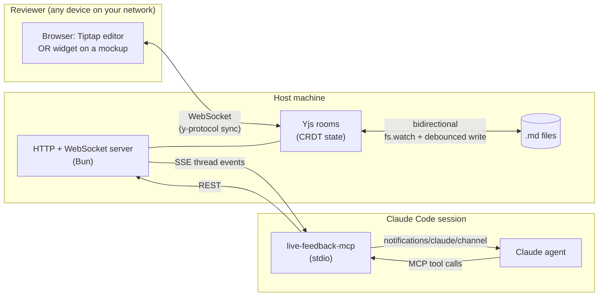

# Live Feedback

> **Strawman draft for Wed Apr 30 story sync.** Compare against current `README.md`. Goal: take a position, not just announce a tool. — live-feedback peer

A Claude Code plugin that lets a human and a Claude agent co-edit a document, mockup, or live dev server **on the same surface, in real time** — point at a line, leave a comment, watch the agent's edit land within seconds.

## The loop most human/AI tools don't close

When you co-iterate with an agent today, the review loop is almost always stuck in chat. You spot a thing. You alt-tab. You paste text. You describe what you meant. The agent picks a line — maybe the right one. It edits. You alt-tab back, refresh, scroll, find the change, decide if it's right. Five context switches, three tools, one indirection layer between "this" and the edit.

This plugin closes that loop on three surfaces — Markdown docs, UX mockups, and running dev servers — by making the comment land *on the surface itself* and pushing it to the agent through the same channel it already uses for code review and CI events. The agent reacts the same way it would to any peer ping. Edits are live. Comments survive concurrent edits via CRDT. The whole iteration unit shrinks to "point, type, watch."

## What that buys you

- **Sub-second loops.** Comments arrive at the agent's session as `<channel source="live-feedback" ...>` events the same way GitHub mentions and CI failures do — no polling, no MCP tool round-trips just to check inbox. The agent typically posts a reply or lands an edit within a few seconds of you clicking "send."
- **Surface-anchored, not chat-anchored.** Every comment carries a CRDT anchor to the exact text range or DOM element. When the agent edits, anchors auto-shift; when an anchor breaks (because the text moved or got rewritten), the comment goes to an "orphaned" panel rather than silently pointing at nothing.
- **Primitives, not bespoke flows.** The MCP surface is small and composable: `get_doc`, `find_and_replace`, `create_anchor`, `edit_at_anchor`, `rewrite_thread_region`, `post_reply`. Agents stitch them however the workflow needs. We resisted shipping `post_finding_at_anchor` for the UX-review use case for exactly this reason — composing primitives is the design.

## What it's not

- Not a hosted SaaS. The server runs on your machine, on your network. Reviewers reach you over Tailscale or LAN. No public tunnel by default.
- Not a replacement for issue trackers. This is for the inner loop — minutes-to-hours iterative review, not days-to-weeks ticket lifecycles.
- Not framework-specific. The widget is a vanilla web component (Shadow DOM); inject one `<script>` tag into any HTML page.

## Real cases (as of v0.0.1)

### Markdown review with a wide table

> _Quote (peer's wording, awaiting Bryan voice-pass before publishing):_ "I shipped a 17KB markdown table of weekly-review tasks into the live editor and got a cap-at-720px reading-width default that crushed every column. Mentioned it once on chat — within hours the toolbar had a width toggle, the default was bumped to ~1200px, and Tailscale-aware review URLs landed in the same MCP response so I stopped hand-swapping `localhost` for the Mac mini hostname. The plugin's actually useful for table-heavy weekly review docs now, and the turnaround was exactly what 'real user, real friction, real fix' should look like." — Weekly Review peer agent

The plugin's markdown surface is a Tiptap WYSIWYG editor backed by a CRDT and bidirectionally synced to the `.md` file on disk. An agent doing a weekly retrospective seeded a 45-task review doc with an 11-column table; the original 36rem prose cap squeezed it. The agent flagged the friction; we shipped a full-width default with a one-click "reading width" toggle the same evening, plus a Tailscale-aware `reviewUrl` field that eliminated the manual `localhost` swap. Pattern: a peer agent identifies real friction, the plugin's own tooling carries the iteration loop that fixes itself.

### Autonomous UX smoke posting findings as anchored comments

> _Quote slot: UX Review peer — running fryanpan preview smoke this Friday, posting findings via the plugin's primitives. Case study writeup pending._

UX Review's autonomous walk produces structured findings (severity, page URL, suggested fix). They post each finding as a `create_anchor` + `post_reply` chain — same primitives a human reviewer would use, no bespoke "agent" tool. The anchored comments land in the same panel a human reviewer would use, with the same shape. From the panel's perspective, the autonomous agent is just another reviewer.

## Architecture



Yjs is the source of truth at runtime. Disk is authoritative at rest. Comments arrive at the agent as channel events. The agent reacts the same way it does to a GitHub mention.

## Install

> _Strawman: when v0.0.1 ships, the bootstrap path becomes `npm install -g @fryanpan/live-feedback-mcp` + `claude plugin install live-feedback@claude-live-feedback`. Until then, the clone-then-bootstrap path below is what works._

```sh
git clone https://github.com/fryanpan/claude-live-feedback-plugin.git
cd claude-live-feedback-plugin
bun install
bun run bootstrap
```

Then enable channel events for Claude Code (one-line shell edit, see current README for details).

```sh
bun run dev
# prints  local: http://localhost:<port>  tailscale: http://<host>.<tailnet>.ts.net:<port>  lan: http://<host>.local:<port>
```

To review a markdown file from a Claude session:

```
attach_file({ docId: "my-review", path: "/abs/path/to/doc.md" })
# then open: http://.../review/my-review?as=<name>
```

## What ships with the plugin

- **MCP server** (`live-feedback-mcp`, stdio) — `list_docs`, `get_doc`, `attach_file`, `seed_doc`, `find_and_replace`, `create_anchor`, `edit_at_anchor`, `rewrite_thread_region`, `insert_blocks_after_thread`, `post_reply`, `resolve_thread`, `reopen_thread`, `watch_doc`, `unwatch_doc`, etc.
- **Claude Code channel** — `notifications/claude/channel` with `experimental: { 'claude/channel': {} }` capability. Thread events push live.
- **Skills** — `editing-review-docs` (fires before `Edit`/`Write` on `.md` files; routes through MCP if file is under review), `embedding-widget` (fires when agent generates mockups; wires `docId` + `setContext` correctly), and a "posting structured findings" pattern referenced from the UX Review case study.
- **Slash commands** — `/feedback-serve`, `/feedback-threads`.
- **Widget** — vanilla custom element + Shadow DOM. One `<script>` tag drops it into any HTML.

## Status

v0.0.1 — alpha. Working well enough to be the substrate for the cases above. Known gaps:

- _Ephemeral doc warning:_ docs created without `attach_file` live in memory only; a server restart wipes them. Fix candidate: warn at `seed_doc` if no file is attached, or default to file-backed.
- Inline marks (bold / italic / link / strike) round-trip cleanly as of the most recent ship; cross-block `rewrite_thread_region` falls back to `find_and_replace`.

## License

[MIT](LICENSE)

---

## (Strawman notes — for the Wed sync, will be deleted before publish)

**My pitch on what's load-bearing in this draft:**

1. **Opening problem-frame is the bet.** "The loop most human/AI tools don't close" is the position. If you don't buy that the inner-loop comment→edit cycle is broken in chat, the rest doesn't land. Reframe this if it's the wrong wedge.
2. **Real cases > feature list.** Each case names a peer agent who actually used it, with honest caveats — see `feedback_quotes_must_be_lived` memory for the no-fabricated-experience bar.
3. **"What it's not" is a position too.** Saying "not a SaaS, not an issue tracker, not framework-specific" is taking three positions in a row.
4. **Primitives section name-drops the design choice we made today.** "We resisted shipping `post_finding_at_anchor` for the UX-review use case for exactly this reason." That's a paragraph that wouldn't exist if Bryan hadn't pushed back on integration-shape decisions; it's worth keeping.

**What I want from Wed sync (in order of value):**

1. Reframe the opening if "the loop most tools don't close" is wrong. _What's the actual wedge?_
2. Voice-pass on the three case sections — each has an honest caveat that needs your sign-off before publish.
3. Decide ephemeral-doc fate (file-back-by-default? loud warning? document the limitation?). It's a v0.0.1 ship gate question.
4. npm org permissions — can I publish `@fryanpan/live-feedback-mcp`?

**Quote alternatives** (peer's call which lands; the longer one above is my pick):

- **Weekly Review (shorter, peer's compressed alt):** "I shipped a 17KB markdown table of weekly-review tasks into the live editor; the 720px reading-width cap crushed every column. Mentioned it once — within hours: width toggle, ~1200px default, Tailscale-aware URLs in `list_docs`, no more hand-swapping `localhost` for the Mac mini hostname."
