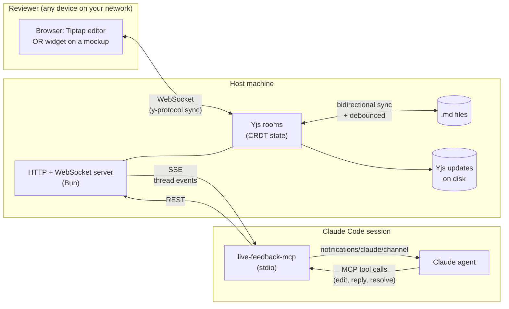

# claude-live-feedback-plugin (Prototype!)

## Goal: Smoother Iterative Remote Review with Claude

This plugin lets you work iteratively and remotely with Claude on reviewing Markdown documents, interactive mockups, and dev server previews of your live web app.

Claude gives you a secure link to the doc, mockup or dev server you're working together on (via Tailscale if you're not on local network).

And then it listens to comments (via <link class="null" href="https://code.claude.com/docs/en/channels" rel="noopener noreferrer" target="_blank" title="null">channels</link>) and can immediately address your feedback live.  Meanwhile you can keep reading (or with markdown, you can also edit directly yourself at the same time as Claude).

This is a companion plugin to the <link class="null" href="https://github.com/fryanpan/ai-project-support" rel="noopener noreferrer" target="_blank" title="null">ai-project-support</link> project, which makes it easier to work with a team of agents locally or remotely, with a team lead agent, with all agents backed by git repos and running Claude Code sessions.

## Before This Plugin

Before this plugin existed, if I was working remotely (which I often do while funemployed!), I couldn't read access any development artifacts to give feedback.  

Sometimes, I made do working with Claude remotely using Notion pages, but Notion is pretty heavyweight and clunky for Claude to interact with (Claude regularly struggles with the size of the API and the page structure)

## Alternatives

If you didn't need the full power of synchronous, live editing and comments going directly to Claude, I probably could have mounted my development folders in Dropbox (or other cloud fileshare) and read them remotely.

<link class="null" href="https://claude.ai/design" rel="noopener noreferrer" target="_blank" title="null">Claude Design</link> is also a fun prototype, but I've found that for the projects I'm working on now, Claude Design performs worse than using Claude Code Opus 4.7 in repo, with the ability to look at the web app running with actual data in Chrome.  And iterating there.  Instead of iterating on mockups and having one more level of indirection and trying to manage context transfer between disjoint tools.

## What's in the box

- **Markdown review** — a browser-based WYSIWYG editor backed by a file on disk. Open `/review/<docId>?as=<name>` from any device on your Tailnet or LAN. Comments anchor to text ranges and survive concurrent edits via CRDT. Bidirectional disk sync keeps your repo's `.md` in lockstep with the live editor.
- **UX / mockup widget** — one `<script>` tag (web component, shadow-DOM isolated) drops comment threads onto any HTML page. Anchors include page URL + optional view state so one `docId` can span a multi-page site or SPA.
- **Agent tool surface** — an MCP server the plugin installs into Claude Code. Agent can `get_doc`, `find_and_replace`, `rewrite_thread_region`, `insert_blocks_after_thread`, `delete_block_at_anchor`, `delete_blocks_in_range`, `delete_section`, `seed_doc`, `attach_file`, and more.
- **Claude Code channel** — thread events (`thread.created` / `thread.replied` / `thread.resolved` / `thread.reopened`) arrive in the agent's session as `<channel source="live-feedback" ...>` messages. The agent reacts the same way it would to any peer ping.

## Architecture



Yjs is the source of truth at runtime. Disk is authoritative at rest: every prose change flushes to the `.md` file within ~1 second, and external edits to that file (VS Code, git pull, another agent) flow back into the live doc within ~1 second via `fs.watch`. Claude sees comments as channel events pushed via the MCP's `notifications/claude/channel` capability.

## Install

### One-time setup (on the host machine that'll run the review server)

```
git clone https://github.com/fryanpan/claude-live-feedback-plugin.git
cd claude-live-feedback-plugin
bun install
bun run bootstrap    # wires up npm link, adds marketplace, installs plugin at user scope
```

That script does:

1. `cd packages/mcp && npm link` — so `live-feedback-mcp` resolves on your PATH.
2. `claude plugin marketplace add .` — adds this repo as a local marketplace.
3. `claude plugin install live-feedback@claude-live-feedback --scope user` — enables the plugin for every Claude Code session on this machine.

### Enable channel events in Claude Code (one-line shell edit)

Claude Code requires an explicit opt-in per session for plugins that emit channel events. Add this flag to however you launch `claude`:

```
--dangerously-load-development-channels plugin:live-feedback@claude-live-feedback
```

e.g. in your `~/.zshrc`:

```
claude() {
  /path/to/claude \
    --dangerously-load-development-channels plugin:live-feedback@claude-live-feedback \
    "$@"
}
```

Then `source ~/.zshrc` and relaunch Claude Code.

## Run

```
bun run dev
```

Starts the feedback server + watches source files for live reload. Prints URLs for every way to reach it:

```
 local:      http://localhost:<port>
 tailscale:  http://<host>.<tailnet>.ts.net:<port>
 lan:        http://<host>.local:<port>
```

Open any URL in a browser. To review a markdown file from your repo:

```
# In a Claude Code session
attach_file({ docId: "my-review", path: "/abs/path/to/doc.md" })
# Then open:  http://.../review/my-review?as=<name>
```

## Skills shipped with the plugin

- **`embedding-feedback-widget`** — fires when the agent is asked to generate a mockup or sample page. Wires the widget with the right `docId` / `setContext` pattern.
- **`editing-review-docs`** — fires before the agent edits a `.md` file. Checks whether the file is under live review and routes edits through MCP tools instead of `Edit`/`Write` if so, preventing divergence.

Plus two slash commands: `/feedback-serve`, `/feedback-threads`.

## Access model

No public tunnels. Reviewers reach the host over **Tailscale** (private WireGuard mesh, "MagicDNS" handles the hostname) or on the same **local network** (mDNS / LAN IP). If you want public access, add a tunnel of your choice (Cloudflare, ngrok, Caddy) — the server is just HTTP.

## Status

Working alpha, used for small reviews between me and my own agents. See [docs/product/vision.md](docs/product/vision.md) for the fuller problem framing and [docs/product/plans/mvp-plan.md](docs/product/plans/mvp-plan.md) for what shipped.

Current limitations:

- Plugin is installed from a local clone; not yet published. `npm link` bridges it for now. `npm publish` of the `@fryanpan/live-feedback-mcp` binary would let remote users skip the clone.
- Inline marks (bold/italic/link) round-trip as plain text through the file serializer.
- Cross-block ranges on `rewrite_thread_region` are rejected; fall back to `find_and_replace`.

## License

[MIT](LICENSE)

