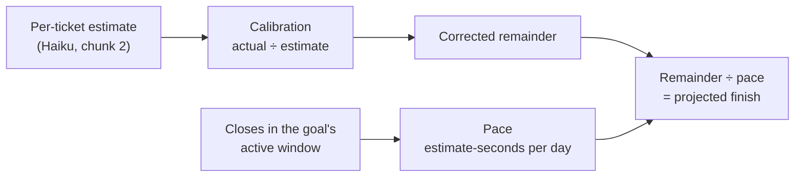

# Goal projection — the bar, the remainder and the date

What a goal band prints: how far along it is, how much of Bryan's own
attention is left, and roughly when it lands. The arithmetic is
`packages/core/src/goal-effort.ts` — pure, in `core` rather than the server,
because the board recomputes it in the browser off rows it already holds.

This file is the **product rules**: the questions someone reading a date on
the board would ask, answered once. The mechanics, the priors and the reasons
for each design choice are in that module's own doc comments, which are long
and stay long; nothing here repeats them.

## The chain

Estimates are on both sides of every fraction. A measured number is never
multiplied — a correction scales the forecast and nothing else.

## Pace is measured over the goal's own active window

The denominator is **the goal's age**, clamped to
`[EFFORT_MIN_PACE_WINDOW_DAYS, EFFORT_PACE_WINDOW_DAYS]` — one day to
fourteen. It used to be a flat fourteen days for every goal, which made the
divisor a fact about the calendar rather than about the goal: a goal three
days old with two closes was reported at `2/14` per day and looked becalmed,
while a goal running since spring read fast because only its last fortnight
counted. Same numerator, and the goal that had earned it in three days got
the smaller rate.

- **The goal's age is its oldest live ticket's `createdAt`.** The goal record
  itself never reaches the module — `summarizeGoalEffort` takes a list of
  tickets so the board can recompute client-side — and the oldest ticket
  filed under a band is the closest honest proxy. It errs the safe way: a
  goal cannot have been running before anything was filed under it, so the
  window can only come out too short, never too long.
- **The ceiling is fourteen days** because a rate learned from what a goal
  was doing two months ago is history, not a rate.
- **The floor is one day** because a goal whose first ticket was filed an
  hour ago would otherwise divide by 1/24 of a day and claim a pace
  twenty-four times anything it has demonstrated.
- **One window, both halves.** The same span decides which closes count and
  what the total is divided by. Deriving them separately is how a rate ends
  up measured over one period and divided by another.
- A band with **no timestamp anywhere** gets the full fourteen days, not the
  floor: nothing is known about its age, and one day is a claim about a young
  goal rather than a neutral answer.

The header sentence names the window it actually used — "on the last 3 days'
pace" — so the number on screen and the number in the arithmetic are the
same one.

## A close with no work behind it is not throughput

A ticket that went **straight to done** — closed without ever entering
`in-progress` — is excluded from **calibration, pace and the projection
floor** alike.

Nobody watched it being worked, so there is no wall-clock actual to learn a
correction from; that half was always excluded. The other two halves were
not, and that was the bug: closing five stale rows in one afternoon added
five closes and their whole estimate to the numerator of a rate that is
supposed to describe throughput, and the goal's projected finish jumped
forward on an afternoon of bookkeeping. Sweeping a backlog is not a
speed-up.

So the rule is one rule, in one direction: **an unobserved close teaches
nothing.** It still counts everywhere it is a plain fact rather than
evidence — the percentage bar moves, the remainder drops, `complete` can
become true. What it does not do is set a rate or unlock a date.

`EFFORT_MIN_CLOSES_FOR_PROJECTION` therefore counts **observed** closes: a
goal whose only three closes skipped `in-progress` gets no date, and the
header says so.

The one thing this does **not** narrow is hands-on calibration. Attention is
measured directly, off the reading time folded onto the row, and needs no
`in-progress` transition to be real: somebody read the ticket or they did
not. Only the wall-clock trail depends on the transition that a sweep skips.

## A factor is learned from three closes, not one

Below `EFFORT_MIN_SAMPLES_FOR_CALIBRATION` (3) closed tickets, a level
**inherits the level above it** instead of claiming a correction of its own:

| Closed samples | Where the goal's factor comes from |
| --- | --- |
| 3 or more on the goal | The goal's own median, shrunk toward the board |
| Fewer than 3 on the goal | The board's factor, unmodified |
| Fewer than 3 on the whole board | `EFFORT_PRIOR_*` — the starting assumption |

Shrinkage alone did not hold this line. `n/(n+K)` pulls a goal's median
toward the board's, but `shrink(r, r, 1) = r` exactly — and on a board where
one ticket is the only sample, that one ticket **is** the board median, so it
moved every estimate on the board at full strength. A goal's first close
would rewrite its own forecast and everyone else's; the second one could
rewrite it back.

Three is the same floor `EFFORT_MIN_CLOSES_FOR_PROJECTION` and
`EFFORT_MIN_SAMPLES_FOR_RANGE` already use. One number, for the same reason
in all three places: below three, there is a data point, not a distribution.

### Saying so on the board

`EffortRatio.samples` counts the closes the factor was **learned from**, and
stays `0` while a level is inheriting — a prior is not evidence, and no
surface may report one as "×N from M closed tickets".
`EffortRatio.observedSamples` counts what was actually seen, so a panel can
say "two closes so far, below the three needed" instead of the false "nothing
has closed yet".

**Inheritance carries the factor, never the evidence.** A goal that has
closed nothing takes the board's number and both of its counts come back
zero, because every sentence on these surfaces ends "on this goal" — a board
holding forty closes under other bands must not report forty under this one.
`ratioForGoal` does the zeroing at the single point the inheritance happens,
so no caller has to remember to. Such a goal is still explained rather than
left with an unaccounted-for ×0.09: the panel says the factor was learned
from closed tickets *elsewhere on the board*.

Neither of those answers the question a marker on the board has to ask, so
there is a third field. `samples: 0` is true both of a goal inheriting a
board that has learned from forty closes — a measured correction — and of one
inheriting a prior nothing has corrected — a guess. `EffortRatio.calibrated`
separates them: it is true when the factor rests on measured closes
*anywhere*, at this level or the one it came from.

A projection resting on an **un**calibrated factor is marked **"estimate
only"** on the goal strip, under the date it qualifies. It rides the date's
own column and never the title's: the title is the primary task at every
width (Bryan, 2026-08-30), and a caveat that pushes it is a caveat in the
wrong place. Unlike the coverage note it survives the narrow tier — a date
silently presented as measured when nothing measured it is the readout being
wrong, not merely terse.

With a date on screen the marker means one thing in practice: the goal's
closes were scored under an **older prompt**. A date needs three observed
closes, and an observed close scored under the current ask is exactly what
the calibrator counts — so three of those would have calibrated it. This is
the visible cost of changing the question, which the module has always paid
deliberately rather than carrying a stale answer forward.

## What a reader is owed

Every absence is a different sentence, and none of them is a zero.

| On screen | Means |
| --- | --- |
| no bar, "not scored yet" | Nothing under this goal has been scored |
| no bar, "scoring failed on N" | The scorer ran and produced nothing |
| `date after 3 closes` | Too little has closed to set a pace |
| `over a year out` | A pace exists; the remainder divides past the horizon |
| `~Sep 12 · estimate only` | A date, from a factor no close has corrected |
| `done` | Every scored ticket in this goal is closed |
