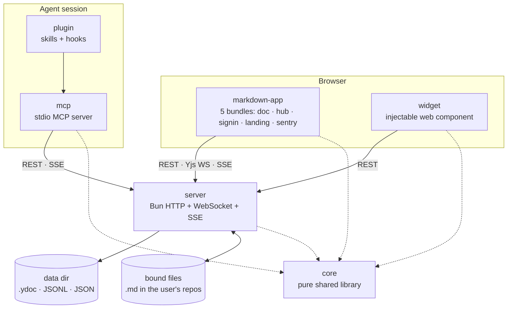
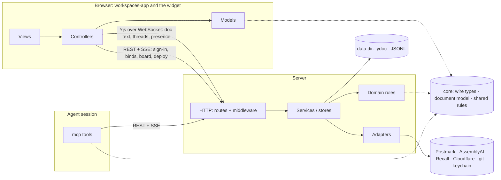
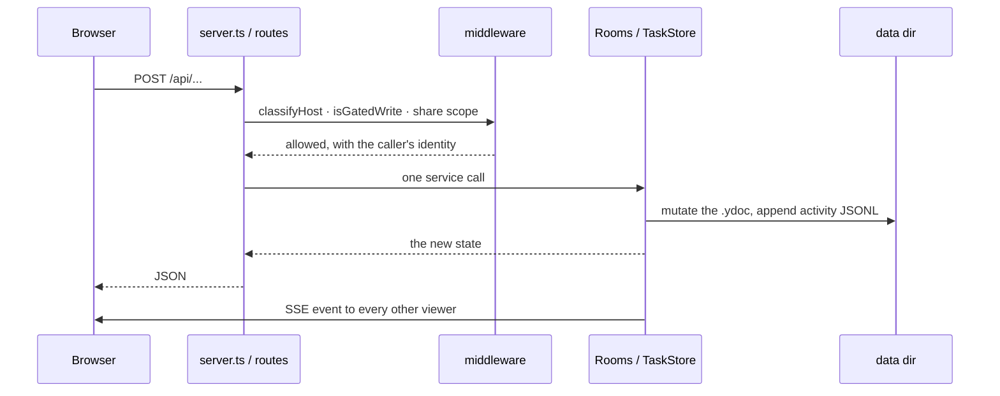
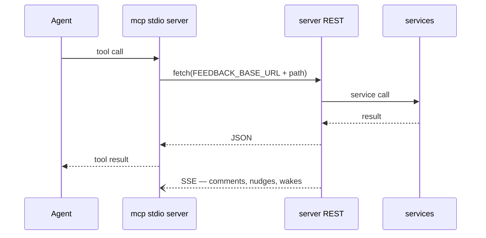
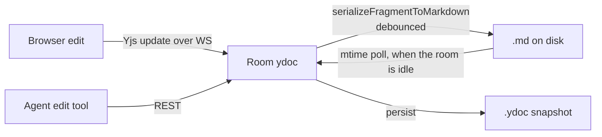
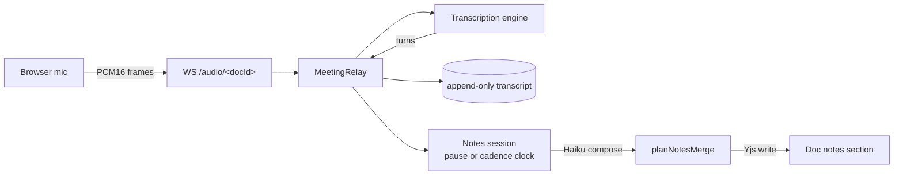

# Architecture Overview

## **Goal:** Make it easier to explore ways for human(s) to work with a team of agents to do work.

It's built on a few guiding principals or observations:

- Built for Bryan and his side projects / fractional gigs
  - *Approach*: *Start with a [local-first](https://www.inkandswitch.com/) approach that lets one primary user iterate faster with their agent fleet*
  - *Caveats: This system may or may not work for how you want to work!*
- A team of humans & agents benefit from knowing the same shared context
  - *Approach: Real-time, multiplayer space to share knowledge and streamline all important work*
- Existing APIs (and MCP) in legacy systems are evolving too slowly to explore
  - e.g. in Notion, Asana, Confluence, Jira, Linear, Figma, Github, Zoom, etc.
  - Integrating with each of these and across multiple legacy systems slows agents down
  - *Approach: Keep moving critical workflows into the workspace and synchronize with legacy tools as needed*
- Human input to make consequential decisions is becoming even more important, not less
  - *Approach*: *Make human decisions first class citizens in the architecture and make them pervasive*
  - *Approach: Try to give humans the ideal user interface where they can make decisions, in context, and just point at something and give feedback with minimal overhead*
- When our main work is review and making decisions, that work can be done from anywhere
  - *Approach: Everything works on the go from a phone, tablet, or laptop or at home on a desktop* 

## Workflows Covered by Workspaces

This project started first as a way to give real-time synchronous document, mockup, and dev server feedback between one human and a Claude Code agent.  

Over time, we've evolved this to try to cover all of these workflows and decision types in an integrated way:

- Setting goals
- Research and planning
- Prioritization against goals
- Gathering human feedback on decisions, docs, code diffs, mockups, or running apps(the original intent of this repo)
- Building, testing, peer reviewing, and deploying software products
- Having discussions

There are lots of similarities between this tool and [Claude Desktop](https://claude.com/product/claude-code), [Claude Design,](https://claude.com/product/design) [Nimbalyst](https://nimbalyst.com/), [Conductor](https://www.conductor.build/), [Ink & Switch](https://www.inkandswitch.com/), [Fireflies](https://fireflies.ai/), [Notion](https://www.notion.com/), but all of these other tools are inflexible and have major gaps for my workflow.

## The packages

| Package        | What it is                                                   | Hard constraint                                              |
| -------------- | ------------------------------------------------------------ | ------------------------------------------------------------ |
| `core`         | Pure shared library: wire types, the Yjs⇄markdown document model, anchors, review-item rules, goal arithmetic, prompts, path resolution. | Imports no other workspace package. No `node:` I/O beyond path math, no DOM. |
| `server`       | The one process. Owns the data directory, the Yjs rooms, the board, meetings, auth, sharing, deploys. | The only writer of durable state. Everything else asks it.   |
| `markdown-app` | The browser client, built into five separate bundles by `scripts/build.ts`. | Ships as static assets the server publishes as a numbered release. |
| `mcp`          | The stdio MCP server agents talk to. It is a **client** of the server's REST and SSE, not a second backend. | No business logic that the server does not also enforce.     |
| `widget`       | The injectable comment widget for mockups and dev servers. Vanilla JS + web components. | 40 KB gzipped, enforced by `check:widget-size`. No framework deps. |
| `plugin`       | The Claude Code plugin: skills, hooks, and a bundled copy of `mcp`. | Version bumped in three places; see CLAUDE.md.               |

## Yjs or REST: which channel carries what

Three channels leave the browser, and each carries a different kind of state.

**Yjs over one WebSocket per document** carries everything two people can watch change under each other's cursors: the text of every bound document, its comment threads and replies, suggestions, anchors, presence, and meeting notes and transcripts as they arrive. The server is the one Yjs peer that persists (`.ydoc` in the data dir) and the browser holds a full replica, so a person, a collaborator and an agent editing the same doc converge without a save button, and a reload is a replay of the same log. Agents never hold a replica: every MCP edit is a REST call the server applies to the Yjs document, which is how it reaches every open tab.

**REST** carries requests that need the server as an authority rather than a shared value: sign-in and session cookies, binding a file, folder or mockup, reading a file tree or a git diff, share links, deploy and plugin refresh, and the whole board. Tasks, goals, review items, dispatches and answers live in JSON that the server owns; the board writes them through REST and only projects a read-only mirror of task rows into the Yjs documents that show task chips. That split is deliberate: a board write is a decision with an author and a gate, so it goes through one validating path instead of a merged CRDT.

**Server-sent events** push what changed to anyone without a Yjs socket for it: the board page listens on `/events/workspace/{id}` for task, goal and presence changes, and the MCP server listens the same way for comments, CI and dispatch nudges.

Rule of thumb: if two viewers must see the same value at the same instant, it lives in Yjs. If the action needs the server's identity, its filesystem, a vendor, or a quality gate, it is REST, and it ends by either mutating a Yjs document or emitting an SSE event, which is how the result reaches every viewer.

## Layers inside `server`

Four layers, the shared core package beneath them, and a composition root that is scaffolding rather than a layer. **Imports point downward only.** A file may import its own layer and every layer below it, never one above.

| Layer                            | Where it lives                                               | May import                                 | Responsibility, and why it is its own layer                  |
| -------------------------------- | ------------------------------------------------------------ | ------------------------------------------ | ------------------------------------------------------------ |
| **HTTP**                         | `server.ts`, `routes/**`, `shells.ts`, `middleware/**`       | services, domain, adapter interfaces, core | Parse the request, decide once whether this caller may proceed on this host (that is what `middleware/` is), call one service, format the response. Its own layer because it is the only code that knows about HTTP. |
| **Services / stores**            | `rooms.ts` and the doc stores, `tasks.ts` and the board stores, `review-items/**`, `share/**`, `auth/**`, the `meeting-*` family and the notes writers it delegates to (`notes-section-write.ts`, `notes-ownership.ts`), `sse.ts`, `activity.ts` | domain, adapters, core                     | Own durable state and orchestrate one change across stores and adapters. Separate from adapters because a service holds state and a workflow; an adapter holds neither. |
| **Domain (pure)**                | `task-owner.ts`, `task-fields.ts`, `task-row.ts`, `decision-shape.ts`, `safe-path.ts`, `diff-groups.ts`, `pause-ticker.ts`, `meeting-capture-guards.ts`, `meeting-capture-prompt.ts`, `notes-section.ts` | core                                       | Functions over values: no clock, filesystem or socket unless passed in. Separate so a rule can be tested without a server, and so a service stays a thin orchestration. |
| **Adapters**                     | `transcribe-*.ts`, `recall*.ts`, `summarize.ts`, `deploy*.ts`, `client-release.ts`, `push-notify.ts`, `share/cf-api.ts`, `share/keychain.ts`, `git-diff.ts`, `port-bind.ts`, `sentry.ts` | domain, core                               | One vendor or one OS facility each, behind an interface the composition root injects. Separate from services so a vendor swap or a test double touches one file and no state. |
| **Core** (shared package)        | `packages/core`: wire types, the Yjs⇄markdown document model, anchors, the rules both sides compute | nothing in `server`                        | The calculations the browser and the server must reach identically. Not a server layer; every server layer imports it, and so does the browser. |
| *Composition root* (not a layer) | `bin.ts`, `server-config.ts`, `server-deps.ts`               | everything                                 | Reads the environment once, builds the adapters, wires the services, starts the server. About 400 lines of scaffolding that sits outside the stack rather than on top of it. |

The `routes/`, `review-items/`, `share/` and `auth/` directories are the existing proof that this works. `routes/` handlers are `handleXRoutes(ctx, rq) => Response | undefined`, chained by `??`, with their dependencies named in an explicit context type rather than captured from a closure. `review-items/store.ts` declares a nine-member persistence interface so a test can hand it a plain object. Follow those shapes; do not invent a new one.

## Layers inside `markdown-app`

Five layers, same downward rule. This is what makes the hub testable: the models are DOM-free, so `hub-model.test.ts` runs without a document.

| Layer                    | Where it lives                                               | Responsibility                                               |
| ------------------------ | ------------------------------------------------------------ | ------------------------------------------------------------ |
| **Entries**              | `app.ts`, `hub/hub-app.ts`, `signin/signin-app.ts`, `landing-app.ts`, `sentry-boot.ts` | One per bundle. The only files that call `main()` and own the top-level state object. |
| **Controllers / mounts** | `review-chrome.ts`, `meeting-strip.ts`, `meeting-chooser.ts`, `redline/markup-margin.ts`, `threads.ts` | Owns a DOM subtree and, sometimes, a socket. Takes its dependencies as arguments. |
| **Views**                | `hub/hub-render.ts`, `editor.ts`, `redline/redline-html.ts`  | Data in, elements out. No fetch, no socket, no timers.       |
| **Models**               | `hub/hub-model.ts`, `meeting-banner-model.ts`, `hub/activity-model.ts` | Pure functions over wire types. Import `core` and nothing else in this package. |
| **Transport**            | `push-client.ts`, `core`'s `ws-client.ts`, `meeting-protocol.ts` | Speaks a protocol. Returns values; never touches the DOM.    |

`hub/`, `redline/`, `code/` and `signin/` are feature directories that cut across those layers. That is intended: a feature directory holds its own model, view and controller, and the layer rule still governs which of them may import which.

## Layers inside `core`

Three tiers, bottom up: **wire types** (`types.ts`, `task-wire.ts`, `schema.ts`) carry the shapes both sides agree on; the **document model** (`prose.ts`, `suggest-ops.ts`, `anchor/**`, `redline.ts`) is the Yjs⇄markdown conversion and everything anchored into it; **domain rules** (`review-item.ts`, `goal-effort.ts`, `meeting-timing.ts`, `speaker-tags.ts`) are the calculations both server and browser must agree on. Prompts and machine-path helpers are leaves that import only the tier below them.

A rule lives in `core` when the browser and the server must reach the same answer. `goal-effort.ts` is the worked example: the board recomputes the goal bar in the browser from rows it already holds, so the arithmetic cannot live in the server.

## The main flows

### A browser write

The route's only job is the first and last hop. A new field needs three additions — MCP tool schema, route, service — and the route is the one nothing type-checks, so it is the one that silently drops it. Add an HTTP-level test through the real route for every new parameter.

### An MCP tool call

The MCP server holds no state that matters. It resolves the base URL from the discovery file, forwards, and turns SSE frames into channel events. If a rule exists only in `mcp`, a browser can bypass it.

### A doc edit round-trip

The file is the source of truth at rest, the live doc at runtime. Both directions are debounced, which is why a plain `Write` to a bound file loses: the doc reasserts itself about a second later and git still exits 0. Route every edit to a bound file through the MCP edit tools.

### A meeting tick

The audio socket is the meeting's lifecycle: every way it can end ends the meeting exactly once. Word-rate frames never enter the SSE replay buffer.

## Subsystem docs

Read the relevant one before touching its subsystem. None of these are `@`-imported, so they cost no context until you open them.

- [meeting-assistant.md](meeting-assistant.md) — live transcription and notes on a pause-or-cadence clock.
- [stall-detection.md](stall-detection.md) — board wakes, what counts as stalled, and their economics.
- [goal-projection.md](goal-projection.md) — the goal bar, the remainder, and when a goal lands.
- [security.md](security.md) — the boundaries, and which gate decides each one.
- [exceptions.md](exceptions.md) — every file over 500 lines, split or excepted, one row each.
- [split-plan.md](split-plan.md) — the execution plan for the 33 files marked `Split`.

## Adding a file

1. Name its layer first. If you cannot, it is doing two jobs.
2. Check the import direction. A service importing a route, or a model

  importing the DOM, is the error the layers exist to catch.
3. Keep it under 500 lines, or add a row to `exceptions.md` saying why. CI

  fails a file that crosses the line with no row.
