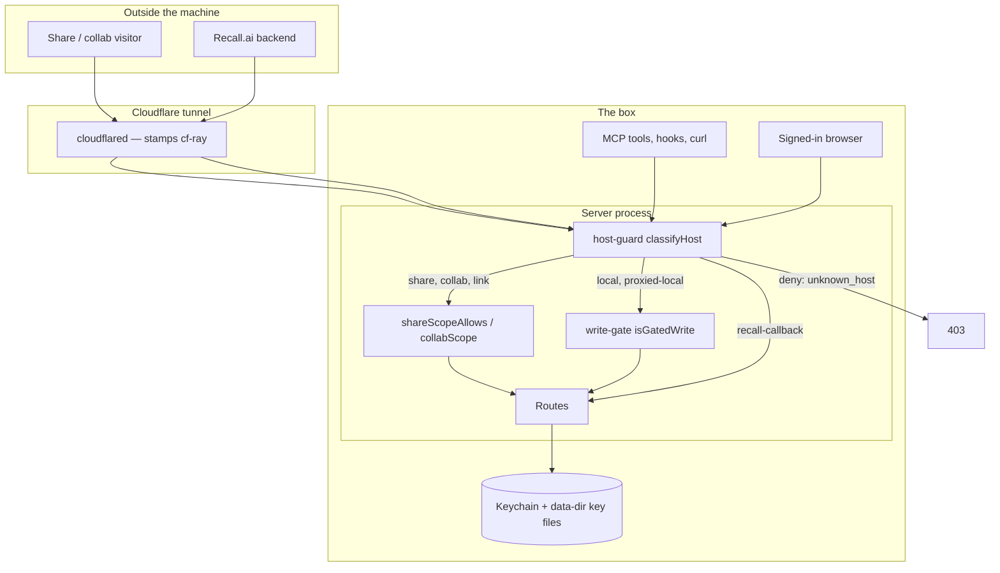

# Security boundaries

**Goal:** the product is open to everyone who can reach it and closed to
everyone who cannot, and which of those a caller is must be decided by one
gate rather than by whichever route they happened to hit. Reading is cheap
and ungated; writing carries a name; naming a host path is an agent action;
restarting the box is a loopback action.

This is the map. Each claim names the file that enforces it — read the file
before changing the behaviour, because every gate here has a header comment
explaining the hole it closed.

## The boundaries

Two questions are kept orthogonal on purpose, and the route layer reads both:
**reachability** (may this caller talk to this server at all — the host gate,
Cloudflare Access, a share session) and **identity** (who they are — a session
cookie, an Access claim, a widget token). A local host bypasses the first and
still owes the second (`packages/server/src/server.ts:5537`).

## Who may read and write what

| Caller | Reads | Writes | Gate |
|---|---|---|---|
| Loopback / tailnet / LAN agent (MCP, hooks, curl) | everything | everything except the binding-route browser refusal | `isTrustedLocalHost` (`middleware/host-guard.ts:188`) classifies `local`; no session required |
| Browser on a local host | everything | only when signed in | `isGatedWrite` + `browserProvedNobody` (`server.ts:5591`) |
| Share / link visitor | one board and its members | threads, suggestions, the reading tracker, **the prose of any in-scope doc** over the Yjs socket, and **new doc rooms** via `context-file` / `editable-file` — see the gap below | `shareScopeAllows` (`host-guard.ts:376`) — allowlist, closed by default; per-subroute rules in `docSubrouteAllowed` (`host-guard.ts:738`) |
| Collab-host visitor | any board the path names, resolved per request | same | `isAccessTunnelHost` (`host-guard.ts:227`) → `collabScope` (`host-guard.ts:659`), which delegates to `shareScopeAllows` |
| Operator's proxied host | everything `local` gets, after an Access token | same | `isProxiedTrustedHost` (`host-guard.ts:255`) |
| Recall.ai backend | two routes | one webhook | `recallCallbackAllows` (`middleware/recall-callback-gate.ts:89`) |
| Any other Host | nothing | nothing | `classifyHost` returns `deny: unknown_host` (`host-guard.ts:346`) |

Four separate host lists feed `classifyHost`, and their separation is the
security property: `extraHosts` classifies `local` and is vetoed through the
proxy, `proxiedAccessHosts` classifies `collab`, `proxiedTrustedHosts`
classifies `proxied-local`, and `CW_RECALL_CALLBACK_HOST` classifies
`recall-callback`. None can leak into another (`host-guard.ts:45-160`).
`viaProxy` — the presence of `cf-ray` — vetoes `local` outright, so a tunnel
visitor sending `Host: localhost` is not local.

Two of a visitor's writes are easy to miss because neither is an ordinary
POST, and both are deliberate. **Document prose** is edited over the Yjs
websocket, not over REST: an Access-authenticated share or collab visitor
gets a read-WRITE upgrade, because `provenIdentityFor` turns their verified
Access email into an identity and `browserProvedNobody()` is therefore false
for them. That is the point of a live review, and `docSubrouteAllowed`'s own
header says so. **New doc rooms** are materialized by `POST .../context-file`
and `.../editable-file`, which are on the visitor allowlist as reads (see
`OPEN_FOR_READING_POST` below): each opens a derived view of a file the
visitor may already read, at a deterministic id, and creates no content of
anybody's. A link-mode visitor gets neither, for the reason in the gap below.

`SharingGate` (`share/sharing-gate.ts`) is the master switch above all of
this: off means every non-local host is refused before authentication runs,
and it fails closed on an unparseable `sharing.json`. **Non-local means all
four external kinds** — `share`, `link`, `collab` and `proxied-local`. The
last one is the operator's own hostname through the tunnel and is the widest
of them, so leaving it out would have meant flipping the switch during a
review without closing the widest door. Nothing local is touched, so the way
back is the way in: flip it from the box or the tailnet.

### Writes from a browser

`CW_REQUIRE_SIGNIN_TO_WRITE` defaults **on** — `signInToWriteFromEnv`
(`middleware/write-gate.ts:52`) treats unset and every misspelling as on, and
only `0`/`false`/`no`/`off` turn it off. `bin.ts:241` reads it and
`server.ts:4807` defaults it to `true` when the option is absent.

The predicate is keyed on **method**, not on a route list
(`isGatedWrite`, `write-gate.ts:195`): every mutating route is a non-GET, so
routes written later are covered by construction. Two exemption lists run the
other way — reads to let through rather than writes to catch — so a forgotten
entry surfaces as a refused read, not a silent hole: `READ_SHAPED_POSTS`
(`write-gate.ts:146`) and `OPEN_FOR_READING_POST` (`write-gate.ts:174`).
`/api/auth/*` is exempt because gating it would deadlock the flow that lifts
the gate (`isSignInFlowPath`, `write-gate.ts:127`).

Agents are untouched because `isBrowserRequest` (`write-gate.ts:116`) keys on
`Origin` / `Sec-Fetch-Site` / `Sec-Fetch-Dest`, which no client in this repo
sends. That is an **attribution** boundary, not an authorization one — a
determined non-browser caller can decline to look like a browser, and what
keeps that caller out is the host gate and Access above it.

**The method key covers HTTP routes, and websockets are not among them.** A
websocket upgrade is a GET, so `isGatedWrite` cannot see one by construction,
and "routes written later are covered" is a claim about REST alone. There are
two such surfaces, and each carries the sign-in decision by hand at its own
handshake. Anyone adding a third has to do the same; nothing will catch it.

- **`/y/<docId>`** — the editing socket, which is also the READING socket, so
  a refusal here would gate a read. It computes
  `requireSignInToWrite && browserProvedNobody()` and carries the answer as
  `WsCtx.readOnly` for the life of the connection: sync step 1 is answered,
  and anything that would change the doc is dropped (`yjs-protocol.ts`).
  Awareness still flows both ways — presence is not content. The mockup
  auto-create sits BEHIND that decision, because creating a room and filing a
  hub row is a write like any other.
- **`/audio/<docId>`** — the meeting socket, which is write-and-spend: a
  `start` frame opens a billed transcription session and a notes pipeline that
  writes into the doc. It carries the same decision, and the relay refuses the
  `start` frame with an error the strip can render rather than refusing the
  upgrade — a refused upgrade reaches the page as a bare error event with no
  body to show.

### Binding routes refuse browsers outright

`POST /api/docs`, `POST /api/workspaces` with a `folderPath`, and
`POST /api/workspaces/<id>/import-tasks` turn a host path into content this
server reads and serves. All three answer `browser_cannot_bind` to any
browser, on any origin, signed in or not (`server.ts:6446`, `:6705`, `:7676`;
body from `browserCannotBindBody`, `write-gate.ts:225`). This closes the
page-on-this-machine hole — a dev server on another local port passes the
origin policy — not a determined agent.

### What a share visitor may open

A folder bind or diff review roots a whole repository, and a visitor reaches
it. `isListedFile` (`fs-scan.ts`) is the rule: a path opens only if the
tree listing contains it, and the listing is
`git ls-files --cached --others --exclude-standard` via `scanFolderPaths`,
so a gitignored `.env` never appears. Anything under
`.git/` is refused before the listing is consulted. Call sites:
`rooms.ts:2950` and `rooms.ts:3023`.

**The git listing has a fallback mode, and it is not the same guarantee.**
`scanFolder` drops to a recursive `readdir` whenever `git ls-files` exits
non-zero — a folder bound outside any checkout — or git is missing. There is
no ignore file to honour out there, so the fallback carries a floor of its
own (`isSecretShapedName`): it omits every dotfile and every key-shaped name
(`*.pem`, `*.key`, `*.p12`, `*.pfx`, `*.keystore`, `id_*`). Before that floor
existed the dot-prefix test applied to directories only, so a bind on a
non-repo directory listed `.env` and `.npmrc` in the tree and served them.
A false refusal here is one missing row in a tree; a false admission is a
credential leaving the box.

Browser origins are handled separately: `isAllowedBrowserOrigin`
(`middleware/browser-origin.ts:68`) reflects one known origin or sends no CORS
headers at all, matching hostnames exactly rather than by suffix.

### Known gap: a link-mode visitor in a browser cannot write at all

The sign-in write gate runs above route dispatch and has no share-visitor
exemption, and a link-mode visitor proves no identity — they hold `lf_share`,
not `cw_session`, and no Access claim. So `browserProvedNobody()` is true for
them and every write is refused `401 sign_in_required`. The refusal points at
`/signin`, which `shareScopeAllows` does not admit, so the remedy it names is
itself out of scope.

Measured on 2026-09-02 against a link share through the real route table,
with a positive control: the same visitor's `POST .../threads/by_find`
answers 200 without browser headers and 401 with `Origin` and `Sec-Fetch-*`
set, and `/signin`, `/api/auth/session` and `/api/auth/start` all answer
`403 out_of_share_scope` on the share host.

An Access-fronted share or collab host is unaffected: `provenIdentityFor`
(`server.ts:5168`) turns the verified Access email into an identity, so those
visitors still write. This gap is link mode only, and it is a product
decision — whether an invited reviewer must hold an account — not a bug with
an obvious fix.

## Secrets — where they live, never what they are

| Secret | Home | Reached by |
|---|---|---|
| Summary / judge / notes LLM key | Keychain `claude-workspaces-summary-api-key` (legacy `live-feedback-summary-api-key`) | `summarize.ts:41`, `:54` |
| AssemblyAI key | Keychain `assemblyai-api-key` | `transcribe-assemblyai.ts:61` |
| Soniox key | Keychain `claude-workspaces-soniox-api-key` | `transcribe-soniox.ts:63` |
| Recall.ai key | Keychain `claude-workspaces-recall-api-key` | `recall.ts:48` |
| Google OAuth app | Keychain `claude-workspaces-google-oauth`, two accounts | `recall-calendar.ts:72` |
| Postmark server token | Keychain `postmark-api-token` | `auth/postmark-code-sender.ts:142` |
| Cloudflare API token | Keychain `cloudflare-api-token` | `bin.ts:445` |
| Share URL-signing key | `<dataDir>/share-url.key`, mode 600 | `share/url-signing.ts:38` |
| Session / share cookie key | `<dataDir>/share-cookie.key`, mode 600 | `share/link-session.ts:29` |
| Recall webhook secret | `RECALL_WEBHOOK_SECRET` env | `bin.ts:589` |

Keychain reads go through `readKeychainPassword` / `readKeychainAccountPassword`
(`share/keychain.ts:20`, `:50`), which shell out to `security` and accept an
uppercased-service env override for tests. The two key files generate
themselves on first use at mode 600 and are `chmod`ed again if they already
existed. The URL key is deliberately **not** the cookie key: it leaves the box
as the edge Worker's secret and must not carry the power to mint sessions.

The launchd plist sets the non-secret configuration —
`CW_REQUIRE_EMAIL_AUTH`, `CW_OWNER_EMAIL`, `CF_SHARE_PUBLIC_HOSTNAME`,
`CF_ACCESS_TUNNEL_HOSTS`, `CW_PROXIED_TRUSTED_HOSTS`,
`CW_PROXIED_TRUSTED_EMAILS`, `CF_ACCESS_TEAM_DOMAIN`, `CF_ACCESS_AUD`
(`scripts/launchd/com.fryanpan.claude-workspaces.plist.template`). No API key
is set there; every key comes from the Keychain at read time.

Login codes are never stored in the clear: `auth/email-code.ts` keeps them
hashed with a per-challenge salt, in memory only, behind per-challenge,
per-email and per-address limits plus two hourly abuse ceilings.

Nor are they logged. The fallback transport (`auth/code-sender.ts`) is the
server's default when no sender is passed, and it engages silently on either
half of a partial email config — `AUTH_EMAIL_FROM` unset, or the Postmark
token missing from the Keychain — so it is live more often than it looks. It
records that a code was issued, to whom and for how long, and **masks the code
itself unless `CW_LOG_LOGIN_CODES=1`**. Without that mask, whoever could read
the service log could complete a sign-in for any address they could start a
challenge for, `CW_OWNER_EMAIL` included. The flag is a development
convenience and the masked line names it.

## The three signed-token schemes, one signing module

All three are HMAC-SHA256 over a dotted payload with a timing-safe compare,
and that construction lives once in `auth/signed-token.ts:114`. Each scheme
contributes only a `TokenFormat` — its key domain, its version tags, how its
claims become a payload and back, and when it expires — so no scheme owns a
copy of the algorithm.

| Scheme | Carries | Format |
|---|---|---|
| Share link-session cookie `lf_share` | shareId only — no expiry, so revocation is immediate | `share/link-session.ts:54` |
| Auth session cookie `cw_session` | identityId, sessionId, issuedAt; `v2` never expires, ends by revocation | `auth/session.ts:84` |
| Widget popup token | identityId, sessionId, session issuedAt, own expiry, and the one page origin | `auth/widget-token.ts:69` |

They share one key file and separate on the key derived from it
(`auth/signed-token.ts:92`). The auth session and the widget token each
derive under their own domain string. The **share cookie signs with the key
file's own bytes** — it predates domain separation and its cookies are in
browsers, so that is a wire lock rather than an omission, and what keeps it
apart from the others is that neither of their keys is this one.

The share **URL** signature is a fourth, different thing: an HMAC over
`<id>.<exp>` verified independently by the edge Worker and by the server
(`share/url-signing.ts:71`), so the app never trusts that the Worker ran.

The widget token is narrower than the cookie it borrows from: it only
attributes, it expires on its own (`WIDGET_TOKEN_TTL_MS`, seven days), every
use is re-checked against the live session's revocation state, and it is
accepted only from a request whose `Origin` matches the origin signed into it
(`server.ts:5556`).

The wire format is frozen: cookies minted before the schemes were folded
together are in browsers and share links are in the wild.
`test/signed-token-compat.test.ts` keeps a verbatim copy of each old mint
path and asserts both directions against the shipping code, so a change to
any payload shape fails there rather than in the field.

## Deploy, refresh and webhook surfaces

`POST /api/deploy` (`server.ts:10181`) is the narrowest route on the server.
It refuses share visitors, refuses when no deployer is configured, requires a
**loopback peer address** (checked on `server.requestIP`, not the
client-controlled `Host` header), and then refuses any request carrying
`cf-ray` — cloudflared runs on this box, so a tunnelled request also arrives
from 127.0.0.1. `GET /api/deploy` stays at trusted-local: reporting what
already happened cannot restart anything.

`POST /api/plugin/refresh` (`server.ts:10080`) is the same shape one notch
wider: trusted-local rather than loopback, because a refresh interrupts
nobody, plus the same `cf-ray` refusal.

Both also answer `browser_cannot_operate` to any browser
(`browserCannotOperateBody`, `write-gate.ts`) — the sibling of the binding
routes' refusal, and for the same hole. None of the checks above can tell a
page from an agent: the loopback test reads the peer address, which is
loopback for a page served from this machine; the origin policy admits any
machine-local hostname on any port; a local dev origin is same-site with this
server, so a session cookie rides along; and `cf-ray` is absent on a request
that never went through the edge.

`POST /recall/status` (`server.ts:6168`) answers `404 not_found` on every host
unless `RECALL_WEBHOOK_SECRET` is set — the signature is the route's only
credential, so without one there is no door to knock on. It then verifies a
Svix signature over `${id}.${timestamp}.${body}` with a five-minute tolerance
(`recall-webhook-auth.ts:46`), then admits the delivery id through
`WebhookReplayGuard` (`recall-webhook-auth.ts:120`) — a repeat inside the
window answers 409. The guard is checked **after** the signature, so an
unsigned caller cannot learn which ids the server has seen; it is bounded by
TTL (twice the tolerance) and by entry count.

The Recall callback hostname serves those two routes and nothing else. Each is
armed only while its own credential is configured, so a server that cannot
mint a bot token never exposes an unauthenticated path
(`recall-callback-gate.ts:89`). **That arming is now the route's own, not only
the hostname's.** The webhook is reachable on every admitting host class, and
its signature-and-replay block used to sit inside `if (secret)`: with the
secret unset — which is the default, and the boot warns rather than refuses —
an unauthenticated non-browser caller on the LAN or the tailnet could inject
bot-status and calendar-sync events, unsigned and outside the replay guard.

## Changing any of this

Run the per-release checklist in `.claude/rules/security-review.md` before
opening a PR that adds or changes a route, a token, a share surface, a
webhook, or an auth default. The `ship-it` skill runs it automatically when
the changed-file list touches those areas.

## Review log

An adversarial review reads this document against the code and reports where
the two disagree. Each pass is recorded here so the next one starts from what
the last one already looked at, and so a claim that was checked and left alone
is distinguishable from one nobody has read.

### 2026-09-02 — commit `a644afdd`, 10 confirmed findings

Read the whole document against the route table, the host guard, the write
gate, the share redactions and the secret transports. All ten were reproduced
at the cited lines before anything was changed.

| # | Severity | Finding | Verdict |
|---|---|---|---|
| 1 | high | `/audio/` upgrade is a GET, so the write gate never saw it, and unlike `/y/` it never consulted `browserProvedNobody()` — a signed-out browser could open a billed engine session and write notes into a doc | **Fixed.** The upgrade carries the same decision; the relay refuses `start` with an error the strip can render |
| 2 | medium | The `/y/` mockup auto-create ran above the read-only decision, so an unproven browser could create a room and file a hub-workspace row | **Fixed.** The decision moved above the creation; refusing gates no read, because the doc does not exist yet |
| 3 | medium | `POST /api/deploy` and `/api/plugin/refresh` had no browser refusal — the same page-on-this-machine class the binding routes close | **Fixed.** Both answer `browser_cannot_operate`, a sibling of `browser_cannot_bind` |
| 4 | low | This document's write-gate section claimed method-keyed completeness and never mentioned either websocket surface | **Fixed.** "Writes from a browser" now names both and says the method key does not reach them |
| 5 | high | `GET /api/workspaces/<id>` answered share and collab visitors with the stored record, including `notesHome.repoRoot` and `retiredBy` | **Fixed.** Visitors get an allowlist projection; the local surface keeps the whole record |
| 6 | medium | `scanFolder`'s non-git fallback applied its dot-prefix test to directories only, so a bind outside a repo listed and served `.env` | **Fixed.** The fallback carries its own floor, and "What a share visitor may open" says the git listing has a fallback mode |
| 7 | medium | `SharingGate` did not cover `proxied-local`, contradicting "every non-local host is refused" | **Fixed.** The operator's proxied hostname is in the condition; local, tailnet and LAN are untouched, so the switch can be flipped back |
| 8 | low | The visitor Writes column omitted Yjs prose editing and lazy doc materialization | **Fixed.** Both are in the table and explained under it |
| 9 | low | `POST /recall/status` accepted unsigned bodies and skipped the replay guard whenever the secret was unset, on every host but the callback one | **Fixed.** The route answers 404 without a secret, whichever host asked |
| 10 | low | The fallback login-code transport printed the live code and the recipient to the server log | **Fixed.** Masked unless `CW_LOG_LOGIN_CODES=1`, and the doc's "never in the clear" claim is qualified |

Nothing was declined. The "Known gap" section above was deliberately left as
it stands — it is a product decision awaiting an answer, not a defect.
