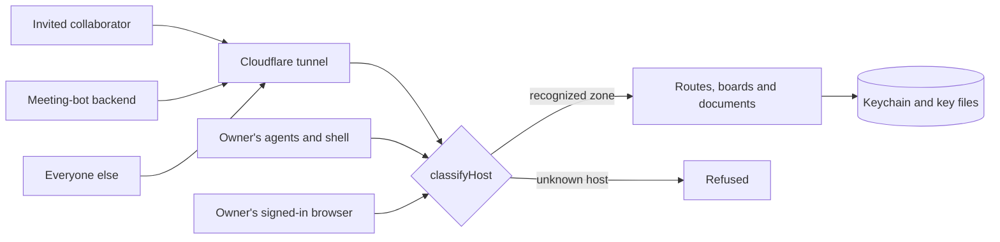

# Security model

Claude Workspaces is a self-hosted server. One owner runs it on their own
machine, their Claude Code agents talk to it over loopback or a private
network, and anyone else reaches it only through a Cloudflare tunnel the owner
opened on purpose. There is no multi-tenant service and no shared database:
the trust boundary is the owner's machine.

This document is the map of that boundary — the zones, what each caller may
read and write, and where secrets live. It is a description of the design, not
a claim of completeness. Every gate named below has a header comment in its
own file explaining what it is for; read that before changing the behaviour.

## Trust zones

The tunnel is the only way in from outside the owner's machine, and everything
that arrives through it is classified before any route runs.

| Zone | Who is in it | How the server recognizes them |
|---|---|---|
| The box | The owner's agents, hooks and shell — MCP tools, `curl`, the CLI | The `Host` header names loopback AND the socket's peer address is loopback. Both, always |
| The owner's browser | The owner, reaching their own hostname through the tunnel | The operator host list, plus a Cloudflare Access identity on the operator allowlist |
| Invited collaborator | Someone the owner shared a board with | A dedicated hostname through the tunnel, plus a Cloudflare Access identity |
| Meeting-bot backend | Recall.ai, delivering transcription callbacks | A dedicated hostname, plus a signed webhook |
| Everyone else | The rest of the internet, and every LAN or tailnet name | Not recognized — refused before any route runs |

One function decides which zone a request is in — `classifyHost` in
`packages/server/src/middleware/host-guard.ts`. Every route sits behind it, so
the answer cannot differ by which URL a caller happened to hit. Four separate
host lists feed it, one per external zone, and none can leak into another. The
presence of a `cf-ray` header vetoes the local classification outright, so a
tunnel visitor sending `Host: localhost` is not on the box.

Reachability and identity are kept as separate questions. Being in a zone says
a caller may talk to the server at all; a session cookie, an Access claim or a
widget token says who they are. A caller on the box skips the first and still
owes the second before it may write.

### Every browser-facing hostname is behind Cloudflare Access

The rule, in one sentence: **the box is served without a token, and nothing
else is.** No exemption for the tailnet, the LAN, or a hostname the operator
declared — a declaration is not a sign-in.

It closed two holes at once, and both were reachable by anyone who could route
a packet to this machine:

- **The LAN / tailnet grant.** Any name that resolved here — a `TRUSTED_HOSTS`
  entry, a Tailscale name, a LAN alias — used to be served exactly like
  loopback: the whole product, no token, no sign-in.
- **The `Host` header.** Both reverse proxies dial the origin over loopback, so
  the socket's peer address cannot separate a tunnel visitor from an agent on
  the box, and the header was the only thing consulted. A request from anywhere
  claiming `Host: localhost` read as local. Being on the box now requires the
  loopback Host *and* a loopback peer address.

What still reaches the server without a Cloudflare Access token is one thing:
a process on this machine calling `http://localhost:<port>`, which is how every
MCP client and hook resolves it from the discovery file. Everything a person
opens in a browser — the board, a doc, its attachments, a folder tree, a diff
review, the Yjs socket, the SSE stream — requires a verified identity.

Because access proves an address before the page loads, the server's own
emailed-code sign-in is off under this rule (`CW_EMAIL_CODE_SIGNIN=1` puts it
back). The `/signin` page and the two challenge routes answer 404; reading a
session, renaming, and signing out stay open, and `/api/auth/session` reports
which deployment this is so no surface paints a link to a page that is not
there.

There is one tier of access, not two. A signed-in visitor reads and writes
under the address Access proved — a comment they post carries that identity,
whatever the request body claims.

**Configuration, by name.** Which hosts are browser-facing is config, resolved
once in `server-config.ts` and never read inline:

| Env var | What it names |
|---|---|
| `CW_ACCESS_ONLY_BROWSER_HOSTS` | The rule itself. Defaults ON; only `0`/`false`/`no`/`off` turns it off, so a typo fails closed |
| `CW_PROXIED_TRUSTED_HOSTS` | The owner's own hostname(s) through the tunnel — the whole product behind Access |
| `CW_PROXIED_TRUSTED_EMAILS` | Which verified addresses that hostname admits (defaults to `CW_OWNER_EMAIL`) |
| `CF_ACCESS_TUNNEL_HOSTS` | Collaboration hostname(s) — the product's shared surfaces, not the operator verbs |
| `CF_SHARE_BASE_HOSTNAME` | The parent of every per-share hostname a board share mints under |
| `CF_ACCESS_TEAM_DOMAIN`, `CF_ACCESS_AUD` | The Access team and the static audience the operator and collaboration hosts verify against |
| `TRUSTED_HOSTS` | LAN / tailnet aliases. **No longer a grant** while the rule is on — kept for the deployments that turn it off |
| `CW_EMAIL_CODE_SIGNIN` | Forces the server's own emailed-code sign-in back on |

With the rule on and no Access hostname configured, the server logs a loud
warning at boot naming these variables: the only browser that can reach it is
one on the box.

## Who may read and write what

| Caller | Reads | Writes | Enforced by |
|---|---|---|---|
| Agent on the box (loopback Host AND loopback peer) | Everything | Everything except binding a host path from a browser | `isTrustedLocalHost` — no session needed |
| Owner's proxied hostname | Everything the box gets, after an Access token on the operator allowlist | Same | `isProxiedTrustedHost` |
| Share or collaboration visitor | One board and its members | Comment threads, suggestions, the reading tracker, and document prose over the editing socket | `shareScopeAllows` / `collabScope` — an allowlist, closed by default |
| Meeting-bot backend | Two routes | One webhook | `middleware/recall-callback-gate.ts` |
| A tailnet or LAN name, or any other host | Nothing | Nothing | `classifyHost` returns a refusal |

A visitor's ability to edit document prose is deliberate: that is what a live
review is. It runs over the Yjs websocket rather than over REST, and only for
a visitor whose Cloudflare Access identity the server verified.

`SharingGate` (`share/sharing-gate.ts`) is the switch above all of this. Turned
off, every external host is refused before authentication runs, and an
unparseable config fails closed. It covers the share, collaboration and
proxied-operator zones. The meeting-bot callback hostname is deliberately
outside it, because closing that mid-call would drop a live meeting's
callbacks; that hostname serves two routes, each armed only while its own
credential is configured.

## Writes from a browser need a sign-in

`CW_REQUIRE_SIGNIN_TO_WRITE` defaults **on**, and only an explicit
`0`/`false`/`no`/`off` turns it off. The gate (`isGatedWrite` in
`middleware/write-gate.ts`) is keyed on HTTP method rather
than a list of routes, so a mutating route written later is covered without
anyone remembering to add it. The exemptions run the other way — reads to let
through, not writes to catch — so a mistake surfaces as a refused read rather
than a silent hole. The sign-in flow itself is exempt, because gating it would
deadlock the thing that lifts the gate.

Two surfaces the method key cannot reach, because a websocket upgrade is a GET:
the document editing socket and the meeting audio socket. Each carries the
sign-in decision by hand at its own handshake and holds it for the life of the
connection. Anyone adding a third websocket has to do the same; nothing will
catch it for them.

Agents are unaffected, because the gate keys on browser-only headers
(`Origin`, `Sec-Fetch-*`) that no client in this repo sends. That is an
attribution boundary, not an authorization one — what actually keeps a stranger
out is the host classification above it.

Four routes turn a path on the host machine into content this server reads and
serves: binding a file, binding a folder, importing a task list, and rooting a
diff review. All four refuse any browser outright, signed in or not. The hole
that closes is a page on this machine — a dev server on another local port
passes the origin policy and would otherwise ride the owner's cookie. The
deploy, plugin-refresh and share-mutation routes refuse browsers for the same
reason.

## What a visitor may open from a bound folder

Binding a folder or rooting a diff review exposes a whole checkout to a
reviewer, so one rule decides what opens (`isListedFile` in `fs-scan.ts`): the
file must appear in the tree listing, and the listing is
`git ls-files --cached --others --exclude-standard`. An ignored file never appears, and anything under `.git/` is
refused before the listing is consulted.

Ignoring is not the whole guarantee, because `--others` lists untracked files
and a checkout may simply never have had a rule for one. So the listing also
applies a name floor, refusing credential-shaped filenames — `.env` and its
variants, `.npmrc`, `.netrc`, `.pgpass`, `.htpasswd`, `.pypirc`, `*.pem`,
`*.key`, `*.p12`, `*.pfx`, `*.keystore` and `id_*`.

Outside a git checkout the scan falls back to a recursive directory read. There
is no ignore file to honour there, so the fallback additionally hides every
dotfile. That wider rule is deliberately not applied inside a repo, where
dotfiles are committed content a reviewer has to read.

Visitor-facing responses are filtered by allowlist rather than denylist:
`share/redact-meta.ts` rewrites review URLs to the visitor's own board and
drops host paths, and agent presence records name the fields a visitor gets, so
a field added later is withheld until somebody decides otherwise.

## Where secrets live

Values are never in this repo, in the launchd configuration, or in logs. What
follows is only where the server looks for each one.

| Secret | Home |
|---|---|
| LLM API key (summaries, notes, judging) | macOS Keychain, service `claude-workspaces-summary-api-key` |
| AssemblyAI key | Keychain, service `assemblyai-api-key` |
| Soniox key | Keychain, service `claude-workspaces-soniox-api-key` |
| Recall.ai key | Keychain, service `claude-workspaces-recall-api-key` |
| Google OAuth client and refresh token | Keychain, service `claude-workspaces-google-oauth`, three accounts |
| Postmark server token | Keychain, service `postmark-api-token` |
| Cloudflare API token | Keychain, service `cloudflare-api-token` |
| Share URL signing key | `<dataDir>/share-url.key`, mode 600 |
| Session and share cookie key | `<dataDir>/share-cookie.key`, mode 600 |
| Web Push VAPID private key | `<dataDir>/push-vapid.json`, mode 600 |
| Meeting webhook signing secret | `RECALL_WEBHOOK_SECRET` in the environment |

The three key files are generated by the server on first use at mode 600, and
re-`chmod`ed if they already exist. The URL signing key is deliberately not the
cookie key: it leaves the box as the edge Worker's secret and must not carry
the power to mint sessions. The launchd configuration sets hostnames and
feature flags only; no API key is set there.

Login codes are never stored in the clear. They are held hashed with a
per-challenge salt, in memory only, behind per-challenge, per-email and
per-address rate limits. The fallback console transport masks the code unless a
development flag is set.

Signed tokens — the share cookie, the session cookie and the widget popup token
— all go through one module, `auth/signed-token.ts`: HMAC-SHA256 over a dotted
payload with a timing-safe compare. Each scheme contributes only its key domain,
its claims and its expiry, so none owns a copy of the algorithm. The share URL
signature is a separate thing, verified independently by the edge Worker and by
the server, so the app never has to trust that the Worker ran.

## Reporting a vulnerability

Please do not open a public issue. Report privately through GitHub's
[private vulnerability reporting](https://github.com/fryanpan/claude-workspaces-plugin/security/advisories/new)
on this repository. Include what you did, what you observed, and the version or
commit you tested. This is a personal project with no bug bounty and no
response-time commitment, but reports are read and acted on.

## Changing any of this

Run the per-release checklist in
[`.claude/rules/security-review.md`](../../.claude/rules/security-review.md)
before opening a PR that adds or changes a route, a token, a share surface, a
webhook, or an auth default. The `ship-it` skill runs it automatically when the
changed-file list touches those areas. Adversarial reviews of this document
against the code are run periodically and their fixes land in the normal PR
flow.
