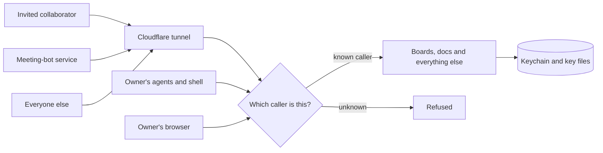

# Security model

Claude Workspaces runs on one person's own computer. That person is the owner. The owner's Claude Code agents talk to the server from the same machine. Anyone else reaches it only through a Cloudflare tunnel the owner set up. There is no shared service and no shared database: the security boundary is the owner's machine.

One server holds many workspaces, so every outside hostname asks two questions rather than one. Cloudflare Access answers the first: which email is this? The server answers the second: was this email given the workspace being asked for? Neither answer is worth anything without the other, and no hostname is a workspace by itself.

A share link opens exactly one workspace, fixed when the link is made. The link is an invitation, not a credential: following it proves nothing on its own, because a visitor arrives at the share hostname only after Cloudflare Access has confirmed an email. The server records that email as a member of the workspace the link names, and from then on the membership is what admits them. The collaboration hostname asks the same second question and answers it from the live shares of that workspace, their email and domain lists, plus the owner's own emails. A workspace nobody has shared admits nobody at either address.

This document describes how the server decides who gets in, what each kind of caller can read and write, and where secrets are kept. It describes the design as it is; it is not a promise that nothing was missed. Every check named below has a comment at the top of its own file explaining why it exists. Read that before changing it.

## Who can reach the server

The tunnel is the only way in from outside the owner's machine. Every request, whether it came through the tunnel or from the machine itself, is sorted into one of these groups before anything else happens.

| Group                    | Who is in it                                                 | How the server knows                                         |
| ------------------------ | ------------------------------------------------------------ | ------------------------------------------------------------ |
| Programs on this machine | The owner's agents, hooks and shell                          | The request is addressed to `localhost` **and** the connection starts on this machine. Both must be true. |
| The owner in a browser   | The owner, using their own hostname through the tunnel       | The hostname is on the owner's list, and Cloudflare Access has confirmed the owner's email |
| Invited collaborator     | Someone the owner shared a workspace with                    | The share hostname, an email Cloudflare Access has confirmed, and a membership of the workspace being asked for |
| Meeting-bot service      | Recall.ai, delivering transcripts                            | Its own hostname, and a signed message                       |
| Everyone else            | The rest of the internet, and any local-network or Tailscale name | Not recognized. Refused before any page or API runs.         |

There is one level of access. A signed-in person reads and writes as the email Cloudflare confirmed, and a comment they post is attributed to that email, whatever the request claims.

One function makes the sorting decision, `classifyHost` in `packages/server/src/middleware/host-guard.ts`, and every page and API sits behind it, so the answer cannot depend on which URL someone tried. Each outside group has its own list of hostnames, and a hostname on one list never counts for another. Cloudflare stamps every request it forwards with a marker of its own, and that marker alone proves a request came through the tunnel, so a tunnel visitor who claims to be `localhost` is not believed.

Two questions are kept apart: may this caller talk to the server at all, and who are they? The groups above answer the first. A sign-in cookie, a Cloudflare Access identity, or a widget token answers the second. A program on this machine skips the first question and still has to answer the second before it may change anything.

## Every browser signs in through Cloudflare Access

The rule: **programs running on this machine get in without signing in. Nobody else does.** There is no exception for the local network, for Tailscale, or for a hostname the owner wrote into a config file. Listing a name is not the same as signing in.

Two details make the rule hold. First, "on this machine" means both things at once: the request names `localhost`, and the connection itself starts on this machine. The tunnel and the local proxy both connect to the server from this machine, so the connection alone cannot tell a visitor from an agent, and the name `localhost` alone can be typed by anyone. Second, any name that happens to point at this machine, such as a Tailscale name or a local-network alias, is refused.

The only thing that reaches the server without a Cloudflare sign-in is a program on this machine calling `http://localhost:8787`. That is the same port the tunnel connects to. Agents and hooks learn that address from a small file the server writes when it starts (`~/.claude/claude-workspaces/server.json`). Everything a person opens in a browser (the board, a document, its attachments, a folder listing, a diff review, live editing, live updates) requires a confirmed identity.

Because Cloudflare confirms the person's email before the page loads, the server's own emailed-code sign-in is switched off. (`CW_EMAIL_CODE_SIGNIN=1` switches it on.) The `/signin` page and its two helper routes answer "not found". Reading your session, changing your display name, and signing out still work, and `/api/auth/session` tells the page which mode it is in, so no page shows a link to a sign-in that is not there.

If the rule is on and no Access hostname is configured, the server prints a clear warning when it starts, because then the only browser that can reach it is one on this machine.

## A share link invites a person; a membership lets them back in

One Cloudflare Access application covers one hostname, `share.<domain>`, with a policy that admits everyone and a login method that emails a one-time code. That application answers exactly one question: which email is this? It decides nothing about workspaces, and it is not meant to. Anyone willing to receive a code can get through it, which is why the server never treats reaching that hostname as permission to open anything.

Sharing a workspace mints a record and nothing else: an unguessable id, the workspace it opens, who made it, when, and an expiry if one was asked for. Links do not expire by default, because a review that goes quiet for three weeks should still open on the fourth. Nothing is created in Cloudflare, no DNS record is added, and the server needs no Cloudflare credential to share a board. The link is `https://share.<domain>/s/<id>`.

The first visit is the whole flow. Cloudflare confirms an email, the server checks the link is still live, records that email as a member of the workspace the link names, and sends the visitor to the board. Visiting a second time adds nothing: the same email is already a member. From then on the link is incidental. Every later request is judged on the membership, per request, against the workspace named in that request's own path. A path that names no workspace, the site root included, is refused rather than answered, so the hostname tells an admitted stranger nothing about what exists behind it.

The workspace comes off the record, never off the request, so nothing a visitor sends can move a redemption onto a board the link does not name.

A link that is revoked, expired, or never existed renders one page, and it is the same page in all three cases. Four different answers would turn the address into a way to test whether a guessed id is real. The page names no workspace and no owner.

The share hostname's Access application has its own audience, configured apart from the owner's. A token minted for the owner's address fails at the share hostname and a token minted at the share hostname fails at the owner's, because each is checked against the audience of its own application. That second direction is the one that matters: the share application admits anyone who can read email, so its token must be worth nothing anywhere else.

Two verbs end access, and they are not the same act. Revoking a link stops anyone new from redeeming it and leaves the people who already did, because a link is often revoked simply because it has been passed around enough. Removing a member ends that person's access at once: the next request is refused, and any live editing connection or event stream that membership had already opened is hung up rather than left running. That second half matters because a connection is authorized once, when it opens, and never asked again. Neither verb destroys anything: a revoked link keeps its record and its list of who redeemed it and when, which is the only account of who was ever let in.

Membership on the share hostname and membership on the collaboration hostname are separate records on purpose. A redeemed share link does not make somebody a collaborator, and an address on the owner's list is not a member of anything on the share hostname. Two doors, two answers.

Workspaces used to be shared by creating a Cloudflare Access application and a DNS record for each individual share. That is retired. Records already minted that way keep working until they expire, and nothing new is made that way.

## What each caller can read and write

| Caller                                                   | Reads                                                        | Writes                                                       |
| -------------------------------------------------------- | ------------------------------------------------------------ | ------------------------------------------------------------ |
| Program on this machine                                  | Everything                                                   | Everything                                                   |
| Owner in a browser                                       | Everything, after Cloudflare confirms an email on the owner's list | Everything, except binding a path on this machine (see below) |
| Share-link or collaboration visitor                      | Only the workspaces their confirmed email is a member of. On the share hostname that membership comes from a share link they redeemed; on the collaboration hostname it comes from that workspace's live shares plus the owner's own emails | Comments, suggestions, the reading tracker, and the text of documents through live editing |
| Meeting-bot service                                      | Two routes                                                   | One incoming message                                         |
| Anyone else, including local-network and Tailscale names | Nothing                                                      | Nothing                                                      |

In code: programs on this machine pass `isTrustedLocalHost` with no sign-in; the owner's browser passes `isProxiedTrustedHost`; a visitor is held to `shareScopeAllows` and `collabScope`, which list what is allowed and refuse everything else; the meeting bot passes `middleware/recall-callback-gate.ts`; everyone else is refused by `classifyHost`. On the share hostname the membership question is asked per request, against the workspace that request's own path names.

Letting a visitor edit document text is on purpose: that is what a live review is. It happens over the live-editing connection, not over the normal API, and only for a visitor whose email Cloudflare confirmed.

`SharingGate` (`share/sharing-gate.ts`) is the master switch above all of this. Turned off, every outside hostname is refused before any sign-in check runs, every share-link visitor's open connection is hung up, and a setting that cannot be read counts as off. It covers the share, collaboration and owner-through-the-tunnel groups. The switch is thrown by an agent on this machine and works on any deployment that has either kind of sharing wired; a browser cannot throw it, and neither can it read the share list, because a link id is the whole secret of a share URL and the member list is a roster of addresses. The meeting-bot hostname is deliberately outside it, because switching it off in the middle of a meeting would drop the transcript; that hostname serves two routes, and each one works only while its own credential is configured.

## Changing anything from a browser needs a sign-in

`CW_REQUIRE_SIGNIN_TO_WRITE` is on by default, and only an explicit `0`, `false`, `no` or `off` turns it off. The check (`isGatedWrite` in `middleware/write-gate.ts`) looks at whether a request is asking to read or asking to change something, not at a list of routes, so a new route that changes data is covered without anyone remembering to add it. The one place that does not hold is a live connection, because opening one looks like a read: the document-editing connection and the meeting-audio connection each check the sign-in themselves when the connection opens and keep that answer for as long as the connection lasts. Anyone adding a third live connection has to do the same; nothing will catch it for them.

The exceptions to the check are reads to let through, not writes to catch, so a mistake shows up as a refused read rather than as a silent gap. The sign-in flow itself is exempt, because otherwise nobody could ever sign in.

Agents are not affected, because the check keys on markers only browsers attach to a request. That tells the server who made a change; it is not what keeps strangers out. The sorting above is what keeps strangers out.

Four routes turn a path on this machine into content the server reads and serves: binding a file, binding a folder, importing a task list, and starting a diff review. All four refuse every browser, signed in or not. The danger is a web page running on this same machine, such as a dev server on another local port: the browser would treat it as coming from the owner, and the owner's signed-in session would come with it. The deploy, plugin-refresh, agent-merge and share-management routes refuse browsers for the same reason.

## What a reviewer can open from a shared folder

Sharing a folder or a diff review exposes a whole checkout, so one rule decides what a reviewer can open (`isListedFile` in `fs-scan.ts`): the file must appear in the folder listing, and the listing is `git ls-files --cached --others --exclude-standard`. A file that git ignores never appears, and anything under `.git/` is refused before the listing is even consulted.

Ignore rules are not the whole story, because the listing includes untracked files and a checkout may never have had an ignore rule for one of them. So the listing also refuses files whose names look like credentials: `.env` and its variants, `.npmrc`, `.netrc`, `.pgpass`, `.htpasswd`, `.pypirc`, `*.pem`, `*.key`, `*.p12`, `*.pfx`, `*.keystore` and `id_*`.

Outside a git checkout, the server reads the directory directly. There is no ignore file to follow there, so it also hides every file whose name starts with a dot. That wider rule is deliberately not used inside a repository, where such files are committed content a reviewer has to see.

What a visitor is sent is built from a list of allowed fields, not a list of forbidden ones: `share/redact-meta.ts` rewrites review links to the visitor's own workspace and removes paths on this machine, and the record of which agents are present names exactly the fields a visitor gets. A field added later is withheld until someone decides otherwise.

## Where secrets live

Secrets are kept in the macOS Keychain or in files only the owner's account can read, and none is checked into this repository or written into the launchd configuration by design. This table says where the server looks for each one.

| Secret                                                       | Where                                                        |
| ------------------------------------------------------------ | ------------------------------------------------------------ |
| LLM API key (summaries, notes, judging)                      | Keychain, service `claude-workspaces-summary-api-key`        |
| AssemblyAI key                                               | Keychain, service `assemblyai-api-key`                       |
| Soniox key                                                   | Keychain, service `claude-workspaces-soniox-api-key`         |
| Recall.ai key                                                | Keychain, service `claude-workspaces-recall-api-key`         |
| Google OAuth client and refresh token                        | Keychain, service `claude-workspaces-google-oauth`, three accounts |
| Postmark server token                                        | Keychain, service `postmark-api-token`                       |
| Cloudflare API token                                         | Keychain, service `cloudflare-api-token`                     |
| Cookie signing key (sign-in cookie, share cookie, widget token) | `<dataDir>/share-cookie.key`, readable only by the owner's account |
| Share links and their members                                | `<dataDir>/share-links.json`, readable only by the owner's account |
| The key that signs browser notifications                     | `<dataDir>/push-vapid.json`, readable only by the owner's account |
| Meeting webhook signing secret                               | `RECALL_WEBHOOK_SECRET` in the environment                   |

The server creates the two key files itself on first use and resets their permissions if they already exist. The launchd configuration holds hostnames and feature switches only; no API key is set there.

When the emailed-code sign-in is on, login codes are never stored in the clear. They are kept scrambled with a per-code salt, in memory only, behind rate limits per code, per email and per network address. The fallback that prints a code to the console hides it unless a development flag is set.

Signed tokens (the share cookie, the sign-in cookie and the widget token) all go through one module, `auth/signed-token.ts`: each token is stamped with a signature made from the secret key, and a token whose signature does not match is rejected. Each kind of token contributes only its own purpose, its contents and its expiry, so none of them has its own copy of the signing code.

## Reporting a vulnerability

Please do not open a public issue. Report privately through GitHub's [private vulnerability reporting](https://github.com/fryanpan/claude-workspaces-plugin/security/advisories/new) on this repository. Include what you did, what you saw, and the version or commit you tested. This is a personal project with no bug bounty and no response-time promise, but reports are read and acted on.

## Changing any of this

Run the checklist in [`.claude/rules/security-review.md`](../../.claude/rules/security-review.md) before opening a pull request that adds or changes a route, a token, a share surface, a webhook, or a sign-in default. The `ship-it` skill runs it automatically when the changed files touch those areas. Independent reviews of this document against the code run from time to time, and their fixes land through normal pull requests.

## Settings, by name

Which hostnames face a browser is configuration, read once in `server-config.ts`:

| Setting                                  | What it means                                                |
| ---------------------------------------- | ------------------------------------------------------------ |
| `CW_ACCESS_ONLY_BROWSER_HOSTS`           | The rule itself. On by default; only `0`, `false`, `no` or `off` turns it off, so a typo leaves it on. |
| `CW_PROXIED_TRUSTED_HOSTS`               | The owner's own hostname(s) through the tunnel. Behind Access, they see the whole product. |
| `CW_PROXIED_TRUSTED_EMAILS`              | Which confirmed emails those hostnames admit. Defaults to `CW_OWNER_EMAIL`. |
| `CF_ACCESS_TUNNEL_HOSTS`                 | Hostnames for collaborators. They see the shared surfaces, not the owner's controls. |
| `CW_SHARE_LINK_HOSTS`                    | The hostname share links are served from, `share.<domain>`. Comma-separated if there is more than one. Ignored unless the two settings below are both set. |
| `CF_ACCESS_SHARE_AUD`                    | The Cloudflare Access application covering that hostname. Its own audience, deliberately not `CF_ACCESS_AUD`, which is what makes a token for one address worthless at the other. |
| `CF_SHARE_BASE_HOSTNAME`                 | Retired. The parent domain each workspace share used to get its own hostname under. |
| `CF_ACCESS_TEAM_DOMAIN`, `CF_ACCESS_AUD` | The Cloudflare Access team and application that the owner and collaborator hostnames are checked against. |
| `CW_EMAIL_CODE_SIGNIN`                   | Turns the server's own emailed-code sign-in on.              |
| `CW_REQUIRE_SIGNIN_TO_WRITE`             | Whether a browser must be signed in to change anything. On by default. |
