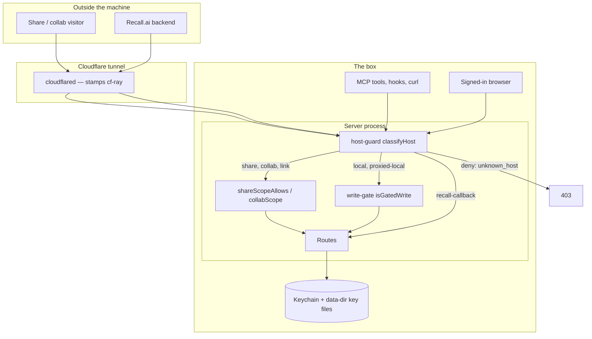

# Security boundaries

**Goal:** the product is open to everyone who can reach it and closed to
everyone who cannot, and which of those a caller is must be decided by one
gate rather than by whichever route they happened to hit. Reading is cheap
and ungated; writing carries a name; naming a host path is an agent action;
restarting the box is a loopback action.

This is the map. Each claim names the file that enforces it — read the file
before changing the behaviour, because every gate here has a header comment
explaining the hole it closed.

## The boundaries

Two questions are kept orthogonal on purpose, and the route layer reads both:
**reachability** (may this caller talk to this server at all — the host gate,
Cloudflare Access, a share session) and **identity** (who they are — a session
cookie, an Access claim, a widget token). A local host bypasses the first and
still owes the second (`packages/server/src/server.ts:5498`).

## Who may read and write what

| Caller | Reads | Writes | Gate |
|---|---|---|---|
| Loopback / tailnet / LAN agent (MCP, hooks, curl) | everything | everything except the binding-route browser refusal | `isTrustedLocalHost` (`middleware/host-guard.ts:188`) classifies `local`; no session required |
| Browser on a local host | everything | only when signed in | `isGatedWrite` + `browserProvedNobody` (`server.ts:5552`) |
| Share / link visitor | one board and its members | threads, suggestions and the reading tracker — see the gap below | `shareScopeAllows` (`host-guard.ts:376`) — allowlist, closed by default; per-subroute rules in `docSubrouteAllowed` (`host-guard.ts:738`) |
| Collab-host visitor | any board the path names, resolved per request | same | `isAccessTunnelHost` (`host-guard.ts:227`) → `collabScope` (`host-guard.ts:659`), which delegates to `shareScopeAllows` |
| Operator's proxied host | everything `local` gets, after an Access token | same | `isProxiedTrustedHost` (`host-guard.ts:255`) |
| Recall.ai backend | two routes | one webhook | `recallCallbackAllows` (`middleware/recall-callback-gate.ts:89`) |
| Any other Host | nothing | nothing | `classifyHost` returns `deny: unknown_host` (`host-guard.ts:346`) |

Four separate host lists feed `classifyHost`, and their separation is the
security property: `extraHosts` classifies `local` and is vetoed through the
proxy, `proxiedAccessHosts` classifies `collab`, `proxiedTrustedHosts`
classifies `proxied-local`, and `CW_RECALL_CALLBACK_HOST` classifies
`recall-callback`. None can leak into another (`host-guard.ts:45-160`).
`viaProxy` — the presence of `cf-ray` — vetoes `local` outright, so a tunnel
visitor sending `Host: localhost` is not local.

`SharingGate` (`share/sharing-gate.ts`) is the master switch above all of
this: off means every non-local host is refused before authentication runs,
and it fails closed on an unparseable `sharing.json`. **Non-local means all
four external kinds** — `share`, `link`, `collab` and `proxied-local`. The
last one is the operator's own hostname through the tunnel and is the widest
of them, so leaving it out would have meant flipping the switch during a
review without closing the widest door. Nothing local is touched, so the way
back is the way in: flip it from the box or the tailnet.

### Writes from a browser

`CW_REQUIRE_SIGNIN_TO_WRITE` defaults **on** — `signInToWriteFromEnv`
(`middleware/write-gate.ts:52`) treats unset and every misspelling as on, and
only `0`/`false`/`no`/`off` turn it off. `bin.ts:241` reads it and
`server.ts:4805` defaults it to `true` when the option is absent.

The predicate is keyed on **method**, not on a route list
(`isGatedWrite`, `write-gate.ts:195`): every mutating route is a non-GET, so
routes written later are covered by construction. Two exemption lists run the
other way — reads to let through rather than writes to catch — so a forgotten
entry surfaces as a refused read, not a silent hole: `READ_SHAPED_POSTS`
(`write-gate.ts:146`) and `OPEN_FOR_READING_POST` (`write-gate.ts:174`).
`/api/auth/*` is exempt because gating it would deadlock the flow that lifts
the gate (`isSignInFlowPath`, `write-gate.ts:127`).

Agents are untouched because `isBrowserRequest` (`write-gate.ts:116`) keys on
`Origin` / `Sec-Fetch-Site` / `Sec-Fetch-Dest`, which no client in this repo
sends. That is an **attribution** boundary, not an authorization one — a
determined non-browser caller can decline to look like a browser, and what
keeps that caller out is the host gate and Access above it.

### Binding routes refuse browsers outright

`POST /api/docs`, `POST /api/workspaces` with a `folderPath`, and
`POST /api/workspaces/<id>/import-tasks` turn a host path into content this
server reads and serves. All three answer `browser_cannot_bind` to any
browser, on any origin, signed in or not (`server.ts:6370`, `:6629`, `:7592`;
body from `browserCannotBindBody`, `write-gate.ts:225`). This closes the
page-on-this-machine hole — a dev server on another local port passes the
origin policy — not a determined agent.

### What a share visitor may open

A folder bind or diff review roots a whole repository, and a visitor reaches
it. `isListedFile` (`fs-scan.ts`) is the rule: a path opens only if the
tree listing contains it, and the listing is
`git ls-files --cached --others --exclude-standard` via `scanFolderPaths`,
so a gitignored `.env` never appears. Anything under
`.git/` is refused before the listing is consulted. Call sites:
`rooms.ts:2950` and `rooms.ts:3023`.

**The git listing has a fallback mode, and it is not the same guarantee.**
`scanFolder` drops to a recursive `readdir` whenever `git ls-files` exits
non-zero — a folder bound outside any checkout — or git is missing. There is
no ignore file to honour out there, so the fallback carries a floor of its
own (`isSecretShapedName`): it omits every dotfile and every key-shaped name
(`*.pem`, `*.key`, `*.p12`, `*.pfx`, `*.keystore`, `id_*`). Before that floor
existed the dot-prefix test applied to directories only, so a bind on a
non-repo directory listed `.env` and `.npmrc` in the tree and served them.
A false refusal here is one missing row in a tree; a false admission is a
credential leaving the box.

Browser origins are handled separately: `isAllowedBrowserOrigin`
(`middleware/browser-origin.ts:68`) reflects one known origin or sends no CORS
headers at all, matching hostnames exactly rather than by suffix.

### Known gap: a link-mode visitor in a browser cannot write at all

The sign-in write gate runs above route dispatch and has no share-visitor
exemption, and a link-mode visitor proves no identity — they hold `lf_share`,
not `cw_session`, and no Access claim. So `browserProvedNobody()` is true for
them and every write is refused `401 sign_in_required`. The refusal points at
`/signin`, which `shareScopeAllows` does not admit, so the remedy it names is
itself out of scope.

Measured on 2026-09-02 against a link share through the real route table,
with a positive control: the same visitor's `POST .../threads/by_find`
answers 200 without browser headers and 401 with `Origin` and `Sec-Fetch-*`
set, and `/signin`, `/api/auth/session` and `/api/auth/start` all answer
`403 out_of_share_scope` on the share host.

An Access-fronted share or collab host is unaffected: `provenIdentityFor`
(`server.ts:5149`) turns the verified Access email into an identity, so those
visitors still write. This gap is link mode only, and it is a product
decision — whether an invited reviewer must hold an account — not a bug with
an obvious fix.

## Secrets — where they live, never what they are

| Secret | Home | Reached by |
|---|---|---|
| Summary / judge / notes LLM key | Keychain `claude-workspaces-summary-api-key` (legacy `live-feedback-summary-api-key`) | `summarize.ts:41`, `:54` |
| AssemblyAI key | Keychain `assemblyai-api-key` | `transcribe-assemblyai.ts:61` |
| Soniox key | Keychain `claude-workspaces-soniox-api-key` | `transcribe-soniox.ts:63` |
| Recall.ai key | Keychain `claude-workspaces-recall-api-key` | `recall.ts:48` |
| Google OAuth app | Keychain `claude-workspaces-google-oauth`, two accounts | `recall-calendar.ts:72` |
| Postmark server token | Keychain `postmark-api-token` | `auth/postmark-code-sender.ts:142` |
| Cloudflare API token | Keychain `cloudflare-api-token` | `bin.ts:445` |
| Share URL-signing key | `<dataDir>/share-url.key`, mode 600 | `share/url-signing.ts:38` |
| Session / share cookie key | `<dataDir>/share-cookie.key`, mode 600 | `share/link-session.ts:28` |
| Recall webhook secret | `RECALL_WEBHOOK_SECRET` env | `bin.ts:589` |

Keychain reads go through `readKeychainPassword` / `readKeychainAccountPassword`
(`share/keychain.ts:20`, `:50`), which shell out to `security` and accept an
uppercased-service env override for tests. The two key files generate
themselves on first use at mode 600 and are `chmod`ed again if they already
existed. The URL key is deliberately **not** the cookie key: it leaves the box
as the edge Worker's secret and must not carry the power to mint sessions.

The launchd plist sets the non-secret configuration —
`CW_REQUIRE_EMAIL_AUTH`, `CW_OWNER_EMAIL`, `CF_SHARE_PUBLIC_HOSTNAME`,
`CF_ACCESS_TUNNEL_HOSTS`, `CW_PROXIED_TRUSTED_HOSTS`,
`CW_PROXIED_TRUSTED_EMAILS`, `CF_ACCESS_TEAM_DOMAIN`, `CF_ACCESS_AUD`
(`scripts/launchd/com.fryanpan.claude-workspaces.plist.template`). No API key
is set there; every key comes from the Keychain at read time.

Login codes are never stored in the clear: `auth/email-code.ts` keeps them
hashed with a per-challenge salt, in memory only, behind per-challenge,
per-email and per-address limits plus two hourly abuse ceilings.

## The three signed-token schemes

All three are HMAC-SHA256 over a dotted payload with a timing-safe compare,
and all three derive from the same key file under different domain strings so
one format can never verify as another.

| Scheme | Carries | Verifier |
|---|---|---|
| Share link-session cookie `lf_share` | shareId only — no expiry, so revocation is immediate | `share/link-session.ts:51` |
| Auth session cookie `cw_session` | identityId, sessionId, issuedAt; `v2` never expires, ends by revocation | `auth/session.ts:95` |
| Widget popup token | identityId, sessionId, session issuedAt, own expiry, and the one page origin | `auth/widget-token.ts:95` |

The share **URL** signature is a fourth, different thing: an HMAC over
`<id>.<exp>` verified independently by the edge Worker and by the server
(`share/url-signing.ts:71`), so the app never trusts that the Worker ran.

The widget token is narrower than the cookie it borrows from: it only
attributes, it expires on its own (`WIDGET_TOKEN_TTL_MS`, seven days), every
use is re-checked against the live session's revocation state, and it is
accepted only from a request whose `Origin` matches the origin signed into it
(`server.ts:5517`).

The code-health audit's coupling row proposes folding these into one signing
module. They already share a key file and a construction; what they do not
share is a single place to change the algorithm.

## Deploy, refresh and webhook surfaces

`POST /api/deploy` (`server.ts:10091`) is the narrowest route on the server.
It refuses share visitors, refuses when no deployer is configured, requires a
**loopback peer address** (checked on `server.requestIP`, not the
client-controlled `Host` header), and then refuses any request carrying
`cf-ray` — cloudflared runs on this box, so a tunnelled request also arrives
from 127.0.0.1. `GET /api/deploy` stays at trusted-local: reporting what
already happened cannot restart anything.

`POST /api/plugin/refresh` (`server.ts:9996`) is the same shape one notch
wider: trusted-local rather than loopback, because a refresh interrupts
nobody, plus the same `cf-ray` refusal.

Both also answer `browser_cannot_operate` to any browser
(`browserCannotOperateBody`, `write-gate.ts`) — the sibling of the binding
routes' refusal, and for the same hole. None of the checks above can tell a
page from an agent: the loopback test reads the peer address, which is
loopback for a page served from this machine; the origin policy admits any
machine-local hostname on any port; a local dev origin is same-site with this
server, so a session cookie rides along; and `cf-ray` is absent on a request
that never went through the edge.

`POST /recall/status` (`server.ts:6129`) verifies a Svix signature over
`${id}.${timestamp}.${body}` with a five-minute tolerance
(`recall-webhook-auth.ts:46`), then admits the delivery id through
`WebhookReplayGuard` (`recall-webhook-auth.ts:120`) — a repeat inside the
window answers 409. The guard is checked **after** the signature, so an
unsigned caller cannot learn which ids the server has seen; it is bounded by
TTL (twice the tolerance) and by entry count.

The Recall callback hostname serves those two routes and nothing else. Each is
armed only while its own credential is configured, so a server that cannot
mint a bot token never exposes an unauthenticated path
(`recall-callback-gate.ts:89`).

## Changing any of this

Run the per-release checklist in `.claude/rules/security-review.md` before
opening a PR that adds or changes a route, a token, a share surface, a
webhook, or an auth default. The `ship-it` skill runs it automatically when
the changed-file list touches those areas.
