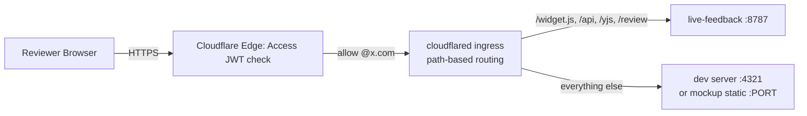
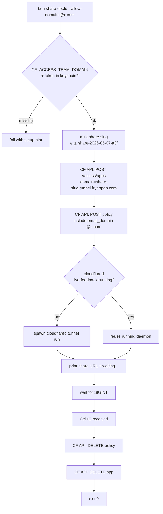
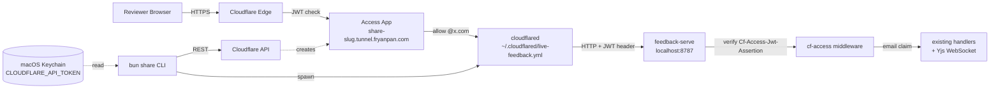

# Cloudflare Access Share — Plan

**Status:** Draft, awaiting Bryan sign-off (2026-05-06) **Reverses:** `docs/product/decisions.md:53` (2026-04-19 — "no public tunnels") **Driver:** External-team review of any of the plugin's three review surfaces — markdown docs, interactive mockups, and live dev servers — for `@partner-org.example` over a 72h window. Tailscale/LAN model doesn't reach external reviewers.

## Relation to today's review flow

Sharing is **purely additive** — it wraps the existing review surfaces in a public, gated URL without changing how agents create reviews today. Significant overlap with the current flow:

| Surface                                     | Today (private review)                                       | With share (public, gated)                                   |
| ------------------------------------------- | ------------------------------------------------------------ | ------------------------------------------------------------ |
| Markdown doc                                | Agent: `create_review_doc(docId, path)` → reviewer opens `mac-mini.tailb53801.ts.net:8788/review/<docId>` over Tailscale/LAN | Same `create_review_doc`. Plus `bun share doc <docId>` → reviewer opens `share-<slug>.tunnel.fryanpan.com/review/<docId>` over the public internet, gated by Access. |
| Interactive mockup (HTML file or directory) | Agent embeds widget `<script>` in the HTML → reviewer opens it locally or via static server on Tailscale/LAN | Same widget embed. Plus `bun share mockup <path> --doc <docId>` → spawns a local static server, tunnels mockup + widget through one gated origin. |
| Live dev server                             | Agent embeds widget `<script>` in dev site → reviewer opens dev server on Tailscale/LAN | Same widget embed. Plus `bun share site http://localhost:4321 --doc <docId>` → tunnels dev origin + widget through one gated origin. |

**Key insight:** the share command is the *publishing* layer in front of review surfaces. It does not replace `create_review_doc` or the widget embed — those continue to be the canonical "make this reviewable" steps. Agents pick whether to publish per share, or stay on the private-by-default flow.

**The dev-server / mockup wrinkle.** The widget JS, REST API, and Yjs WebSocket all live on `localhost:8787` (live-feedback server) while the dev/mockup origin runs on a different port (e.g. `:4321` for Vite/Astro, `:5173` for default Vite, ad-hoc for Bun static). We use **path-based ingress rules** in `live-feedback.yml` so a single tunnel hostname routes `/widget.js`, `/api/*`, `/yjs/*`, and `/review/*` to `:8787`, and everything else to the dev/mockup origin. One Access app, one URL, one login — covers both surfaces without CORS pain.



Implications for the share MCP tools (refines Components & interfaces below):

- share_doc(docId, allowDomain[], ttl) — markdown only; no extra origin to expose.
- share_site(url, docId, allowDomain[], ttl) — adds path-based ingress for <url> as the catch-all origin.
- share_mockup(path, docId, allowDomain[], ttl) — same as site but auto-spawns a Bun static server over <path> (file or directory) and uses that as the catch-all origin. Convenience for mockups not already running.
- All three accept the same args. Lifecycle is TTL-based (default 72h), with unshare(shareId) for early teardown and list_shares() for audit. cloudflared runs as a launchd-managed daemon — no foreground bun process required. Underlying logic lives in packages/server/src/share/, exposed via three entrypoints: MCP tools (primary, agent-driven), bun share CLI (thin wrapper for humans), and a /feedback-share slash command. User flows Three parallel flows. Each starts with the existing private review (no change), then the agent layers `share_*` on top when the user asks for external review. Flow A — Markdown doc *User:* "Draft me a plan for X and let me review."*Agent:* writes `docs/.../x-plan.md`, calls `create_review_doc(docId='x-plan', path=...)`, replies with private URL.*User:* reviews privately on Tailscale, comments. Agent applies edits.*User:* "Send to appdev for a 72h review."*Agent:* reads `.claude/live-feedback.json` for the configured allowDomains, calls `share_doc(docId='x-plan', allowDomain=['@partner-org.example'], ttl='72h')`. Returns share URL.*External reviewer:* clicks URL → Cloudflare Access login → email-OTP → editor → comments. Agent watches via the same `watch_doc(docId)`.After 72h: Access app auto-expires; URL stops working. Or agent calls `unshare(shareId)` for early teardown. Flow B — Live dev server *User:* "Spin up the new screen, I want to look."*Agent (or user):* runs the dev server (e.g., `npm run dev` on `:4321`). Widget already embedded in the dev site code (one-time setup via `live-feedback:embedding-widget` skill).*User:* opens the dev site over Tailscale, comments via the floating widget. Agent watches.*User:* "Share this with appdev for QA."*Agent:* reads `.claude/live-feedback.json`, calls `share_site(url='http://localhost:4321', docId='screen-review', allowDomain=['@partner-org.example'], ttl='72h')`.*External reviewer:* clicks URL → Access login → sees dev site with widget → comments anchor to elements just like locally.Path-based ingress under the hood routes `/widget.js`, `/api/*`, `/yjs/*`, `/review/*` to `:8787`; everything else to `:4321`. One origin, no CORS. Flow C — Static mockup *User:* (or agent) authors `mockup.html` with the widget pre-embedded.*Agent:* calls `share_mockup(path='/path/to/mockup.html', docId='mockup-review', allowDomain=['@partner-org.example'], ttl='72h')`.*MCP server:* spawns a tiny Bun static server over the file's directory on a random local port, registers the ingress rule, creates the Access app.*External reviewer:* clicks URL → Access login → sees mockup → widget connects to live-feedback for storage.*User:* watches the same comment stream via `watch_doc('mockup-review')`. **Common bits across all three:** The "make this reviewable" step is **separate** from share — `create_review_doc` / widget-embed runs first; `share_*` is the publishing layer on top.Lifecycle is **TTL-based**, not process-tied. Default 72h. `unshare(shareId)` revokes early. `list_shares()` audits.Reviewer experience is identical across surfaces: hit URL → email-OTP login → review surface with widget → comments flow back to the agent.Agent watches via the same `watch_doc(docId)` regardless of whether comments came from a Tailscale visitor or a public-share visitor. Per-repo config: `.claude/live-feedback.json` Each repo configures its own external-review team. Schema add: {
  "share": {
    "defaultAllowDomains": ["@partner-org.example"],
    "defaultTTL": "72h"
  }
} **Pattern:** the agent reads its own repo's `.claude/live-feedback.json` and passes `allowDomain` + `ttl` to the MCP tool explicitly. The MCP tool stays repo-agnostic — it validates `allowDomain` is non-empty but doesn't read repo state itself. If a repo has no `share` config, the agent **must ask the user** before sharing — never default to "anyone." The `live-feedback:share` skill instructions enforce this. Multiple teams per repo: `defaultAllowDomains` is an array; agent can also override per call. Architecture: MCP-first + cloudflared as launchd **Primary surface: MCP tools.** The live-feedback MCP server (already running on the Mac Mini) hosts `share_doc`, `share_site`, `share_mockup`, `list_shares`, `unshare`. State (active shares, TTLs) lives in a JSON registry on disk, swept by a 10-min interval timer for expired shares.**cloudflared as launchd daemon.** One-time `cloudflared service install` on the Mac Mini ensures the `live-feedback` tunnel runs forever (matches the existing pattern of `notion-bridge` and `sentry-bridge`). No bun process owns its lifecycle.**Thin CLI** (`bun share`) and **slash command** (`/feedback-share`) call into the same `packages/server/src/share/` module the MCP tools do. Three entrypoints, one engine.**Tunnel ingress reload.** When MCP tools register a new share, they update `~/.cloudflared/live-feedback.yml` with the new path-based rule and SIGHUP the daemon (cloudflared hot-reloads on config change).

## Measurable outcomes

1. `bun share <docId> --allow-domain @partner-org.example` brings up a public URL of the form `https://share-<slug>.tunnel.fryanpan.com/review/<docId>` within 10 seconds.
2. Visiting that URL from an unauthenticated browser redirects to a Cloudflare Access login page (email-OTP by default).
3. Login with an `@partner-org.example` email succeeds and lands the reviewer on the live-feedback editor.
4. Login with any other email domain is rejected by Cloudflare with the standard Access deny page.
5. A direct request to `localhost:8787/review/<docId>` (bypassing CF) with no `Cf-Access-Jwt-Assertion` header returns `401 Unauthorized` *when* `CF_ACCESS_TEAM_DOMAIN` is set in the server's env.
6. `Ctrl+C` on the `share` process deletes the Access app + policy in Cloudflare and exits cleanly. Re-running `bun share orphans` lists and cleans any stale apps.
7. Yjs WebSocket sync, comment creation, and resolution work end-to-end through the gated URL on both desktop and mobile.

## Key workflow



## Alternatives evaluated

| Approach                                                     | Effort        | Risk                                                         | Usability                                             | Impact                                                       |
| ------------------------------------------------------------ | ------------- | ------------------------------------------------------------ | ----------------------------------------------------- | ------------------------------------------------------------ |
| **(A) Cloudflare Access via API + existing wildcard tunnel** | M (2-3 days)  | Low — CF Access is mature, API is stable, tunnel infra exists | High — `bun share <doc>` is one command               | High — unblocks every external-team review use case          |
| **(B) Tailscale Funnel + add reviewers to tailnet**          | S (~1 day)    | Medium — requires tailnet onboarding for each external team, awkward to revoke | Low — onboarding friction for non-technical reviewers | Low — only works for trusted long-term collaborators         |
| **(C) Custom auth in feedback-serve (basic auth or magic link)** | L (1-2 weeks) | High — rebuilds CF poorly, adds attack surface, magic-link delivery infra | Medium — fewer setup steps for end users              | Medium — works without CF but ties us to maintaining auth code |

(A) is the obvious pick given existing infra (cert.pem, wildcard tunnel) and the stated 72h-external-team use case.

## It System design



### Components & interfaces

| Component             | Path                                          | Inputs                                                       | Outputs                                                      |
| --------------------- | --------------------------------------------- | ------------------------------------------------------------ | ------------------------------------------------------------ |
| `share` CLI           | `scripts/share.ts`                            | `<docId\                                                     | setId>`, `--allow-domain` (repeatable), `--port`, `--name <slug>` |
| Cloudflare API client | `scripts/lib/cf-api.ts`                       | API token, account ID, team domain                           | typed `createApp`, `createPolicy`, `deleteApp`, `listApps`   |
| Keychain reader       | `scripts/lib/keychain.ts`                     | service name (`cloudflare-api-token`)                        | token string or throws with install hint                     |
| JWT verify middleware | `packages/server/src/middleware/cf-access.ts` | env: `CF_ACCESS_TEAM_DOMAIN`, `CF_ACCESS_AUD`; req header `Cf-Access-Jwt-Assertion` (or `CF_Authorization` cookie) | sets `req.cfAccessEmail`; returns 401 on bad/missing JWT when env is set; no-op when env unset (local dev) |
| JWKS fetcher          | `packages/server/src/middleware/jwks.ts`      | team domain                                                  | cached JWKS, 1h TTL, network failure surfaces as 503 not 401 |
| Server wiring         | `packages/server/src/server.ts`               | —                                                            | call middleware before route dispatch when env present       |
| Tunnel config         | `~/.cloudflared/live-feedback.yml`            | (one-time edit)                                              | route `*.tunnel.fryanpan.com → localhost:8787` instead of placeholder `:9900` |
| Decision log update   | `docs/product/decisions.md`                   | new entry dated today                                        | "Public sharing via Cloudflare Access — re-opens 2026-04-19 decision for explicit-share use case only; default access remains Tailscale/LAN" |

### Subdomain pattern

`share-<YYYY-MM-DD>-<3-char-suffix>.tunnel.fryanpan.com`. Example: `share-2026-05-07-a3f.tunnel.fryanpan.com`. Suffix from crypto.randomBytes(2).toString('hex').slice(0, 3) — short enough to type, low collision risk. Same subdomain pattern serves all three surfaces (markdown, mockup, dev server) — only the tunnel ingress rules differ.

User can override with `--name <slug>`: `bun share <doc> --name partner-org-mockup` → `share-partner-org-mockup.tunnel.fryanpan.com`.

### Bryan's one-time setup (manual; agents can't do)

1. **Enable Cloudflare Access.** Dashboard → Zero Trust → Access. On first visit you pick a team subdomain (e.g., `fryanpan.cloudflareaccess.com`). **This is permanent.** Accept ToS, pick the default email-OTP IdP. ~3 min.
2. **Find the Account ID.** Right sidebar of any zone page. Save it; we'll wire it into env or a config file.
3. **Create a scoped API token.** Dashboard → Profile → API Tokens → Create Custom Token:

   - Permissions: `Account → Access: Apps and Policies → Edit`    - Account Resources: include the specific account    - TTL: 1 year (rotate annually)

1. **Stash in Keychain** (the `share` CLI will print this exact command on first run if missing):

   ```    security add-generic-password -a "$USER" -s "cloudflare-api-token" -w "<paste-token>"    ```

1. **Edit ****`~/.cloudflared/live-feedback.yml`** to point the wildcard at port 8787 instead of the placeholder 9900 (or the share script can do this on first run with a confirm prompt — TBD during implementation).

### Server env (set on the live-feedback host)

| Var                     | Source                               | Purpose                                                      |
| ----------------------- | ------------------------------------ | ------------------------------------------------------------ |
| `CF_ACCESS_TEAM_DOMAIN` | e.g. `fryanpan.cloudflareaccess.com` | JWKS endpoint base + issuer claim check                      |
| `CF_ACCESS_AUD`         | per-app AUD tag from CF              | audience claim check (the share CLI writes this to a server-readable config when it creates the app) |

When unset → middleware is a no-op (local dev unchanged). When set → all routes require valid JWT.

## Execution strategy

Single linear pass via `superpowers:executing-plans`. Three commits:

**Commit 1 — JWT verify middleware**

- `packages/server/src/middleware/cf-access.ts` + `jwks.ts`
- `packages/server/src/server.ts` wiring (env-gated)
- Unit tests with mock JWKS server (vitest + msw or a tiny in-process HTTP stub)
- No behavior change when `CF_ACCESS_TEAM_DOMAIN` is unset → existing tests pass unchanged

**Commit 2 — share CLI + CF API client + Keychain reader**

- `scripts/share.ts`, `scripts/lib/cf-api.ts`, `scripts/lib/keychain.ts`
- `package.json` script: `"share": "bun run scripts/share.ts"`
- Unit tests for CF API client against fixture responses; lifecycle test for slug → URL → cleanup with the API client mocked

**Commit 3 — docs + decision log update**

- New `docs/product/sharing.md` with the prereq + usage walkthrough
- `docs/product/decisions.md` new entry overriding the 2026-04-19 stance for the share use case
- README.md note pointing at sharing.md
- `.gitignore` confirm: nothing token-shaped should ever land

## Testing strategy

- **Unit (CI):** middleware against mock JWKS, CF API client against fixtures, slug minter, env-unset no-op path.
- **Integration (manual, one-off):** Bryan runs `bun share <real-docId> --allow-domain @partner-org.example`, opens the URL in incognito with a non-`@partner-org.example` email (expect deny), then with an `@partner-org.example` email (expect allow), comments, resolves, Ctrl+C, confirms CF dashboard shows app deleted.
- **Smoke (post-ship):** add `bun share doctor` that checks: cloudflared installed, cert.pem present, API token in Keychain, Account ID set, tunnel reachable. Runs in <5s.

## Risks & mitigations

| Risk                                         | Likelihood | Mitigation                                                   |
| -------------------------------------------- | ---------- | ------------------------------------------------------------ |
| API token leaks in logs / commits            | Low        | Keychain only; never logged; explicit gitignore; security-posture.md rule 2 enforced |
| Process crash leaves orphan Access apps      | Medium     | `bun share orphans` lists and deletes apps prefixed `share-*` not seen in current process registry. Manual cleanup also possible via dashboard. |
| Wildcard tunnel collides with future use     | Low        | The single rule today routes everything to one port; if we need multiple ports later, switch to per-share specific ingress rules in the same yml |
| JWT verification breaks local dev            | Low        | Middleware is env-gated; unset env = no-op                   |
| Cloudflare Access free-tier limit (50 seats) | Low        | One seat per *unique reviewer email* per 30 days. For a 72h external-team share, well under the limit |
| Reviewers confused by Access login           | Medium     | Document the email-OTP flow in invite messages; add screenshot to `docs/product/sharing.md` |

## Out of scope (explicit non-goals)

- Persistent shares that survive process restart → option (B) from lifecycle discussion, deferred.
- Per-invite policies (named-email allowlists) → option (C), deferred.
- Auto-rotating subdomains → not needed; share lifecycle is short.
- DNS automation via API → unnecessary; wildcard tunnel handles it.
- Anything other than email-OTP IdP → can be added later by changing the Access app config in the dashboard, no code change.
