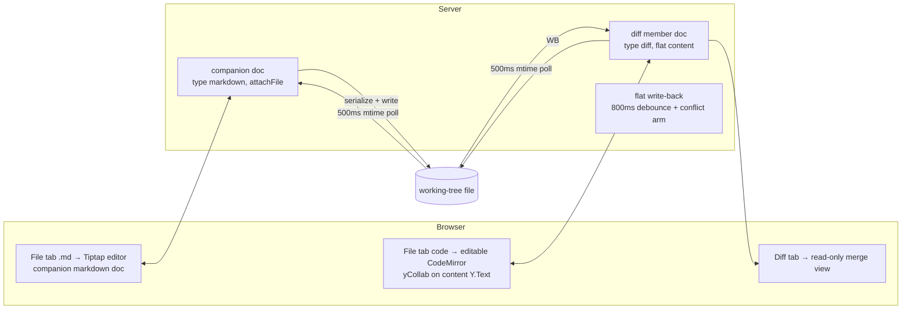
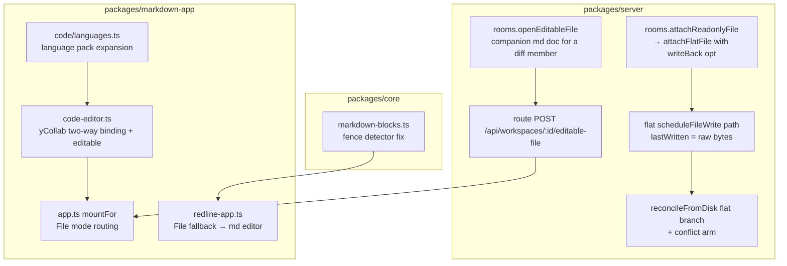

# Diff-Review Live Editors — Plan

Bryan's requests (2026-08-03, via Quick Build review + direct):

1. "In a file view of a multi-file diff for a markdown file, I expect the
   usual markdown editor where I can also make live edits."
2. "I also want source code files editable (xml, java, kt, json, etc.) with a
   collaborative live edit interface like the default markdown editor. These
   should support syntax highlighting for file types typically found in an
   Android, iOS, or web frontend or backend project."
3. "Redline view is pretty broken for a markdown file with mermaid diagrams —
   I just get big blocks of code instead of the markdown text."

## Measurable outcomes

- [ ] In a **working-tree** diff review, opening the File tab of a changed
      `.md` file shows the full Tiptap markdown editor (mermaid renders as
      diagrams), edits are live-collaborative, and they land in the
      working-tree file within ~1s.
- [ ] In a **working-tree** diff review, the File tab of a changed source
      file (`.kt`, `.java`, `.xml`, `.json`, …) is an editable CodeMirror
      bound through Yjs (`y-codemirror.next`): two browsers see each other's
      keystrokes, edits write back to the working-tree file within ~1s, and
      the Diff tab re-renders to include them.
- [ ] Syntax highlighting covers Android/iOS/web project types: Kotlin, Java,
      XML, JSON, Groovy/Gradle, Swift, Objective-C, JS/TS, HTML, CSS/SCSS,
      YAML, Python, Ruby, shell, properties, and markdown.
- [ ] **Pinned** (`target` set) diff reviews stay read-only everywhere — no
      write-back, no editable surfaces.
- [ ] Redline renders a markdown file containing mermaid diagrams (fenced,
      indented-in-list, or `~~~`-fenced) as prose + diagrams, never as
      escaped pseudo-code. Pinned by regression tests including the
      `mermaid-fence-repro` case.
- [ ] A concurrent external write to a file a reviewer is editing in the
      File tab does NOT silently discard the reviewer's edits: the flat
      reconcile gains the same conflict arm as prose (backup losing version
      to `clobber-backups/`, keep live edits, record `syncError`).
- [ ] Existing diff-tab comment threads keep resolving (anchor space for
      `type:'diff'` docs is unchanged).
- [ ] Verified at 430px wide (design-mobile.md) for the new editable File
      surfaces; markdown-app bundle size delta reported in the PR.

## Key workflow

The markdown path deliberately reuses the whole existing prose sync stack: a
companion `type:'markdown'` doc bound to the same working-tree file. Its
write-back flows through disk into the diff member's existing poll, so the
Diff tab re-renders within ~1s of a File-tab edit — same loop the agent's
own edits already use.

## Alternatives considered

| Approach | Effort | Risk | Usability | Impact |
|---|---|---|---|---|
| **A. Flip changed `.md` members to `type:'markdown'`** | M | **High** — `contentKind` flips to prose, silently rewiring `get_doc`, `create_thread`'s flat find path, diff-tab base fetch, and orphaning every existing content-offset thread | Good | Breaks agent API + old threads |
| **B. Dual surface in one ydoc** (flat `content` + prose fragment, kept in sync) | H | **High** — two sources of truth per doc; every edit path must dual-write | Good | Sync bug factory |
| **C. Companion doc for `.md` + editable flat for code** (chosen) | M | Low — diff member docs unchanged; markdown reuses `attachFile` wholesale; only genuinely new machinery is flat write-back, needed for code regardless | Good — full editor for md, in-place editing for code | No API/thread breakage |

C wins because the only new sync machinery it needs (flat write-back +
conflict arm) is machinery requirement 2 forces anyway, and everything else
is reuse. Decision logged in `docs/product/decisions.md`.

## System design

### Interfaces

| Interface | Change |
|---|---|
| `rooms.attachReadonlyFile(docId, path)` | Becomes `attachFlatFile(docId, path, { writeBack })`; read-only alias kept. `writeBack: true` registers a `content.observe` write-back observer (origin-guarded like prose), raw-bytes `lastWritten`, shared mtime pre-write guard. |
| `bindDiff` (working-tree mode, non-deleted files) | Attaches with `writeBack: true` for changed members. Pinned mode unchanged (no binding at all). |
| `reconcileFromDisk` flat branch | `conflict` → `backupExternalVersion` + keep live + reassert + `syncError`, mirroring prose. |
| `rooms.openEditableFile(workspaceId, relPath)` (new) | Returns (creating if needed) a companion `type:'markdown'` doc bound via `attachFile` to the same working-tree file, docId `${workspaceId}:edit~${relPath}` — distinct from the diff member id. Traversal-guarded like `openContextFile`. Route + client fetch. Working-tree reviews only; 409 for pinned. |
| Client `DocMeta` | Widened with `diffTarget` presence flag (pinned vs live) so the client knows whether editing is allowed. |
| `mountFor` / `redline-app` File fallback | `.md` diff member + File mode → mount markdown editor over the companion doc. Code/diff + File mode + working-tree → editable CodeMirror; pinned → read-only as today. |
| `code-editor.ts` | Replace one-way `content.observe` whole-doc mirror with `yCollab(content, awareness)`; drop `readOnly` flags when editable; add history/keymap (`@codemirror/commands`). |
| `languages.ts` | Add: xml, html, css/scss, yaml, markdown (already-declared pack), kotlin (keep clike), swift/objective-c/groovy-gradle/ruby/shell/properties via `@codemirror/legacy-modes`. New deps: `@codemirror/lang-xml`, `-html`, `-css`, `-yaml`. |
| `markdown-blocks.ts` | Fence detector: allow up to 3 leading spaces + list-indented fences, `~~~` fences, matching-length closers. |

### Threads and anchors

- Diff-tab + code File-tab threads: unchanged — content-offset anchors into
  the diff member's `Y.Text`.
- Markdown File-tab threads: prose anchors in the companion doc (standard
  markdown-doc behavior). Companion docs join the same `workspaceId`, so
  they appear in the workspace thread stack.
- No anchor conversion between spaces is attempted (map §6.1) — the two
  surfaces are separate docs by design.

## Execution strategy

Ordered commits in ONE PR (cohesive feature):

1. **Fence detector fix** (`markdown-blocks.ts`) + regression tests incl.
   mermaid-in-list and `~~~`. Fixes Bryan's redline complaint standalone.
2. **Language expansion** (`languages.ts` + new deps) incl. `.md`
   highlighting. Report bundle delta.
3. **Server: flat write-back + conflict arm** (`attachFlatFile`,
   `scheduleFileWrite` generalization, flat conflict handling) + tests
   mirroring `sync-clobber.test.ts`.
4. **Client: editable CodeMirror** (yCollab, editable File mode for
   working-tree members, edit affordance in chrome) + tests for the two-way
   binding.
5. **Server + client: companion markdown doc** (`openEditableFile`, route,
   File-tab mount) + e2e test through the real route.
6. **Mobile pass** at 430px + bundle-size report.

Sequential (each step builds on the last); no parallel agents needed.
Risks: (a) yCollab + the merge-view compartment interplay — mitigated by
keeping Diff mode read-only exactly as-is; (b) double-writer on `.md`
(companion prose write-back + member flat write-back) — mitigated by NOT
enabling `writeBack` for `.md` members (their edits flow through the
companion; the member stays disk→doc only); (c) bundle growth from language
packs — static imports by design (build has `splitting:false`), measure and
report.

## Testing & deployment

- Unit: fence detector cases; languages map; flat write-back debounce/
  conflict/backup; companion-doc idempotency + traversal guard + pinned 409.
- HTTP-level: one test through the real route per new param (learnings rule).
- E2E on the deployed server against the live Quick Build review
  (`quickbuild~core~README.md`) and the `mermaid-fence-repro` doc; ping the
  Quick Build peer to verify, then delete the repro doc.
- Deploy: standard — merge, pull on the box, `bun run build:all`,
  `launchctl kickstart`. markdown-app dist is rebuilt at deploy (untracked);
  no MCP schema changes expected (no new agent tools), so no bundle rebuild
  needed unless a tool is added.
