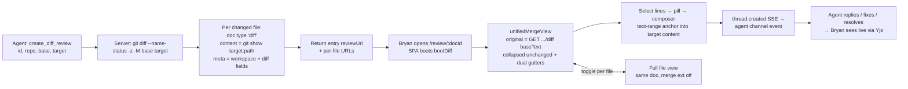
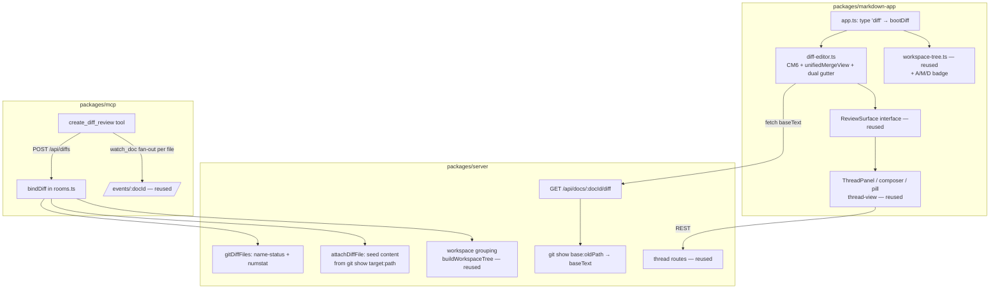

# Plan: Git diff review — PR-style diff surface with live line comments

> **Revision (2026-07-09, after Bryan's spec correction):** the primary mode
> is now **working-tree review** — `create_diff_review(repo, base)` diffs base
> against the folder as it is NOW (uncommitted + untracked included), each doc
> binds to the live file (code-doc mtime poll), and the reviewer's diff
> re-renders within ~1s as the agent edits. Comments ride along via the
> existing snippet auto-reanchor; a vanished line orphans the thread into the
> existing outdated-comments flow. The original pinned two-hash mode remains
> available by passing `target`. "Immutable content" claims below apply to
> pinned mode only.

## Context

Bryan wants to review git diffs (repo path + base..target hashes) through live-feedback instead of GitHub: a PR-style diff UI grouped by file, with hunks and old/new line numbers, live line-anchored comment threads that the producing agent watches and resolves, and a per-file toggle between the diff and the whole file at the target hash (commentable in both views). Driver: four real ADFA diffs to dogfood immediately (smallest: 1 file +33/−6; largest: ~65 files +4303/−1367).

**Measurable outcomes**

1. `create_diff_review(reviewId, repoPath, baseRef, targetRef)` MCP tool returns a review URL; opening it renders the diff grouped by file with hunks and old/new line numbers. Yes/no.
2. Selecting lines in the diff view creates a comment thread; the watching agent receives it as a `<channel source="live-feedback">` event and can `post_reply`/`resolve_thread` with zero changes to those tools. Yes/no.
3. Each file toggles between diff view and whole-file-at-target view; comments can be created in both views and the same threads show in both. Yes/no.
4. The file tree shows every changed file with per-file unresolved-comment counts and added/modified/deleted status. Yes/no.
5. The ~65-file Maps diff binds and navigates without melting the server (per-file docs keep payloads bounded). Yes/no.
6. Works at 430px wide per docs/product/design-mobile.md. Yes/no.

**Non-goals (this milestone):** commenting on *deleted* lines (they're render-widgets, not target text — see Limitations), side-by-side split view, PR metadata (commit messages, review approval), editing code from the review surface (read-only like `code` docs).

## Key insight driving the design

Base and target are **immutable hashes**, so the review surface is static — the anchor-stability problem that dominates markdown review disappears. What we need from the existing stack is thread storage + CRDT sync + SSE watch events, all of which are already doc-kind-agnostic. We anchor every comment to the **full file at the target hash** stored in the standard `content` Y.Text (exactly like `code` docs), and treat the diff as a *rendering* over that text: `@codemirror/merge`'s `unifiedMergeView` takes the base text as `original` and displays deleted chunks as widgets above the new text. Diff view and full-file view index the **same document**, so one anchor system serves both and the toggle is a CodeMirror reconfiguration.

## Key workflow

## Alternatives considered

| Approach | Effort | Risk | Usability | Impact |
|---|---|---|---|---|
| **A. Per-file `diff` docs in a workspace; content = file@target; diff = CM `unifiedMergeView` render (chosen)** | Medium — new doc kind cloning `code`, one new editor module, one REST endpoint | Low — every hard piece (anchors, threads, sync, tree, mobile) is reused verbatim; merge addon is first-party CodeMirror | File tree + per-file pages; familiar unified diff; toggle is instant (same doc) | Full feature incl. scale test |
| B. Single aggregate doc per review; server-parsed unified diff text as content; custom DOM renderer | High — new multi-file surface, new anchor coordinate space, no reuse of code surface or workspace tree | High — anchors into diff text break on any re-render decision; full-file toggle needs a second content source and second anchor space | GitHub-like single page, but 65-file page is heavy on a phone | Same feature, worse foundations |
| C. Server-rendered static diff HTML + inject the feedback widget (element anchors) | Low-medium | Medium — element anchors on generated DOM are brittle; no Yjs content doc means `get_doc`/thread snippets degrade; second thread UX diverges from code surface | Comments feel bolted-on; no full-file toggle for free | MVP-ish, dead-ends the roadmap |

A wins: it's "bind_folder where the file list comes from `git diff` and the bytes come from `git show`," and the whole review stack already works on that shape.

## System design

### Interfaces

| Interface | Shape | Notes |
|---|---|---|
| MCP `create_diff_review` | `(reviewId?, repoPath, baseRef, targetRef, title?, maxFiles?, subscribe?)` → `{reviewId, entryUrl, files[{relPath, status, additions, deletions, reviewUrl, docId}], skipped[]}` | Mirrors `bind_folder`; auto-watches each file doc; agent shares `entryUrl` (first changed file) |
| `POST /api/diffs` | body `{reviewId?, repo, base, target, owner, title?, maxFiles?, producedBy?}` → same as above | New route; validates repo + refs via `git rev-parse --verify <ref>^{commit}` (reject refs starting `-`), `spawnSync` arg arrays only |
| `rooms.bindDiff(opts)` | Creates per-file rooms: docId `` `${reviewId}:${relPath.replaceAll('/','~')}` `` (hash fallback >100 chars), `type:'diff'`, meta `{workspaceId: reviewId, relPath, workspaceRoot: repo, diffBase, diffTarget, diffStatus, diffOldPath?, diffAdditions, diffDeletions, title}` | Idempotent (deterministic docIds — re-bind preserves threads); guardrails: maxFiles 300, >512KB and binary → skipped |
| `attachDiffFile` | Seeds `content` Y.Text from `git show target:path` once (empty-fragment gate) | No mtime poll, no write-back — content immutable; `reparse_from_disk` re-runs git show |
| `GET /api/docs/:docId/diff` | → `{baseText, status, oldPath, base, target, additions, deletions}` | Computed on demand (`git show base:oldPath`); added files → `baseText:''`; failure → 200 with `baseText:null` + error note (full-file view still works from ydoc) |
| `DocType` | `+ 'diff'` in core types; `DocMeta` + the `diff*` fields above | Thread through `initDocMeta`/`readDocMeta` like `workspaceId` was |
| Type-branch sites in rooms.ts/server.ts | `hydrateFromDisk` (no re-attach needed — content persisted in .ydoc), `getDoc` (content block like code), `wireEvents` (code path; reanchor sweep is harmless no-op on immutable content), `withReviewUrl` (`/review/:docId`), `POST /api/docs` (reject bare `type:'diff'` — must come via `/api/diffs`) | Clone the `=== 'code'` branches |
| `bootDiff` (SPA) | `app.ts:97` gains `if (docType === 'diff')`; shares code-app wiring (ThreadPanel, composer, pill, mobile thread-view, tree) via extracted common boot or parallel module | Refactor `code-app.ts` minimally to share rather than fork |
| `diff-editor.ts` | Implements `ReviewSurface` (`getSelectionRel/resolveRel/scrollToPos/pulseRange/setThreadRanges/destroy`); CM6 read-only + `unifiedMergeView({original: baseText, mergeControls:false, syntaxHighlightDeletions:false, collapseUnchanged:{margin:3}, gutter:true})` in a `Compartment`; toggle = reconfigure to `[]`; dual old/new line-number gutter computed from `getChunks(state)` | Anchors identical in both views (same doc offsets); language ext from existing `languages.ts` |
| Anchor | Existing `text-range` into `content`, `snapToLines` — unchanged wire shape | Zero thread/anchor code changes |
| Tree | `buildWorkspaceTree` file nodes gain optional `status/additions/deletions` passthrough; UI renders A/M/D badge + +/− counts | Only additive |
| Plugin skill | New `packages/plugin/skills/diff-review/SKILL.md`; extend MCP `instructions` string (mcp.ts:83) + `editing-review-docs` note + plugin README bullet | The client-facing deliverable |

### Edge cases

- **Renames** (`-M`): `diffOldPath` stored; baseText from `base:oldPath`; tree shows `R` badge with old→new.
- **Added files**: `baseText:''` → whole file renders as insertion; commentable everywhere.
- **Deleted files**: doc content is empty; render base text via merge view (everything a deletion widget). Comments can't anchor → panel shows a per-file note; MVP acceptable (none in the 4 dogfood diffs matter).
- **Deleted lines in modified files**: rendered as widgets; not selectable → not commentable in MVP. Documented in skill ("comment on the adjacent kept line"). Follow-up idea: click-a-deletion → composer anchored to the following target line quoting the deleted text.
- **Binary / >512KB**: skipped with reason, listed in bind response and tree.
- **Repo disappears later** (worktree cleaned up): full-file + threads still work (ydoc persisted); only the diff endpoint degrades → banner + auto-fallback to full-file view.

## Execution strategy

Single session, this worktree, one PR on `feature/diff-review` (per "one big PR for cohesive features"), ordered commits:

1. **core**: `DocType 'diff'` + `DocMeta` diff fields + schema init/read (+ tests).
2. **server**: git helpers (`gitDiffFiles`, `gitShowFile`, ref validation) + `bindDiff` + `attachDiffFile` + type branches + `POST /api/diffs` + `GET /api/docs/:docId/diff` + `withReviewUrl` (+ server tests incl. a fixture git repo built in-test).
3. **SPA**: `@codemirror/merge` dep; `diff-editor.ts` + dual gutter + `bootDiff` + toggle UI + tree badges + styles (mobile per design-mobile.md; the CM scroller owns horizontal overflow).
4. **mcp + plugin**: `create_diff_review` tool + instructions + rebuild bundled `packages/plugin/mcp/index.js`; `skills/diff-review/SKILL.md` + README.
5. **verification + fixes** as separate commits.

Sequential (each layer feeds the next); no subagent fan-out needed for implementation. Risk notes: dual-gutter is the only genuinely new UI machinery — validate `getChunks` line math early with the ADFA-3945 diff; `collapseUnchanged` + widgets vs. comment-pill positioning needs a real-browser pass.

## Testing & verification

- **Unit/server**: fixture git repo (init, two commits) in test tmp; `bindDiff` file list/status/rename/guardrails/idempotency; diff endpoint baseText + added/deleted cases; docId encoding; reviewUrl. Core: schema fields round-trip. Pure line-number mapping helper (chunks → old/new gutter numbers) unit-tested.
- **E2E (isolated)**: run `bun packages/server/src/bin.ts --port 8891 --data-dir <scratchpad>/lf-diff-data` from THIS worktree (never :8787). Create a diff review for ADFA-3945 (`5273a7717..cb178fa02`), open in Chrome: verify per-file render, hunks, old/new numbers, line comment round-trip (create in browser → SSE event → `post_reply` → appears live → `resolve_thread`), toggle both views + comment in full-file view, 430px pass.
- **Scale**: Maps diff (`e8c6e64..37ea03a`, ~65 files) binds < a few seconds, tree navigates, biggest file renders.
- Full `bun run test` + `typecheck` + `lint`; build all bundles.
- After merge: production server restart is Bryan/Team-Lead's call (isolation rule).
