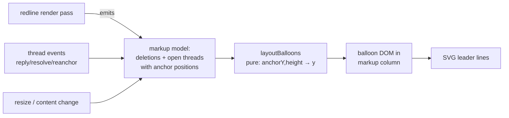

# Redline Balloons — Word-style markup for deletions and comments

**Direction (Bryan, 2026-08-03):** use Word's balloon model for deletions and comments in the markdown redline view.

## Goal

The redline view should read like the *final* document, with markup pushed to the side the way Word's "All Markup with balloons" does: insertions inline in change color, **deletions and comments in a right-margin markup area as balloons**, each connected to its anchor by a leader line. Today's view interleaves struck-through deletions with the text and underlines whole added files, which makes the document itself hard to read — the balloon model keeps the prose clean while every change stays visible.

## Measurable outcomes

1. On screens ≥1100px, deleted content no longer renders struck-through inline; each deletion appears as a balloon in the right margin, vertically aligned to its anchor, with a leader line. Y/N
2. Open comment threads appear as balloons in the same margin, stacked without overlap; reply / resolve / re-anchor work from the balloon. Y/N
3. Insertions render inline in change color; a 100%-added file renders clean with a "New file" banner instead of whole-document markup. Y/N
4. At 430px there is no horizontal scroll: the markup column disappears, deletions collapse to a tappable inline marker that opens the deleted content in the bottom sheet, and comments keep the existing pill/drawer flow. Y/N
5. No agent-facing API changes; thread anchors and the diff member model are untouched. Y/N

## Alternatives

| Approach | Effort | Risk | Usability | Impact |
|---|---|---|---|---|
| **A. Reserved markup column + measured balloon stacking (recommended)** — grid column ~300px, balloons absolutely positioned by a pure layout pass, SVG leader lines | M | M — anchor Y measurement must re-run on render/resize/scroll-height changes | Word-familiar; prose stays clean | High |
| B. Free-floating cards over the content (no reserved column) | S | H — overlap chaos on dense edits; occludes prose | Poor on real docs | Low |
| C. Balloons for comments only, deletions stay inline | S | L | Half-measure; deletions are the main noise source | Medium |

B fails on any paragraph with several edits. C doesn't deliver what was asked. A is what Word actually does and its one hard part (stacking) is a small pure function we can unit-test.

## Key workflow

## System design

| Component | Responsibility | Interface |
|---|---|---|
| `redline-editor.ts` (existing) | Keep computing ins/del decorations; **stop rendering deletions inline on wide screens** — instead expose the deletion list | `getDeletions(): Array<{ pos, deletedMarkdown }>` |
| `balloon-layout.ts` (new, pure) | Word's stacking: sort by anchor Y, push down to avoid overlap, minimal displacement | `layoutBalloons(items: {anchorY, height}[], gap): number[]` |
| `markup-margin.ts` (new) | Owns the margin column: renders deletion + comment balloons, measures anchor Y from the live DOM, re-layouts on render/resize, draws leader lines in one SVG overlay | `mountMarkupMargin({ editorEl, getDeletions, threads, chrome, scope })` |
| `review-chrome.ts` (existing) | Stays the owner of thread state/actions; balloons call into it (reply/resolve/re-anchor) rather than duplicating logic | unchanged API |
| CSS | `.redline-layout` grid `minmax(0,1fr) 300px` (the `minmax(0,…)` footgun from learnings); `<1100px` → single column + inline deletion markers | — |

Deletion content in a balloon renders as plain text of the deleted markdown, truncated ~6 lines with an expand toggle (Word shows "Deleted: …" the same way). Comment balloons reuse the existing thread card markup.

**Added-file case:** when `baseText` is empty, skip ins-marking entirely — clean render + "New file in this diff" banner. This kills the "everything underlined" complaint at the root.

**Mobile (<1100px):** balloons are desktop-only. Deletions render as a compact `⌫ n lines` chip at the deletion point; tapping opens the deleted content in the existing bottom drawer. Comments keep today's pill/drawer flow unchanged. (Word's phone apps make the same trade — markup collapses to markers.)

## Execution strategy

Single worktree branch `feat/redline-balloons`, one PR, ordered commits:

1. `balloon-layout.ts` + unit tests (pure, TDD).
2. Deletion-model extraction from redline-editor (+ added-file clean render) — vitest.
3. Markup column + deletion balloons + leader lines.
4. Comment balloons wired to review-chrome actions.
5. Mobile fallback (inline chips + drawer) & polish.

Risks: anchor-Y measurement across mermaid diagrams (async render changes heights — re-layout must hook mermaid completion); balloon density on heavily-edited docs (mitigate: collapse consecutive same-paragraph deletions into one balloon).

## Testing & deployment

- Unit: stacking algorithm (overlap, ordering, displacement), deletion extraction, added-file case.
- vitest DOM: deletion balloon renders with correct content; comment balloon resolve calls chrome; 430px layout class applies (jsdom can assert classes, not real layout).
- **Real-browser + 430px pass required before shipping** (design-mobile.md) — flag explicitly if the Chrome extension is unavailable and verify post-deploy on the live server.
- Deploy: standard (merge → pull → `bun run build:all` → kickstart); no server-side changes expected, so no data-migration concerns.
