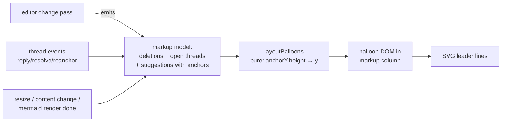

# Redline Balloons & Suggested Edits — plan

**Direction (Bryan, 2026-08-03):** use Word's balloon model for deletions and comments; make the redline view a live multi-user editor; support Word-style suggested edits — from humans *and agents*; keep the markdown editor, redline view, and raw-text surface feeling like one product.

## Goal

Reviewing a document should feel like Word with Track Changes on: the prose reads clean and final, insertions show inline in change color, and **deletions and comments sit in a right-margin markup area as balloons** with leader lines to their anchors. Today's view interleaves struck-through deletions with the text and underlines whole added files — the balloon model keeps the prose readable while every change stays visible.

The surface is not a preview: it is the live collaborative editor itself, so concurrent edits, comments, and deletions from any participant — human or agent — appear as markup while you watch. On top sits Word's proposal concept: any edit can be made outright **or** offered as a *suggestion* that stays visible-but-unapplied until accepted. Agents get all three verbs: edit outright, suggest for review, comment inline.

## The model: one editor, three lenses

There is **one markdown editor**. What differs per context is which lenses are on:

- **Clean** — the editor as it is today (File view, plain review docs). No markup.
- **Markup** — the same editor plus base-diff decorations and the balloon margin. This is "redline"; it needs a git base, so it's diff-review-only.
- **Suggesting** — an *input* mode, not a display mode: edits become attributed proposals instead of direct changes. Works on ANY markdown doc (no git base needed) and composes with either display lens.

Because the lenses share one editor, the chrome pays off everywhere: comment balloons appear on plain review docs too, and suggestions work on a plan doc like this one, not just diff reviews.

**Raw-text (code) surface parity** — same features where the idiom fits, deliberately different where code convention differs:

| Capability | Markdown editor | Code/raw-text surface |
| --- | --- | --- |
| Live multi-user editing | this plan (redline joins the already-editable File view) | ✅ shipped (yCollab File view) |
| Comments | balloons (desktop) / drawer (mobile) | line-snapped threads, existing inline flow — balloons not planned; inline is the code-review idiom |
| Deletions display | margin balloons | stays in the unified-diff idiom (inline deletion widgets are code's native balloon) |
| Display lens toggle | Markup ↔ Clean | already exists as Diff ↔ File |
| Suggested edits | Phase 2 | Phase 3 — GitHub-suggestion-style over flat text |

## Measurable outcomes

1. **Synchronous multi-user editing:** the redline surface is itself editable by multiple users at once — typing in it lands in the working tree within ~1s (via the companion doc), and concurrent edits, comments, and deletions made by other users or agents appear as live markup (insertions inline, deletions as balloons) with no reload or mode switch.
2. **Layout**
   1. On screens ≥1100px, deleted content no longer renders struck-through inline; each deletion appears as a balloon in the right margin, vertically aligned to its anchor, with a leader line.
      1. Open comment threads appear as balloons in the same margin, stacked without overlap; reply / resolve / re-anchor work from the balloon.
      2. Insertions render inline in change color; a 100%-added file renders clean with a "New file" banner instead of whole-document markup.
   2. At 430px there is no horizontal scroll: the markup column disappears, deletions collapse to a tappable inline marker that opens the deleted content in the bottom sheet, and comments keep the existing pill/drawer flow.
3. **Suggested edits:** an edit made in Suggesting mode never reaches disk until accepted; accept applies it (and it flows to the working tree), reject removes it cleanly; both work from the balloon and from MCP tools.
4. **Agent verbs:** an agent can, per edit, choose to apply outright (existing tools, unchanged), suggest for review (`suggest: true`, attributed balloon with Accept/Reject), or comment inline (existing `create_thread`) — all three usable in a single pass over a doc.
5. **API compatibility (amended from "stable API"):** every existing agent tool keeps its current behavior; the API grows *additively* (a `suggest` option, new suggestion tools). Thread anchors and the diff member model are untouched.

## Design

### Markup lens & balloons (Phase 1)

| Component | Responsibility | Interface |
| --- | --- | --- |
| `redline-editor.ts` (existing) | Becomes an EDITABLE collaborative Tiptap surface over the companion doc's Yjs (the same doc as the File view and the agent tools) — ins/del markup computed live against baseText per change (debounced); deletions not rendered inline on wide screens but exposed as a list for the margin | `getDeletions(): Array<{ pos, deletedMarkdown }>` |
| `balloon-layout.ts` (new, pure) | Word's stacking: sort by anchor Y, push down to avoid overlap, minimal displacement | `layoutBalloons(items: {anchorY, height}[], gap): number[]` |
| `markup-margin.ts` (new) | Owns the margin column: renders deletion + comment (+ Phase 2 suggestion) balloons, measures anchor Y from the live DOM, re-layouts on render/resize/mermaid-completion, draws leader lines in one SVG overlay | `mountMarkupMargin({ editorEl, getDeletions, threads, chrome, scope })` |
| `review-chrome.ts` (existing) | Stays the owner of thread state/actions; balloons call into it (reply/resolve/re-anchor) rather than duplicating logic | unchanged API |
| CSS | `.redline-layout` grid `minmax(0,1fr) 300px` (the `minmax(0,…)` footgun from learnings); `<1100px` → single column + inline markers | — |

Deletion balloons render the deleted markdown as plain text, truncated ~6 lines with an expand toggle; consecutive deletions in one paragraph collapse into one balloon. Comment balloons reuse the existing thread card markup.

**Added-file case:** when `baseText` is empty, skip ins-marking entirely — clean render + "New file in this diff" banner. Kills the "everything underlined" complaint at the root.

### Live multi-user redline (Phase 1)

The redline mount stops being a read-only re-rendered surface and becomes the **editable companion editor** (Collaboration over the same Yjs doc as the File view and the agent tools), with markup decorations computed live. Edits flow companion → disk → the diff member's poll — exactly the shipped File-view path. Because comment balloons are shared chrome, plain markdown review docs (no diff) get them too.

### Suggested edits (Phase 2)

**Modes** (Google Docs' pencil menu, Word's Track Changes toggle):

- **Editing** — direct: keystrokes land in the working tree within ~1s (shipped behavior). Markup shown is the derived git diff vs base.
- **Suggesting** — proposing: an insertion is stored as text carrying a `suggest-ins` mark (author, timestamp); a deletion does NOT remove text, it adds a `suggest-del` mark. Nothing suggested reaches the working tree until accepted.

**The serializer rule is the crux:** doc→disk emits the *accepted* state — `suggest-ins` text excluded, `suggest-del` text still included. Disk (working tree, git, CI, other agents' reads) only ever sees accepted content; the live doc carries the proposals. Accept = strip the ins mark / delete the del text; reject = the inverse. Both are ordinary Yjs transactions, so they merge with concurrent edits.

**Where suggestions surface:** suggestion balloons in the same margin (author color, "replace X with Y" for adjacent del+ins pairs), each with **Accept / Reject**; a doc-level accept-all/reject-all; on mobile, suggestions collapse to the same chip + bottom-sheet pattern as deletions.

### Agent capabilities (Phase 2)

Agents get the same three verbs a human reviewer has, chosen per edit:

| Verb | How | Status |
| --- | --- | --- |
| **Edit outright** | existing tools (`find_and_replace`, `rewrite_thread_region`, …) unchanged | shipped |
| **Suggest** | same tools + `suggest: true` → creates an attributed suggestion, returns `suggestionId`; plus `list_suggestions`, `accept_suggestion`, `reject_suggestion` | Phase 2 |
| **Comment inline** | existing `create_thread` / `post_reply` | shipped |

So an agent can apply mechanical fixes directly, propose judgment calls for one-tap approval, and raise questions as comments — in a single pass. Suggestion balloons show the agent's name/color like any author. Additive API only; the MCP plugin bundle is rebuilt and committed in the same PR (learnings: peers load the tracked bundle, not the source).

### Mobile (<1100px)

Balloons are desktop-only. Deletions and pending suggestions render as compact inline chips (`⌫ n lines`, `✎ suggestion`) that open the existing bottom drawer with the content and, for suggestions, Accept/Reject. Comments keep today's pill/drawer flow. Word's phone apps make the same trade — markup collapses to markers.

## Alternatives considered (balloon layout)

| Approach | Effort | Risk | Usability | Impact |
| --- | --- | --- | --- | --- |
| **A. Reserved margin column + measured stacking (chosen)** | M | M — anchor-Y measurement re-runs on render/resize | Word-familiar; prose stays clean | High |
| B. Free-floating cards over content | S | H — overlap chaos on dense edits | Poor on real docs | Low |
| C. Balloons for comments only, deletions inline | S | L | a reviewerf-measure; deletions are the main noise | Medium |

B fails on any paragraph with several edits. C doesn't deliver what was asked. A is what Word does; its one hard part (stacking) is a small pure function we can unit-test.

## Execution strategy

**Phase 1 — balloons + editable redline** (branch `feat/redline-balloons`, one PR, ordered commits):

1. `balloon-layout.ts` + unit tests (pure, TDD).
2. Rebase the redline mount onto the editable companion editor (Collaboration over the File view's Yjs doc) with live ins/del decoration vs baseText; deletion-model extraction; added-file clean render — vitest.
3. Markup column + deletion balloons + leader lines.
4. Comment balloons wired to review-chrome actions; enable the margin on plain markdown review docs.
5. Mobile fallback (inline chips + drawer) & polish.

**Phase 2 — suggested edits** (own PR): suggestion marks + serializer rule → accept/reject chrome in balloons → MCP `suggest: true` + suggestion tools + bundle rebuild.

**Phase 3 — code-surface suggestions** (follow-on, own design): flat text can't carry marks — needs a parallel suggestions map keyed by RelativePositions, GitHub-suggestion-style UI. Out of scope here; the accept/reject chrome and MCP tool surface from Phase 2 carry over.

**Risks:** anchor-Y measurement across async mermaid renders (re-layout must hook render completion); balloon density on heavily-edited docs (collapse consecutive same-paragraph deletions); live decoration cost while typing (debounce, reuse the block-level LCS from the serializer work); Phase 2's serializer rule touches the doc→disk path — the most incident-prone code in the repo — and gets the same conflict/backup test rigor as the flat write-back did.

## Testing & deployment

- Unit: stacking algorithm (overlap, ordering, displacement), deletion extraction, added-file case; Phase 2: serializer accepted-state rule with round-trip + conflict/backup coverage.
- vitest DOM: deletion balloon content, comment balloon → chrome actions, suggestion accept/reject, 430px layout class (jsdom asserts classes, not real layout).
- **Real-browser + 430px pass required before shipping** (design-mobile.md) — verify post-deploy on the live server if the Chrome extension is unavailable, and say so in the PR.
- Deploy: standard (merge → pull → `bun run build:all` → kickstart). Phase 2 also rebuilds + commits the MCP plugin bundle.
