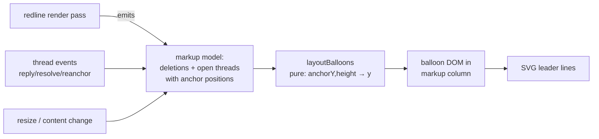

# Redline Balloons — Word-style markup for deletions and comments

**Direction (Bryan, 2026-08-03):** use Word's balloon model for deletions and comments in the markdown redline view.

## Goal

The redline view should read like the *final* document, with markup pushed to the side the way Word's "All Markup with balloons" does: insertions inline in change color, **deletions and comments in a right-margin markup area as balloons**, each connected to its anchor by a leader line. Today's view interleaves struck-through deletions with the text and underlines whole added files, which makes the document itself hard to read — the balloon model keeps the prose clean while every change stays visible. And the redline view is not a static preview: it is itself a live collaborative editor — the same Yjs doc the File view and the agents write to — so concurrent edits, new comments, and new deletions from any participant appear as markup while you watch, Word's "editing with Track Changes on".

## Measurable outcomes

- **Synchronous multi-user editing (from review comment):** the redline surface is itself editable by multiple users at once — typing in it lands in the working tree within ~1s (via the companion doc), and concurrent edits, comments, and deletions made by other users or agents appear as live markup (insertions inline, deletions as balloons) with no reload or mode switch. Y/N

1. On screens ≥1100px, deleted content no longer renders struck-through inline; each deletion appears as a balloon in the right margin, vertically aligned to its anchor, with a leader line. Y/N
2. Open comment threads appear as balloons in the same margin, stacked without overlap; reply / resolve / re-anchor work from the balloon. Y/N
3. Insertions render inline in change color; a 100%-added file renders clean with a "New file" banner instead of whole-document markup. Y/N
4. At 430px there is no horizontal scroll: the markup column disappears, deletions collapse to a tappable inline marker that opens the deleted content in the bottom sheet, and comments keep the existing pill/drawer flow. Y/N
5. No agent-facing API changes; thread anchors and the diff member model are untouched. Y/N

## Alternatives

| Approach                                                     | Effort | Risk                                                         | Usability                                         | Impact |
| ------------------------------------------------------------ | ------ | ------------------------------------------------------------ | ------------------------------------------------- | ------ |
| **A. Reserved markup column + measured balloon stacking (recommended)** — grid column ~300px, balloons absolutely positioned by a pure layout pass, SVG leader lines | M      | M — anchor Y measurement must re-run on render/resize/scroll-height changes | Word-familiar; prose stays clean                  | High   |
| B. Free-floating cards over the content (no reserved column) | S      | H — overlap chaos on dense edits; occludes prose             | Poor on real docs                                 | Low    |
| C. Balloons for comments only, deletions stay inline         | S      | L                                                            | a reviewerf-measure; deletions are the main noise source | Medium |

B fails on any paragraph with several edits. C doesn't deliver what was asked. A is what Word actually does and its one hard part (stacking) is a small pure function we can unit-test.

## Key workflow

## System design

| Component                       | Responsibility                                               | Interface                                                    |
| ------------------------------- | ------------------------------------------------------------ | ------------------------------------------------------------ |
| `redline-editor.ts` (existing)  | Becomes an EDITABLE collaborative Tiptap surface over the companion doc's Yjs (the same doc as the File view and the agent tools) — ins/del markup is computed live against baseText on each change (debounced), deletions are not rendered inline on wide screens but exposed as a list for the margin | `getDeletions(): Array<{ pos, deletedMarkdown }>`            |
| `balloon-layout.ts` (new, pure) | Word's stacking: sort by anchor Y, push down to avoid overlap, minimal displacement | `layoutBalloons(items: {anchorY, height}[], gap): number[]`  |
| `markup-margin.ts` (new)        | Owns the margin column: renders deletion + comment balloons, measures anchor Y from the live DOM, re-layouts on render/resize, draws leader lines in one SVG overlay | `mountMarkupMargin({ editorEl, getDeletions, threads, chrome, scope })` |
| `review-chrome.ts` (existing)   | Stays the owner of thread state/actions; balloons call into it (reply/resolve/re-anchor) rather than duplicating logic | unchanged API                                                |
| CSS                             | `.redline-layout` grid `minmax(0,1fr) 300px` (the `minmax(0,…)` footgun from learnings); `<1100px` → single column + inline deletion markers | —                                                            |

Deletion content in a balloon renders as plain text of the deleted markdown, truncated ~6 lines with an expand toggle (Word shows "Deleted: …" the same way). Comment balloons reuse the existing thread card markup.

**Added-file case:** when `baseText` is empty, skip ins-marking entirely — clean render + "New file in this diff" banner. This kills the "everything underlined" complaint at the root.

**Mobile (<1100px):** balloons are desktop-only. Deletions render as a compact `⌫ n lines` chip at the deletion point; tapping opens the deleted content in the existing bottom drawer. Comments keep today's pill/drawer flow unchanged. (Word's phone apps make the same trade — markup collapses to markers.)

## Suggested edits (Word's proposal model)

From review: the surface should support Word's **suggestion** concept — an edit made while "suggesting" is a *proposal* attributed to its author, visible as markup, and applied only when accepted.

**Edit modes** (Google Docs' pencil menu, Word's Track Changes toggle):

- **Editing** — direct: keystrokes land in the working tree within ~1s (the behavior shipped in the File view). Markup shown is the derived git diff vs base.
- **Suggesting** — proposing: an insertion is stored as text carrying a `suggest-ins` mark (author, timestamp); a deletion does NOT remove text, it adds a `suggest-del` mark. Nothing suggested reaches the working tree until accepted.

**The serializer rule is the crux:** the doc→disk serializer must emit the *accepted* state — text with `suggest-ins` is excluded, text with `suggest-del` is still included. Disk (and therefore the agent's working tree, git, CI) only ever sees accepted content, while the live doc carries the proposals. Accept = strip the mark (ins) / delete the text (del), which flows to disk through the normal write-back. Reject = inverse. Both are ordinary Yjs transactions, so they merge with concurrent edits and survive in the CRDT history.

**Where suggestions surface:** suggestion balloons in the same margin (author color, "replace X with Y" for adjacent del+ins pairs), each with **Accept / Reject**; a doc-level "accept all / reject all" affordance; on mobile, suggestions collapse to the same chip + bottom-sheet pattern as deletions.

**Agent-facing API** (same change adds the MCP tools, per learnings): `list_suggestions(docId)`, `accept_suggestion` / `reject_suggestion(docId, suggestionId)`, and agents can *make* suggestions via a `suggest: true` option on the existing edit tools — so an agent can propose a rewrite Bryan approves with one tap instead of applying it directly.

**Phasing:** this ships as **Phase 2**, after the balloon margin + editable redline surface (Phase 1) — the balloon chrome, stacking, and accept/reject affordances are the same components, so Phase 1 builds the shelf Phase 2 stocks. Phase 2 outcome: an edit made in Suggesting mode never reaches disk until accepted; accept applies it and the working tree updates; reject removes it cleanly; both work from the balloon and from the MCP tools. Y/N

## Execution strategy

Phase 1 (balloons + editable redline) is one worktree branch feat/redline-balloons, one PR, ordered commits; Phase 2 (suggested edits) follows as its own PR on the same components:

1. `balloon-layout.ts` + unit tests (pure, TDD).
2. Rebase the redline mount onto the editable companion editor (Collaboration over the File view's Yjs doc) with live ins/del decoration vs baseText; deletion-model extraction; added-file clean render — vitest.
3. Markup column + deletion balloons + leader lines.
4. Comment balloons wired to review-chrome actions.
5. Mobile fallback (inline chips + drawer) & polish.

Risks: anchor-Y measurement across mermaid diagrams (async render changes heights — re-layout must hook mermaid completion); balloon density on heavily-edited docs (mitigate: collapse consecutive same-paragraph deletions into one balloon); live decoration cost while typing (markdown-level diff per change — debounce, reuse the block-level LCS from the serializer work); Phase 2's serializer rule touches the doc→disk path, the most incident-prone code in the repo — it gets the same conflict/backup test rigor as the flat write-back did.

## Testing & deployment

- Unit: stacking algorithm (overlap, ordering, displacement), deletion extraction, added-file case.
- vitest DOM: deletion balloon renders with correct content; comment balloon resolve calls chrome; 430px layout class applies (jsdom can assert classes, not real layout).
- **Real-browser + 430px pass required before shipping** (design-mobile.md) — flag explicitly if the Chrome extension is unavailable and verify post-deploy on the live server.
- Deploy: standard (merge → pull → `bun run build:all` → kickstart); no server-side changes expected, so no data-migration concerns.
