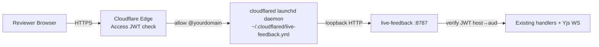

# Sharing a review surface with an external team

This guide explains how to publish a live-feedback review surface to a
public URL gated by Cloudflare Access — so a team you don't share a
Tailscale network with can review for a bounded window (default 72h) and
then have their access expire automatically.

## Mental model

Sharing is **purely additive**. You still bind a markdown doc with
`create_review_doc` (or embed the widget in a dev site / mockup) the same
way you do for private Tailscale review. The `share_doc` MCP tool wraps
that surface in a public, gated URL. Same comment threads, same agent
watching, just a different audience.



## One-time setup (host machine)

1. **Enable Cloudflare Access.** Dashboard → Zero Trust → Access. On
   first visit you pick a team subdomain (e.g.
   `fryanpan.cloudflareaccess.com`). **Permanent** — choose carefully.
   Accept ToS, pick the default email-OTP IdP. ~3 min.

2. **Note your Account ID.** Right sidebar of any zone page in the
   Cloudflare dashboard.

3. **Create a scoped API token.** Dashboard → Profile → API Tokens →
   Create Custom Token:
   - Permissions: `Account → Access: Apps and Policies → Edit`
   - Account Resources: scoped to the account
   - TTL: 1 year (rotate annually)

4. **Stash the token in macOS Keychain:**
   ```sh
   security add-generic-password -a "$USER" -s "cloudflare-api-token" -w "<paste-token>"
   ```

5. **Install cloudflared as a launchd service** so the tunnel survives
   reboots and runs alongside the existing `notion-bridge` /
   `sentry-bridge` tunnels:
   ```sh
   sudo cloudflared service install
   ```

6. **Edit `~/.cloudflared/live-feedback.yml`** so the wildcard ingress
   points at the live-feedback port (default `8787`):
   ```yaml
   tunnel: live-feedback
   credentials-file: /Users/bryanchan/.cloudflared/<tunnel-uuid>.json
   ingress:
     - hostname: "*.tunnel.fryanpan.com"
       service: http://localhost:8787
     - service: http_status:404
   ```

7. **Set server env** (in your shell rc, launchd plist, or wherever
   `bun run dev` reads its env):
   ```sh
   export CF_ACCESS_TEAM_DOMAIN="fryanpan.cloudflareaccess.com"
   export CF_ACCOUNT_ID="<your-account-id>"
   export CF_SHARE_BASE_HOSTNAME="tunnel.fryanpan.com"
   ```
   Then restart the live-feedback server. Look for these lines in startup
   logs to confirm it's wired:
   ```
   [feedback]   cf-access:  team=fryanpan.cloudflareaccess.com aud=auto-from-shares
   [feedback]   share:      base=tunnel.fryanpan.com account=abc12345…
   ```

## Per-repo team config

Each repo that uses sharing should set a default allow-list in its
`.claude/live-feedback.json`:

```json
{
  "share": {
    "defaultAllowDomains": ["@yourteam.com"],
    "defaultTTL": "72h"
  }
}
```

The agent reads this when you ask it to share. If the repo has no
`share` section, the agent will **ask before sharing** rather than
default to "anyone."

## Day-to-day: sharing a markdown doc

Tell the agent something like:

> "Publish this draft to the appdev team for a 72h review."

The agent will:

1. Confirm the doc is bound via `create_review_doc`.
2. Read `share.defaultAllowDomains` from `.claude/live-feedback.json`.
3. Call the `share_doc` MCP tool with that allow-list.
4. Hand you a URL like `https://share-2026-05-07-a3f.tunnel.fryanpan.com/review/<docId>`.
5. Watch the doc so external comments arrive on the same channel as
   yours.

You can also drive it manually with the CLI:

```sh
bun share doc <docId> --allow-domain @appdevforall.org --ttl 72h
bun share list
bun share revoke <shareId>
```

## What the reviewer sees

1. They click the share URL.
2. Cloudflare shows the email-OTP login page.
3. They enter their `@allowed-domain` email.
4. They get a 6-digit code by email; entering it lands them on the
   editor or widget surface.
5. Comments save the same way they would for a Tailscale visitor —
   anchored, persistent, watched by the agent.

The session cookie lives the full TTL of the share. After that, the
cf-access app is gone, the URL stops working, and any cached cookie
becomes useless.

## Troubleshooting

- **"missing_jwt" 401 on the share URL** — the request didn't carry an
  Access cookie. Usually means the reviewer hit the URL before
  authenticating; refreshing kicks the OTP flow.
- **"no_share_for_host" 401** — the URL points at a hostname we don't
  have an active share for (expired or revoked). Run
  `bun share list` to confirm and re-share if needed.
- **Reviewer's allowed domain rejected** — confirm the domain in the
  Cloudflare Zero Trust dashboard (Access → Applications → your app →
  Policies). The policy is `email_domain` based and exact.

## Limitations (current build)

- `share_doc` (markdown) is implemented. `share_site` (dev server) and
  `share_mockup` (static HTML) are scoped for the next iteration — they
  need the cloudflared ingress YAML mutator and (for mockup) a small
  static-file server.
- Background sweeper for expired shares isn't running yet; expired
  shares clean up on the next server startup. Manual `unshare` works
  any time.
