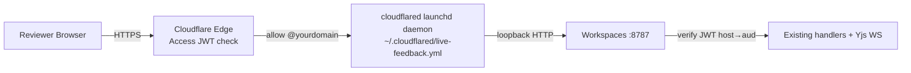

# Sharing a review surface with an external team

This guide explains how to publish a Workspaces review surface to a
public URL gated by Cloudflare Access — so a team you don't share a
Tailscale network with can review for a bounded window (default 72h) and
then have their access expire automatically.

## Mental model

**A board is the unit of sharing** (Bryan, 2026-08-17: "Workspace only — a
review must be filed on a board before it can be shared"). You bind docs the
way you always did — `create_review_doc`, `bind_folder`, `create_diff_review`
— and then you share the BOARD they are filed on.

Two smaller grants used to exist, and both are gone:

| What you had | What it minted | What you get now |
|---|---|---|
| `share_doc`, or `share_link({docId})` | a share scoped to one doc | `410 per_doc_sharing_removed` |
| `share_link` / `share_workspace` with a folder-bind or diff-review id | a share scoped to that grouping | `410 grouping_sharing_removed` |

So the id you pass is always a hub board id — the one `create_workspace`
returned, or the `hubWorkspaceId` that `bind_folder` / `create_diff_review`
reports back.

That is a deliberate narrowing rather than a missing feature. Everything on a
board is available to everyone in it (`.claude/rules/workspace-board.md`), so
the board is the boundary a person can actually reason about; a share per doc,
or per review, made the real audience of a review impossible to see. Decide
what belongs on the board *before* you share it.

The narrowing does move a cost onto you, and it is worth naming: the tight
scope used to be "share just this folder bind". Now the tight scope is "give
this review its own board". `create_workspace` makes an empty one in about a
second and `create_diff_review` accepts it as `hubWorkspaceId` in the same
call, so the flow is still two calls — but the *default* is no longer tight.
A bind or review created without an explicit `hubWorkspaceId` lands on the
shared **"Unfiled"** board along with everything else nobody filed, and
sharing Unfiled shares all of it.

Beyond that, sharing is **purely additive**: same comment threads, same agent
watching, just a different audience.



## One-time setup (host machine)

1. **Enable Cloudflare Access.** Dashboard → Zero Trust → Access. On
   first visit you pick a team subdomain (e.g.
   `fryanpan.cloudflareaccess.com`). **Permanent** — choose carefully.
   Accept ToS, pick the default email-OTP IdP. ~3 min.

2. **Note your Account ID.** Right sidebar of any zone page in the
   Cloudflare dashboard.

3. **Create a scoped API token.** Dashboard → Profile → API Tokens →
   Create Custom Token:
   - Permissions: `Account → Access: Apps and Policies → Edit`
   - Account Resources: scoped to the account
   - TTL: 1 year (rotate annually)

4. **Stash the token in macOS Keychain:**
   ```sh
   security add-generic-password -a "$USER" -s "cloudflare-api-token" -w "<paste-token>"
   ```

5. **Install cloudflared as a launchd service** so the tunnel survives
   reboots and runs alongside the existing `notion-bridge` /
   `sentry-bridge` tunnels:
   ```sh
   sudo cloudflared service install
   ```

6. **Edit `~/.cloudflared/live-feedback.yml`** so the wildcard ingress
   points at the Workspaces server port (default `8787`):
   ```yaml
   tunnel: live-feedback
   credentials-file: /Users/bryanchan/.cloudflared/<tunnel-uuid>.json
   ingress:
     - hostname: "*.tunnel.fryanpan.com"
       service: http://localhost:8787
     - service: http_status:404
   ```

7. **Set server env** (in your shell rc, launchd plist, or wherever
   `bun run dev` reads its env):
   ```sh
   export CF_ACCESS_TEAM_DOMAIN="fryanpan.cloudflareaccess.com"
   export CF_ACCOUNT_ID="<your-account-id>"
   export CF_SHARE_BASE_HOSTNAME="tunnel.fryanpan.com"
   ```
   Then restart the Workspaces server. Look for these lines in startup
   logs to confirm it's wired:
   ```
   [feedback]   cf-access:  team=fryanpan.cloudflareaccess.com aud=auto-from-shares
   [feedback]   share:      base=tunnel.fryanpan.com account=abc12345…
   ```

## A standing collaboration hostname (no share link needed)

The two modes above mint a grant per audience: a share hostname, or a link to
redeem. There is a third shape for the case where the audience is standing
rather than per-review — a collaborator you have already admitted to
Cloudflare Access, who should be able to open any board you send them the URL
of, from outside the tailnet.

Bryan set the boundary (2026-08-18): *"workspaces.fryanpan.com is meant to be
the Cloudflare tunnel for collaboration that's reachable outside tailnet. But
not used for the privileged access that inside-tailnet traffic gets."*

```sh
export CF_ACCESS_TUNNEL_HOSTS="workspaces.example.com"
export CF_ACCESS_TEAM_DOMAIN="<team>.cloudflareaccess.com"
export CF_ACCESS_AUD="<the AUD of the Access app over that hostname>"
```

…plus an ingress entry pointing the hostname at `http://localhost:8787`, and a
Cloudflare Access application covering that exact hostname. Startup logs then
carry `[feedback]   collab:     workspaces.example.com (via Cloudflare Access)`.

**What it grants is the share surface, not the product.** Read the boards and
the docs filed on them, comment, co-edit — scoped per request to whichever
workspace the URL names. What it does not grant is anything an operator does:
the doc list and the workspace list (so a visitor cannot enumerate what
exists), share administration, folder binds, diff creation, delete, wholesale
rewrite, the deploy verb, the plugin refresh, and the landing page. Those stay
on the tailnet and on loopback.

**All three variables travel together or none of them do.** The server ignores
the host list unless the team domain *and* a static AUD are both set, and says
so loudly at boot, because a listed hostname with no Access application in
front of it would be the API exposed to anyone who can reach the tunnel — the
exact hole the `cf-ray` veto in `middleware/host-guard.ts` was added to close.
That veto is untouched: a hostname on this list classifies `collab`, never
`local`, and a request that did not arrive through the edge is refused whatever
Host it claims.

Two things worth knowing before you turn it on:

- **The AUD is the hostname's own.** Cloudflare issues one AUD per Access
  application, and this hostname has its own application — it is not a share
  hostname, so the per-share AUD resolver cannot answer for it. That is why
  `CF_ACCESS_AUD` is required here even on a deployment where link or Access
  sharing is already configured.
- **The master switch covers it**, so `set_sharing_enabled(false)` shuts this
  door with the others. One honest limit: a collaboration request carries no
  shareId, so the hang-up sweep that runs on the switch cannot find its live
  websockets. New requests are refused immediately; an already-open editing
  socket survives until the server restarts.

## Per-repo team config

Each repo that uses sharing should set a default allow-list in its
`.claude/live-feedback.json`:

```json
{
  "share": {
    "defaultAllowDomains": ["@yourteam.com"],
    "defaultTTL": "72h"
  }
}
```

The agent reads this when you ask it to share. If the repo has no
`share` section, the agent will **ask before sharing** rather than
default to "anyone."

## Day-to-day: sharing a workspace

Tell the agent something like:

> "Publish this review to the partner team for a 72h review."

The agent will:

1. Confirm the docs are filed on a board — binding the folder
   (`bind_folder`), creating the diff review, or `attach_doc`-ing a loose
   doc onto a board.
2. Check what else that board holds, because the visitor gets all of it. For
   a diff review the grouping's root is the whole repo, so `files` /
   `context-file` reach every file in it. If the review should travel alone,
   the agent gives it a fresh board rather than the shared "Unfiled" one.
3. Read `share.defaultAllowDomains` from `.claude/live-feedback.json`.
4. Call the `share_workspace` MCP tool with the BOARD id and that allow-list.
5. Hand you a URL like `https://share-2026-05-07-a3f.tunnel.example.com/workspaces/<boardId>`.
6. Watch the docs so external comments arrive on the same channel as
   yours.

For a link share with no sign-in at all, `share_link({ workspaceId })` mints an
unguessable URL instead. The slug IS the credential, so keep the TTL short.

You can also drive it manually with the CLI:

```sh
bun share workspace <workspaceId> --allow-domain @partner-org.example --ttl 72h
bun share list
bun share revoke <shareId>
```

`bun share doc` and `POST /api/share/doc` still exist as refusals rather than
as routes: they answer with the replacement, so an older plugin bundle calling
them gets a sentence instead of a 404.

## What the reviewer sees

1. They click the share URL.
2. Cloudflare shows the email-OTP login page.
3. They enter their `@allowed-domain` email.
4. They get a 6-digit code by email; entering it lands them on the
   editor or widget surface.
5. Comments save the same way they would for a Tailscale visitor —
   anchored, persistent, watched by the agent.

The session cookie lives the full TTL of the share. After that, the
cf-access app is gone, the URL stops working, and any cached cookie
becomes useless.

## Troubleshooting

- **"missing_jwt" 401 on the share URL** — the request didn't carry an
  Access cookie. Usually means the reviewer hit the URL before
  authenticating; refreshing kicks the OTP flow.
- **"no_share_for_host" 401** — the URL points at a hostname we don't
  have an active share for (expired or revoked). Run
  `bun share list` to confirm and re-share if needed.
- **Reviewer's allowed domain rejected** — confirm the domain in the
  Cloudflare Zero Trust dashboard (Access → Applications → your app →
  Policies). The policy is `email_domain` based and exact.

## Limitations (current build)

- Markdown / code / diff workspaces are implemented. `share_site` (dev server) and
  `share_mockup` (static HTML) are scoped for the next iteration — they
  need the cloudflared ingress YAML mutator and (for mockup) a small
  static-file server.
- Background sweeper for expired shares isn't running yet; expired
  shares clean up on the next server startup. Manual `unshare` works
  any time.
