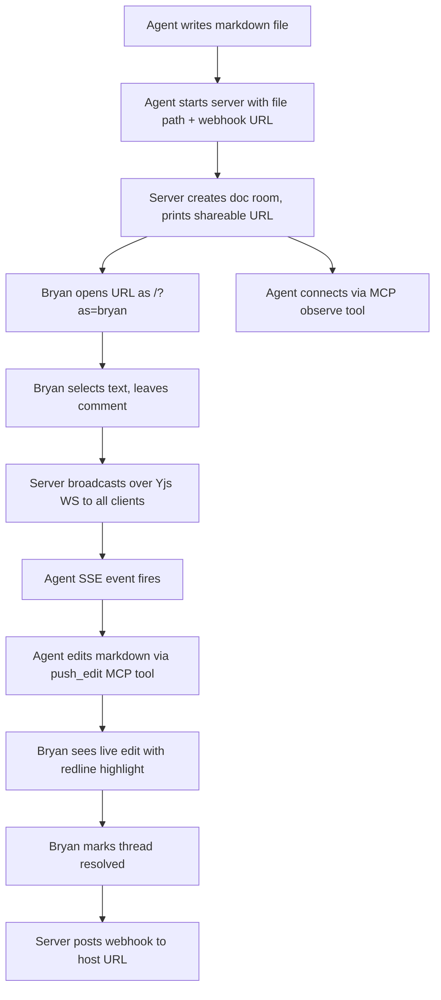
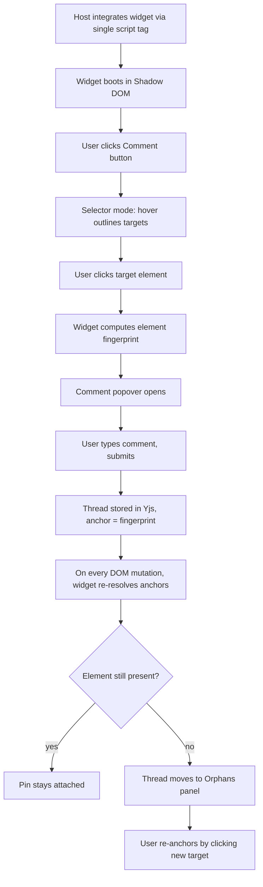
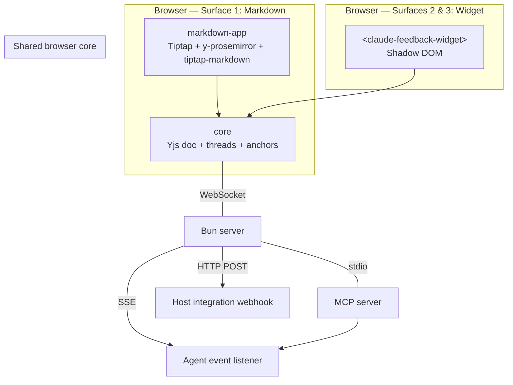

# Live Feedback Plugin — MVP Design

**Status:** Approved 2026-04-17 (Bryan, async).
**Scope:** All three surfaces (markdown review, UX mockup review, live dev-server review) in one autonomous build session.

## Goals (measurable)

1. Two people (Bryan, agent) open the same markdown doc via a shared URL; when one edits, the other sees the change within 500ms. — yes/no.
2. One person selects text in the markdown doc and leaves a comment; the other person sees the comment pin appear in the right rail in ≤1s, anchored to the same text even after an intervening edit elsewhere in the doc. — yes/no.
3. One person injects the widget into a mockup HTML file; clicking "comment" puts the cursor in selector mode; clicking any element attaches a comment pin to it that survives a browser reload. — yes/no.
4. Same widget injected into a running Vite dev server; editing the source and triggering HMR preserves all open comment pins on elements that still exist. Broken anchors move to the Orphans panel. — yes/no.
5. Widget core bundle is ≤40 KB gzipped. — CI-enforced.
6. Third user opens a shared link with no `?as=` param; sees all live edits and comments from Bryan and Agent; can comment as `Anon-N`. — yes/no.
7. Host application configures a webhook URL; when a new comment is created, the server POSTs a standard payload to that URL. — yes/no.
8. `/ux-review` walkthrough of the markdown surface and the widget-on-mockup demo passes with no Critical issues. — yes/no.

## Non-goals for this MVP

- Real authentication (single shared link, `?as=` query param identity only)
- Linear integration (each host project supplies their own webhook handler)
- Persistent users / accounts
- Rich text/paragraph-level reanchoring beyond Yjs `RelativePosition`
- Public-internet exposure. The host binds to localhost + private
  network interfaces; reviewers reach it over Tailscale or the LAN.
  Making it public-internet accessible is an opt-in users layer on
  (Cloudflare Tunnel, ngrok, their own reverse proxy — outside scope).
- History / audit trail beyond what Yjs gives for free

## Key workflows





## Alternatives evaluated

| Approach | Effort | Risk | Usability | Impact | Decision |
|---|---|---|---|---|---|
| **Yjs + y-websocket (chosen)** | M | L | H | H | ✅ Mature CRDT, offline-capable, Prosemirror binding for WYSIWYG, no SaaS. |
| Liveblocks | L | M | H | H | ❌ SaaS lock-in and ongoing cost; Bryan prefers self-host. |
| Automerge | M | M | M | M | ❌ Weaker editor ecosystem, less momentum for ProseMirror integration. |
| Build minimal OT | XL | H | M | M | ❌ NIH — CRDT correctness is the boring bit we don't want to own. |

| Approach | Effort | Risk | Usability | Impact | Decision |
|---|---|---|---|---|---|
| **Vanilla Custom Elements + Shadow DOM (chosen)** | M | L | M | H | ✅ Zero framework conflicts, tiny, no deps. |
| Lit | L | L | H | H | ❌ 5KB dep and another thing to learn; revisit if DX is poor. |
| React rendered into Shadow DOM | L | M | H | M | ❌ Violates CLAUDE.md no-framework rule. |
| Preact (mini React) | L | M | H | M | ❌ Same concern, still a framework dep. |

| Approach | Effort | Risk | Usability | Impact | Decision |
|---|---|---|---|---|---|
| **Layered anchor (chosen)** | M | M | H | H | ✅ stable-id → selector+text fingerprint → Yjs RelativePosition → orphan panel. Matches the three surface types. |
| Pure CSS selector | S | H | M | M | ❌ Breaks on any refactor of HTML. |
| Pure visual (pixel coords) | S | H | L | L | ❌ Breaks on layout / viewport changes. |
| Semantic AI reanchor | XL | M | H | M | ❌ Overkill for MVP; orphan panel is enough. |

## System design



### Packages (Bun workspaces)

| Package | Purpose | Depends on |
|---|---|---|
| `@feedback/core` | Yjs schema, thread/anchor types, anchor resolvers, user identity | yjs |
| `@feedback/server` | Bun HTTP+WS server, MCP, SSE, webhook dispatch, doc persistence | core, @modelcontextprotocol/sdk, y-websocket/bin |
| `@feedback/markdown-app` | Surface 1 browser app (WYSIWYG) | core, @tiptap/core, @tiptap/starter-kit, @tiptap/extension-collaboration, @tiptap/y-tiptap, tiptap-markdown |
| `@feedback/widget` | Surfaces 2 & 3 injectable widget | core (minus server-only deps) |
| `@feedback/demo-mockup` | Static HTML mockup using the widget | widget |
| `@feedback/demo-dev-server` | Vite dev server using the widget | widget |

### Key interfaces

**Server REST + WS:**
```
GET  /                                 → landing page (list open docs)
GET  /review/:docId?as=bryan|agent     → markdown-app for that doc
GET  /widget.js                        → widget bundle (ESM)
GET  /widget.iife.js                   → widget bundle (IIFE)
WS   /y/:docId                         → Yjs sync
GET  /events/:docId                    → SSE stream (agent-oriented)
POST /api/docs                         → create doc room; body: {filePath?, webhookUrl?, type}
GET  /api/docs                         → list
GET  /api/docs/:docId                  → metadata
POST /api/docs/:docId/hooks/fire       → manually trigger webhook (debugging)
```

**MCP tools (stdio):**
```
list_docs()                    → [{docId, type, threadCounts}]
list_threads(docId, status?)   → [ThreadSummary]
get_thread(docId, threadId)    → ThreadFull
post_reply(docId, threadId, text)  → Comment
resolve_thread(docId, threadId)    → Thread
reopen_thread(docId, threadId)     → Thread
push_edit(docId, anchor, replacement) → OK
observe_url(docId)             → sseUrl
```

**Webhook payload (POST to host):**
```json
{
  "event": "thread.created" | "thread.replied" | "thread.resolved" | "thread.reopened",
  "docId": "...",
  "threadId": "...",
  "anchor": {...},
  "thread": {
    "status": "open" | "resolved",
    "comments": [{"author": "bryan|agent|anon-N", "text": "...", "ts": 1234}]
  },
  "doc": {"type": "markdown|mockup|dev", "sourceUrl": "..."}
}
```

**Widget init:**
```html
<script type="module">
  import { FeedbackWidget } from "http://host.tailnet.ts.net:8787/widget.js";
  FeedbackWidget.init({
    serverUrl: "ws://host.tailnet.ts.net:8787",
    docId: "my-mockup",
    user: "?",                        // null/undefined → anonymous
  });
</script>
```

### Data model (Yjs)

```ts
// One Yjs doc per review session.
YDoc {
  meta: Y.Map { type, sourceUrl, createdAt }
  content: Y.Text                       // Surface 1 only; empty for 2/3
  threads: Y.Map<threadId, Y.Map {
    anchor: { kind, ... }               // frozen JSON, not Y.Map (immutable per thread)
    status: 'open' | 'resolved'
    comments: Y.Array<Y.Map { author, text, ts }>
    createdBy, createdAt
  }>
  presence: awareness                   // via y-protocols/awareness
}
```

### Anchor kinds

```ts
type Anchor =
  | { kind: 'text-range',
      startRel: Uint8Array,             // Y.RelativePosition encoded
      endRel: Uint8Array,
      snippet: string }                 // for orphan display
  | { kind: 'element',
      id?: string,
      stableAttrs?: { role, ariaLabel, name, dataTestId },
      structuralPath: { tag, index, ancestors: string[] },
      textSnippet: string,
      rect?: { x, y, w, h } }           // for orphan display fallback
  | { kind: 'orphan',
      original: Exclude<Anchor, { kind: 'orphan' }>,
      lastSeenAt: number }
```

### Anchor resolver contract

```ts
interface Resolver<E> {
  resolve(anchor: Anchor, env: E): { found: E, score: number } | null
  reanchor(target: E, env: E): Anchor
}
```

Score threshold: 40/100 matches health-tool's existing heuristic. Below threshold → orphan.

### Identity & presence

- URL param `?as=bryan` | `?as=agent` → known identity (stored in localStorage for the session).
- No param → `Anon-<short-random>`, persisted in localStorage.
- Avatar = deterministic hash color + initial.
- Awareness protocol broadcasts cursor/selection for known users; anons see others but don't broadcast their selection.

## Execution strategy

One autonomous build session. Chunked as:

1. **Scaffold** — Bun workspace, TS configs, eslint, vitest, CI workflow with bundle-size check.
2. **Core package** — types, Yjs schema, text-range resolver (Yjs RelativePosition), element resolver (port + refactor fingerprint from health-tool).
3. **Server** — Bun HTTP+WS with y-websocket, SSE, webhook dispatch, disk persistence of ydocs (crude: `data/<docId>.ydoc`).
4. **MCP server** — stdio server exposing the 7 tools, running in the same Bun process or a thin wrapper.
5. **Markdown app (Surface 1)** — Tiptap (ProseMirror) + StarterKit + tiptap-markdown for WYSIWYG editing, y-prosemirror Collaboration for Yjs sync, Decoration plugin for thread-range highlights, thread panel, orphan panel.
6. **Widget package (Surfaces 2 & 3)** — Custom Element + Shadow DOM, element selector UI, thread popover, orphan panel. Enforce bundle size in CI.
7. **Demo mockup** — static HTML page using widget.
8. **Demo dev server** — minimal Vite project using widget; test HMR survival.
9. **Integration webhook reference** — tiny example Node server that receives webhooks and logs them; a `cookbook/linear.ts` stub showing how a host project would map to Linear.
10. **Tests** — vitest for core + server; Playwright smoke for each surface.
11. **UX review** — invoke `/ux-review` skill via claude-in-chrome for markdown app + mockup demo; fix Critical issues.
12. **Commit cadence** — commit after each chunk. Open PR when the build is green.

### Parallelism

- Chunks 2–4 (core, server, MCP) are sequentially dependent.
- Chunks 5 and 6 (markdown app, widget) are independent once core exists.
- Chunks 7 and 8 depend on widget.
- Chunk 9 depends on server.
- Chunks 10 and 11 run after everything is stitched together.

### Risk notes

- **Tiptap / y-prosemirror plugin-key mismatch** — Tiptap's Collaboration extension registers its ySyncPlugin under `@tiptap/y-tiptap`'s PluginKey, not `y-prosemirror`'s. Imports MUST come from `@tiptap/y-tiptap` or `getState()` returns undefined and selections never resolve. Pin `@tiptap/y-tiptap` alongside `@tiptap/extension-collaboration`.
- **Widget bundle size** — Yjs is ~40KB gzipped alone. We may need to tree-shake or code-split; if we blow the budget, document it and propose a fix rather than silently shipping over.
- **Shadow DOM + mermaid** — Mermaid uses global state and SVG id collisions. Only used in the markdown-app (no Shadow DOM there), so should be fine.
- **Bun + MCP SDK compatibility** — Anthropic's MCP SDK is Node-first. If Bun chokes, fall back to a Node sidecar for MCP only.

## Testing & deployment

- **Unit tests (vitest):** core anchor resolvers, Yjs schema invariants, webhook dispatch signing (if any), MCP tool handlers.
- **Integration tests (vitest + happy-dom):** two Yjs clients edit concurrently → state converges; thread created on one → appears on other.
- **E2E smoke (Playwright):** open markdown app, leave comment, reload, comment persists. Open mockup demo, leave element comment, remove element from DOM, comment shows in Orphans panel.
- **Bundle size CI step:** `bun run build:widget && node scripts/check-widget-size.js` with 40KB gzip hard limit.
- **UX review gate:** `/ux-review` on both user-facing surfaces with claude-in-chrome before PR.
- **Deploy:** runs locally on the host machine. Access for remote
  devices is via the host's Tailscale hostname (preferred — works
  across networks) or its `.local` / LAN IP (same-wifi). `bun run
  scripts/serve.ts` prints all three URL forms at startup. No public
  tunnel, no DNS setup.

## Open items to revisit later

- Real auth (OIDC? magic links?).
- Redline-accept-reject UI for agent edits to markdown (tonight ships live collaborative editing; visual redline is a follow-up).
- Widget SDK bindings for frameworks (React hook, Vue directive) — vanilla first; wrappers are nice-to-have.
- Persistent user accounts / identity.
- Rich presence (typing indicators, avatars in margin).
- Mermaid diagram comments (comment on a node in the diagram — hard, needs svg-element anchoring; out of scope tonight).
