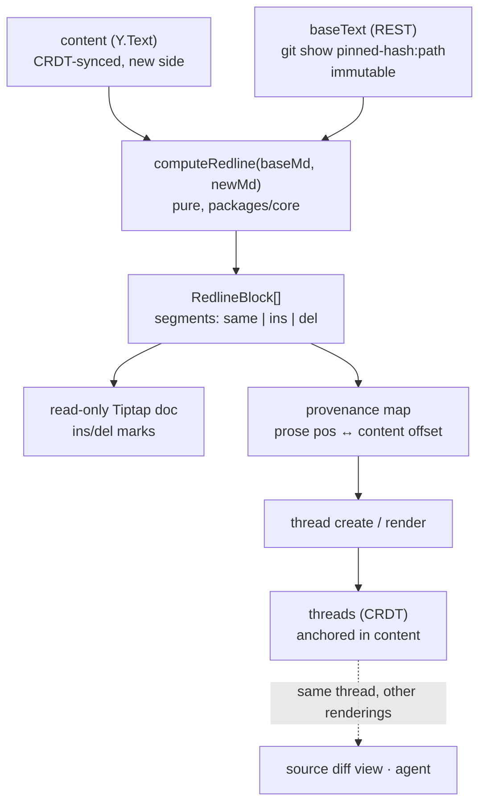

# Word-style redlining for markdown docs in a diff review

**Status:** design, pending approval
**Date:** 2026-07-16

## Goal

When a diff review contains a `.md` file, render it the way Word renders tracked
changes: the prose rendered as prose (headings look like headings, lists like
lists), with removed words struck through and added words underlined *inline*, at
word granularity. Comments work on that surface.

Today a `.md` file in a diff review renders as raw CodeMirror unified diff — you
read markdown syntax with `+`/`-` gutters instead of reading the document.

## What exists today (verified)

- `create_diff_review` → `bindDiff` (`packages/server/src/binds.ts:226`) creates
  **one doc per changed file**, `type: 'diff'`, grouped under `workspaceId` =
  reviewId.
- `DocType = 'markdown' | 'mockup' | 'code' | 'diff'`; `contentKind(type)` maps
  `markdown`→`prose`, `code`/`diff`→`flat` (`packages/core/src/types.ts:10-32`).
  Server code branches on `contentKind`, not on `type ===` checks.
- **Only the new/target side is CRDT state**, in `ydoc.getText('content')`. The
  base side is *not* stored — it is computed on demand by
  `GET /api/docs/:id/diff` (`packages/server/src/server.ts:585-610`), which
  returns `baseText` from `git show <diffBase>:<basePath>`, or `null` if the repo
  moved or was pruned.
- `diffBase` / `diffTarget` are **resolved full commit hashes**, resolved at bind
  time via `resolveCommit` and hard-failing with `bad-ref` otherwise
  (`types.ts:94`: "so the review stays pinned even if the refs move later").
  `baseText` is therefore immutable bytes for the life of the review.
- Threads on a diff doc anchor as `text-range` `Y.RelativePosition`s into the flat
  `content` Y.Text, **line-snapped** (`rooms.ts:455`, flat branch at `:479`).
- The render switch is a single branch on doc type — `packages/markdown-app/src/app.ts:101`:
  ```ts
  if (docType === 'code' || docType === 'diff') { void bootCode({...}); return; }
  ```
  A `.md` inside a diff review renders as raw CodeMirror **only because of this
  line**, not because of anything structural.
- No redlining prior art exists. `docs/product/vision.md:42` calls for it
  ("best-in-breed redlining UX"); it was deferred out of the MVP.

## The load-bearing constraint

Every existing diff thread anchors into the flat `content` Y.Text. A Tiptap prose
view over a `Y.XmlFragment` is a **fundamentally different position space** —
`content` positions do not resolve there. Rendering the redline as a normal
collaborative prose doc would break every anchor and force changes through
`rooms.ts`, `prose.ts`, and the whole reanchor stack.

**Resolution: the doc stays flat (`type: 'diff'`) end to end. The redline is
derived, read-only, and client-local.** Prose-ness is purely a client rendering
choice. The server does not change (except for the anchor hint field below).

## Design

### The provenance map

Because the client *constructs* the redline document itself, it can retain a map
recording, for each rendered segment, the offset it came from in `content`. The
map is bidirectional, and that is what makes comments work:

- **Creating** a thread: prose selection → map → `content` offsets → line-snap →
  the byte-identical `text-range` anchor the source diff view already produces.
- **Rendering** an existing thread: `content` offset → reverse map → prose range →
  decorate.

Threads are therefore **fully interoperable** across the redline view, the source
diff view, and the agent (`list_threads` / `create_thread` unchanged).

### Data flow



### Components

| Unit | Where | Responsibility |
|---|---|---|
| `computeRedline(baseMd, newMd)` | new — `packages/core/src/redline.ts` | Pure. Block-level LCS (reusing the machinery behind `applyMarkdownToFragment`), then word-level diff on paired changed blocks. Returns blocks of `{text, kind, contentOffset?}` segments. No Yjs, fully unit-testable. |
| Redline renderer | new — `packages/markdown-app/src/redline/` | Builds a local read-only Tiptap doc with two marks, `redlineIns` (`<ins>`) / `redlineDel` (`<del>`); emits the provenance map. |
| Anchor bridge | same dir | The bidirectional map. Reuses `snapToLines` and the existing `text-range` encoding. |
| View switch + toggle | `app.ts:101`, doc header | `type === 'diff' && relPath.endsWith('.md')` → redline; toggle flips to today's `bootCode`. |

### Multi-client

The redline is a pure function of two inputs that are **already identical on every
client**: `content` (CRDT, converges by construction) and `baseText` (immutable,
pinned to a commit hash). Same inputs + same pure function = same output. Every
client derives the same redline with no coordination — the same way two clients
render the same markdown to the same HTML without syncing the HTML. There is no
redline state to keep in sync; that is the point of deriving rather than storing.

- **Shared** (CRDT, all clients + agent): `content`, and threads. One thread, three
  renderings.
- **Local** (correctly per-client): view mode, the derived redline, the provenance
  map. View mode is a personal preference like scroll position — syncing it would
  mean one reviewer's toggle yanks another's.

Live updates: in working-tree mode `content` changes ~1s after each agent save;
every client recomputes against the same fixed base and converges. Transient
divergence mid-sync is ordinary Yjs and self-heals.

### Deleted-text anchoring

Deleted text has no position in `content`, but "why did you cut this?" is among the
most natural redline comments, so it must be expressible.

Rule: anchor to the **nearest following retained line**, and record a hint on the
anchor:

```ts
/** Set when the thread was created on text present only on the base side. */
deletedSnippet?: string;
```

The redline view re-finds the deletion by snippet-matching near the anchor line —
the same technique as `autoReanchorDoc` — and renders the thread back on the
deletion where the reviewer put it. The source diff view can label it "on deleted
text". Without the hint the comment silently reads as being about an unrelated
surviving line.

Per `docs/process/learnings.md` ("The route layer silently drops params unit tests
can't see"): this field must be added to core, the rooms method, **and** the REST
route that fronts it, in the same change, with at least one HTTP-level test.

### Block pairing (heuristic — flagged)

LCS identifies which blocks changed. Inside a gap of *n* deleted and *m* inserted
blocks, deciding "this paragraph *became* that paragraph" (→ word-diff it) versus
"this was deleted and that was added" (→ show both whole) is a similarity
judgment. Rules:

- Pair only same-node-type blocks, best similarity first, above a threshold.
- Structural changes (heading level, paragraph→list) render as del-block +
  ins-block. This is what Word does.

### Recompute discipline

In working-tree mode `content` re-renders ~1s per save. The redline recomputes each
time; it is derived and read-only, so unlike `collapseUnchanged` there is no
reviewer state to lose. Still:

- Debounce recompute; preserve scroll.
- Guard the **empty-at-mount** case: the Yjs doc is empty until sync lands. This is
  the same class as the `collapseUnchanged` compartment bug — anything derived at
  mount is stale for docs that stream in after mount.

## Testing

- `computeRedline` is pure → unit tests carry the weight: word-level changes inside
  a paragraph, block insert/delete, heading-level change, paragraph→list, empty
  base (added file), identical input (no-op).
- Provenance map round-trip: prose position → content offset → prose position, over
  a document with interleaved ins/del.
- Thread interoperability: a thread created in the redline view resolves in the
  source diff view at the same line, and vice versa.
- HTTP-level test through the real route for `deletedSnippet`.
- Mobile: verify at 430px per `docs/product/design-mobile.md`.

## Out of scope

- **Presence / remote cursors in the redline.** Whether the current code/diff view
  shows them at all is unverified. The provenance map would support mapping a
  remote selection in, but it is additional work. Threads carry collaboration for
  v1. Logged as future work.
- **Accept / reject controls.** This is a review surface, not an editing surface.
  `vision.md` wants "diff-and-accept" eventually; not here.
- Non-markdown files in a diff review — unchanged.

## Alternatives rejected

**Server computes the redline into a second Yjs fragment.** The agent could read
the redline directly and it would compute once rather than per-client. But it
creates CRDT state that must stay in sync with `content` on every ~1s save, and
puts anchors in a different position space — the large-change path through
`rooms.ts` / `prose.ts` / the reanchor stack. Not worth it for a derived view.

**Rendered preview with change bars only** (no inline strikethrough). Far cheaper,
but it is not redlining — you would see *that* a paragraph changed, not *what*
changed.
