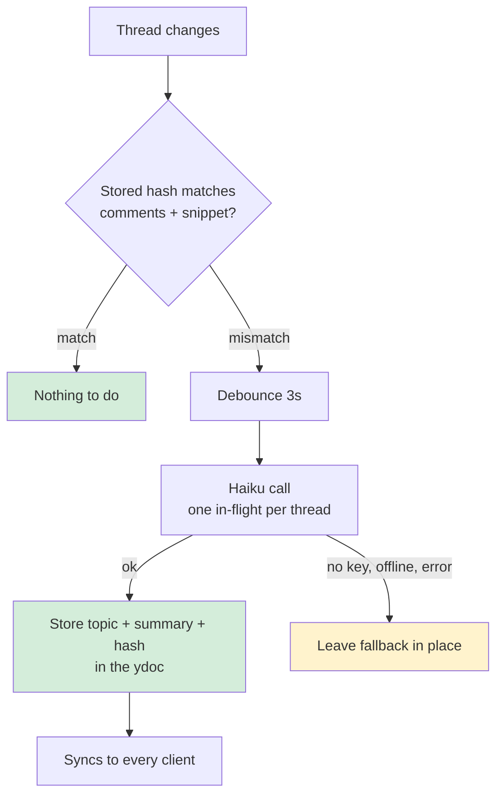

# streamlined_review — thread cards you can read at a glance

**Status:** design, awaiting approval · **Date:** 2026-08-10

## The problem

Collapsing thread cards made the review surface calmer. It also collapsed away
what you need to triage.

A collapsed card today renders four things — author swatch, author name, the
text of the **first** comment, and a reply count. It shows how a thread
*started* and never what it *became*. So triaging means expanding every card
to find the two that still need you.

**Goal:** tell what a thread is about, where it got to, and whether it still
needs you — without expanding it. And close it in one click.

## What you're approving

| | |
|---|---|
| **Surfaces** | desktop margin **and** the mobile thread drawer |
| **Cost** | ~$0.05/month estimated — see *Cost* below. **Unmeasured**; measure before build |
| **Latency** | summary appears ~5s after the last reply (3s debounce + ~2s call) |
| **Opt-out** | `LF_SUMMARIES=0` disables generation; cards fall back, nothing breaks |
| **Tradeoff** | comment text is sent to an external API |

## The card

Desktop margin (open threads only — see *Status*):

```
● Alex · +2 others
↳ Error handling in the retry helper
↳ Debating whether to keep the fallback path
3 replies · 2h ago                            [✓]
```

Mobile drawer adds status, because there it varies:

```
● Alex · orphan · +2 others
↳ Error handling in the retry helper
↳ Debating whether to keep the fallback path
3 replies · 2h ago                            [✓]
```

Lines truncate with ellipsis rather than wrapping, so a card cannot exceed
four lines at any width.

**A thread with no replies stays one line** — today's card, unchanged. The
four-line card appears only at `commentCount > 1`. Otherwise the most common
thread would quadruple in height to restate its single comment three ways.

### One implementation, two surfaces

`ThreadPanel.renderThread` is already shared between the drawer and the
margin — its own comment says a balloon "is literally this same card (plus
positioning classes), so reply/resolve/reopen/re-anchor behave identically
everywhere instead of a second implementation drifting out of sync."

The summary lines follow that rule: one builder produces the summary block,
consumed by both `renderThread` (drawer) and `buildCollapsedComment` (margin).
Do not fork it.

### Status

The margin renders **only open threads** — `markup-margin.ts:588` filters on
`status === 'open'`, because resolved and orphaned threads have no anchor to
hang a balloon from. Printing `· open ·` there would be a constant. So the
margin card omits status.

The drawer carries all three states (`open | resolved | orphan`) and already
heads a section *"Orphaned (N) — re-anchor needed"*. **Orphan is the state
that demands action**, so the drawer card shows status. This is the main
reason mobile is in scope rather than deferred.

### Participants

Distinct comment authors minus the thread's first author, as `+N others`.
Rendered as text, never HTML — author names are agent-supplied and untrusted
(`markup-margin.ts:451` holds this invariant today).

### The resolve button

A `✓` on line 4, wired to the same resolve path the expanded card uses,
reusing `.lf-collapsed-actions`. Needs an explicit `aria-label` ("Resolve
thread"), matching the existing collapsed accept/reject buttons.

Collapsed *suggestion* cards get no resolve button — accept/reject is already
their resolution, and a third checkmark beside `✓/✕` would be ambiguous.

## How summaries are produced

One call per thread returns both lines: `{topic, summary}`, 10 words each,
on `claude-haiku-4-5-20251001`.

Generating the topic is a **deliberate choice, not a necessity**: anchor
snippets are capped at 80 chars (`SNIPPET_MAX`, ~12 words) and would fit
as-is, but a raw snippet is often a mid-sentence code fragment that reads
poorly as a topic. We accept ~2× the cost for a topic line that reads as
prose.

**The server generates; clients only read.** Generation is triggered
server-side on thread change, one in-flight call per thread, deduped — so
three browsers open on one doc cause one call, not three. **Share visitors
never trigger generation**; a public tunnel URL must not be able to spend the
key.



**The hash covers comment texts *and* the anchor snippet.** The snippet feeds
the topic line and changes when the doc is edited, independently of the
comments — hashing comments alone would leave an edited anchor with a stale
topic forever.

**The stored hash joins the balloon render key.** Today that key is
`comment|id|status|commentCount|lastActivity|active|expanded`
(`markup-margin.ts:615`); a summary arriving in the ydoc changes none of those,
so without this the fallback would stay on screen until an unrelated repaint.

**The fallback is a working card, not a blank one.** Line 2 falls back to the
anchor snippet as stored, line 3 to the latest comment's opening words. The
generated summary improves a card that is already useful without it.

### Cost

Estimate, stated so it can be checked: ~26 threads on a large live review,
~3 regenerations per thread per day, ~500 input + ~30 output tokens per call
≈ 40k tokens/day ≈ **$0.05/month** at Haiku pricing. **This is unmeasured.**
Whoever builds this logs actual call volume for the first week and reports
back before it is treated as free.

## What you're accepting

**Comment text goes to an external API.** `scrub-haiku.py` sets the precedent
of sending repo content to the same vendor, but that is a git hook — **there
is no Anthropic client in `packages/server/src` today**. This feature adds
outbound API access to the server for the first time. Key from Keychain
(`lf-summary-api-key`), falling back to `ANTHROPIC_API_KEY`; absent key means
fallback cards, not an error.

**Summaries live in the ydoc.** Acceptable *here* because a summary is no more
sensitive than the comments it summarizes, and share visitors already receive
those. This does not generalize — `private-meta.ts` exists precisely for
fields that must never reach a visitor.

## Interface

| | |
|---|---|
| Route | `POST /api/docs/:docId/threads/:threadId/summary` |
| Request | `{}` — server reads the thread it already holds |
| Response | `{topic, summary, hash}` |
| Failures | `503` when the key is absent or the call fails → client keeps fallback |
| MCP | wrap as `summarize_thread` in the same change — a server route meant for agents that ships without its MCP tool is a documented failure mode in this repo |

## Layout

Four-line cards displace each other further in the margin's shared
anchor-sorted layout pass, lengthening leader lines. That is accepted: no cap,
no scroll container, no new overflow behavior. Cards displace exactly as they
do today.

## Testing

- margin card omits status; drawer card renders all three states including orphan
- single-comment threads stay one line; the four-line card appears at `commentCount > 1`
- participants: dedup, self-exclusion, `+N others`
- hash invalidation: changed comments regenerate; changed **snippet** regenerates; unchanged reuses
- an arriving summary repaints the card (render-key regression test)
- fallback: missing key and failed call each still produce a usable card
- share visitor cannot trigger generation
- 10-word caps enforced on both lines
- browser check at **430px and >1100px** — both surfaces, four lines each

## Out of scope

Read/unread awareness — per-file "viewed" markers that auto-invalidate on
change, unread markers, "changes since my last review" — needs per-user
server-side state and gets its own spec, opening with research into how Word,
Google Docs, and GitHub model per-reader review state.

## To approve

1. The four-line card, on both desktop margin and mobile drawer
2. Sending comment text to Haiku, and giving the server outbound API access
3. The cost estimate is unmeasured — approving means accepting a measure-first-week condition
